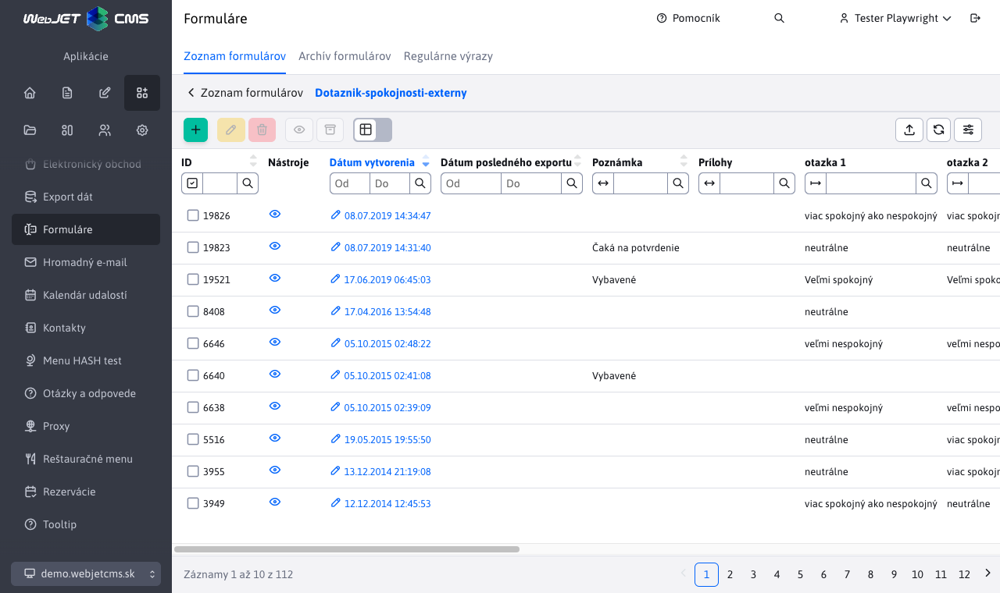
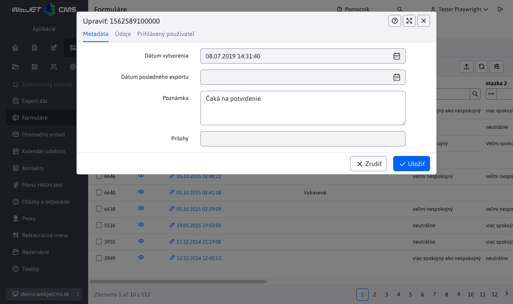

# Zoznam formulárov

Aplikácia formuláre slúži na pokročilú správu formulárov. Každá web stránka môže obsahovať formulár, ktorý návštevník vyplní. Môžu to byť žiadosti o pracovné miesto, žiadosti o podrobnejšie informácie a podobne.

Formuláre môžu byť odoslané na email adresu, pričom v email správe formulár vyzerá rovnako ako na web stránke, je možné ho vytlačiť a ďalej spracovať.

Naviac, všetky formuláre sa ukladajú do databázy, v administračnej časti Web JET je možné sa k nim kedykoľvek vrátiť. Položky vo formulároch je možné usporadúvať podľa ľubovoľného stĺpca a exportovať do programu MS Excel.



Kliknutím na ikonu oka môžete formulár zobraziť do podoby, v akej je na web stránke a vytlačiť ho.

V editácii formuláru môžete meniť pole poznámka (v ktorom si môžete evidovať spracovanie/stav formuláru). Jednotlivé vyplnené polia sú len na čítanie, nie je možné ich po odoslaní meniť. V karte Položky formuláru sú jednotlivé položky vyplneného formuláru, v karte Osobné údaje, Kontaktné údaje a Voliteľné polia sú údaje používateľa, ktorý formulár odoslal (ak bol pri jeho odoslaní prihlásený).



## Vytvorenie formuláru

Formulár najjednoduchšie vytvoríte kliknutím na ikonu Pridať a nastavením jeho základných parametrov v karte Základné. Vytvoríte tak nový formulár typu [Viackrokový formulár](../multistep-form/README.md). Následne môžete k formuláru pridať jednotlivé položky formuláru (textové polia, zaškrtávacie polia, výberové polia a podobne) kliknutím na názov vytvoreného formuláru v tabuľke a prechodom do karty [Položky formuláru](../multistep-form/README.md).

<div class="video-container">
    <iframe width="560" height="315" src="https://www.youtube.com/embed/XRnwipQ-mH4" title="YouTube video player" frameborder="0" allow="accelerometer; autoplay; clipboard-write; encrypted-media; gyroscope; picture-in-picture" allowfullscreen></iframe>
</div>

### Karta Základné


- **Názov formuláru** - unikátny názov formuláru.
- **Email adresa príjemcu** - zoznam príjemcov emailu. Môže obsahovať viac príjemcov oddelených čiarkou.
  - **Upozornenie:** z dôvodu zamedzenia odosielania emailov cez systém na cudzie adresy (`mail relay server`) kontroluje systém, či zadaná cieľová email adresa sa nachádza v tele pôvodnej stránky, alebo v nastaveniach formuláru. Ak teda emailovú adresu dynamicky meníte, musí sa nachádzať v tele stránky v ktorej je formulár vložený.
- **Typ formuláru** - určuje detekovaný typ formuláru, podľa ktorého sa zobrazia dostupné možnosti nastavenia. Pre nové formuláre je vždy nastavený typ Viackrokový formulár.

Formuláru je možné nastaviť ďalšie nepovinné parametre, ktoré ovplyvnia jeho spracovanie.

### Karta - Nastavenia


- **Presmerovanie po vyplnení** - url adresa, na ktorú sa má vykonať presmerovanie po uložení formuláru. Ak nie je zadané presmeruje sa na pôvodnú stránku.
- **Presmerovanie po chybe** - url adresa, na ktorú sa má vykonať presmerovanie, ak sa formulár nepodarí odoslať. Ak nie je zadané, použije sa rovnaká hodnota ako má ```forward```.
- **Ulož kópiu ako PDF** - ak je nastavené na true, tak systém po uložení formuláru vygeneruje aj jeho PDF verziu do adresára ```/WEB-INF/formfiles/ID_FORMULARU_pdf.pdf```, pričom hodnota ```ID_FORMULARU``` je ```id``` formuláru v databáze.
- **Umožni iba jedno odoslanie** - ak je prihlásený používateľ a toto pole je nastavené na hodnotu ```true```, tak ak už daný používateľ formulár odoslal, systém mu nedovolí ďalšie odoslanie. Formulár sa takto bude v databáza od jedného používateľa nachádzať len raz.
- **Prepíš staršie odoslanie** - ak je prihlásený používateľ a toto pole je nastavené na hodnotu ```true```, tak ak už daný používateľ formulár odoslal, bude jeho hodnota prepísaná novou verziou. Formulár sa takto bude v databáza od jedného používateľa nachádzať len raz.
- **Vyžadovať potvrdenie súhlasu emailom** - aktivuje režim [potvrdenia emailovej adresy](#nastavenie-potvrdenia-emailovej-adresy).
- **Poslať formulár ako prílohu do e-mailu** - zapnutím sa formulár do emailu priloží ako príloha vo formáte HTML.
  - **Názov prílohy formulára** - názov prílohy vo formáte HTML.
- **Šifrovací kľúč** - ak chcete hodnoty formuláru zašifrovať, môžete zadať [šifrovací kľúč](../../admin/README.md#hlavička).
- **Doc id stránky, na ktorej sa formulár nachádza** - doc ID stránky na ktorej sa formulár nachádza. Štandardne sa systém túto stránku snaží určiť na základe ```refereru```, alebo posledne zobrazenej stránky v `session`. Pre presné určenie je možné zadať túto hodnotu. Ak nie je zadaná WebJET ju automaticky doplní pri zobrazení formuláru.
- **Doc id notifikácie pre používateľa** - ak je nastavené na hodnotu niektorej web stránky, tak po úspešnom uložení formuláru je na email návštevníka (z poľa email / e-mail) zaslaný email s textom danej web stránky. Môže sa jednať napríklad o poďakovanie za vyplnenie formuláru, alebo ďalšie inštrukcie postupu.
- **Doc id stránky s verziou pre email** - doc ID stránky s verziou pre email. Stránku systém potrebuje na to, aby vedel vygenerovať emailovú podobu. Ak je zadaná hodnota none nepoužije sa určenie web stránky pre email. Ak hodnota nie je zadaná vôbec použije sa hodnota zadaná parametrom ```useFormDocId```. Hodnota je užitočná v tom prípade, ak na všetkých stránkach máte jeden kontaktný formulár vkladaný napr. v pätičke. Pri generovaní emailu sa ako kód použije kód samotnej stránky, v ktorej sa ale formulár nenachádza. Takto je možné povedať aby pre email použil inú stránku.

### Karta - Email


- **Príjemca kópie emailu** - zoznam email adries oddelených čiarkami na ktoré má byť zaslaná kópia emailu.
- **Neviditeľní príjemcovia** - zoznam email adries oddelených čiarkami na ktoré má byť zaslaná skrytá kópia emailu.
- **Odpovedať na e-maily** - emailová adresa, na ktorú má byť zaslaná odpoveď na email (nastavuje email hlavičku `Reply-To`).
- **Predmet emailu** - predmet emailu odoslaného formuláru pre administrátora. Ak nie je vyplnené automaticky sa použije podľa mena web stránky na ktorej sa formulár nachádza.
- **Odoslať email ako text bez formátovania** - ak zaškrtnete je email odoslaný ako neformátovaná text verzia (vo formáte meno poľa: hodnota), inak je odoslaný ako formátovaný HTML text v podobe ako je zobrazený na web stránke.
- **Odstráň diakritiku** - štandardne sa použije kódovanie znakov rovnaké ako má web stránka. Zapnutím sa diakritika odstráni a text emailu bude bez diakritiky.
- **Pridať technické informácie** - ak zaškrtnete pridajú sa do emailu aj technické informácie (názov stránky, adresa stránky, dátum a čas odoslania, informácia o prehliadači).
- **Text na začiatku e-mailu** - text, ktorý sa pridá do emailu pred polia formuláru.
- **Text na konci e-mailu** - text, ktorý sa pridá do emailu za polia formuláru.
- **Hlavička emailu** - ak má vygenerovaný email obsahovať špeciálnu hlavičku je možné do tohto poľa zadať čiarkou oddelený zoznam názvov polí, ktorých hodnoty sa nastavia do hlavičky.

!>**Upozornenie:** formulár očakáva naslednovne pomenované polia pre správne nastavenie emailu odosielateľa a jeho mena:

- ```email / e-mail``` - pole určujúce emailovú adresu odosielateľa emailu. Ak sa jedná o kontaktný formulár je ideálne ak sa takto volá priamo pole, kde návštevník stránky zadáva email.
- ```name / firstname / lastname / meno / priezvisko / jmeno / prijmeni``` - pole určujúce meno odosielateľa emailu. Ak sa jedná o kontaktný formulár je ideálne ak sa takto volá priamo pole, kde návštevník stránky zadáva svoje meno.

### Karta - Pokročilé


- **Riadkové zobrazenie** - umožní vkladať polia do formuláru v riadkovom zobrazení. Nový riadok vytvoríte vložením poľa Nový riadok.
- **Pridať CSS triedy** - zoznam CSS tried, ktoré sa pridajú do obalového elementu formuláru pri jeho zobrazení.
- **Pridať CSS štýly** - čiarkou oddelený zoznam súborov s CSS štýlmi, ktoré sa pridajú k zobrazenému formuláru.
- **Spôsob presmerovania** - typ presmerovania po spracovaní formuláru.
  - Ak nie je hodnota zadaná tak sa formulár spracuje a následne sa vykoná presmerovanie na zadanú stránku s nastaveným parametrom stavu odoslania (napr.`formSend=true`).
  - Hodnota ```forward``` znamená, že na cieľovú stránku sa vykoná interné presmerovanie. Cieľová stránka má tak prístup k identickým parametrom ako formulár a môže vykonať dodatočnú akciu. Keďže sa jedná o interné presmerovanie v adresnom riadku prehliadača zostane hodnota ```/formmail.do```.
  - Hodnota ```addParams``` vykoná presmerovanie na cieľovú stránku s pridaním jednotlivých parametrov do URL. V takomto prípade presmerovanie vykoná prehliadač a v adresnom riadku zostane adresa cieľovej stránky. Keďže ale parametre sú pridané do URL adresy je limitovaný ich počet dĺžkou URL čo je štandardne 2048 znakov.
- **Interceptor pred odoslaním emailu** - hodnota je názov triedy, ktorá **musí implementovať interface `AfterSendInterceptor`**. Po odoslaní email-u sa vykoná kód z tejto triedy. Používa sa pri staršej verzii formulárov odosielaných na URL adresu `/formMailAction.do`.
- **Spracovateľ formulárov** - hodnota je názov triedy, ktorá musí implementovať interface [FormProcessorInterface](../../../../../src/main/java/sk/iway/iwcm/components/multistep_form/support/FormProcessorInterface.java). Trieda zabezpečí spracovanie krokov formuláru podľa vlastnej logiky. Príkladom je trieda [FormEmailVerificationProcessor](../../../../../src/main/java/sk/iway/iwcm/components/multistep_form/support/FormEmailVerificationProcessor.java), ktorá zabezpečí odoslanie overovacieho kódu na email a jeho verifikáciu v druhom kroku formuláru. Používa sa pri viackrokových formulároch.
- **Maximálna veľkosť súboru** - maximálna veľkosť nahrávaného súboru v bajtoch.
- **Povolené prípony** - čiarkou oddelený zoznam povolených prípon nahrávaných súborov, napr. `jpg,png,pdf,docx`.
- **Maximálna výška (pre obrázky)** - maximálna výška nahrávaného obrázku v pixeloch.
- **Maximálna šírka (pre obrázky)** - maximálna šírka nahrávaného obrázku v pixeloch.

## Nastavenie potvrdenia emailovej adresy

Formuláru je možné nastaviť **potvrdenie e-mailovej adresy** ( ```double opt-in``` ). Dosiahnete tak potvrdenie odoslania formuláru kliknutím na odkaz v e-maile a teda **overíte**, že návštevník, ktorý formulár vyplnil, zadal **skutočne platnú e-mailovú adresu**.

Pre zapnutie potvrdenia emailovej adresy je potrebné nastaviť:

1. Vo vlastnostiach formuláru, konkrétne v rozšírených nastaveniach  je potrebné zvoliť možnosť **Vyžadovať potvrdenie súhlasu e-mailom**. 
2. Vytvoriť stránku pre potvrdenie súhlasu, v nej musí byť vložená aplikácia `!INCLUDE(sk.iway.iwcm.components.form.DoubleOptInComponent)!`, ktorá súhlas na základe parametrov v databáze potvrdí. Stránka môže byť použitá pre viacero rôznych formulárov, môže mať URL adresu napríklad `/potvrdenie-double-optin/`.
3. Vytvoriť stránku s textom e-mailu napr. "Pre potvrdenie platnosti email adresy kliknite na nasledovný odkaz" a vložiť odkaz na stránku, kde bude potvrdenie súhlasu. Odkaz musí obsahovať parametre `!FORM_ID!,!OPTIN_HASH!`, teda napr. `/potvrdenie-double-optin/?formId=!FORM_ID!&hash=!OPTIN_HASH!`.  ID tejto stránky nastaviť do poľa ```Doc ID``` notifikácie pre používateľa.

Po kliknutí na odkaz v emaile sa vo formulári nastaví pole Dátum potvrdenia súhlasu, tak viete identifikovať formuláre, ktoré majú súhlas potvrdený. Zároveň formuláre, ktoré nemajú potvrdený súhlas sú zobrazené červenou farbou.


## Nastavenie potvrdenia zaslaným kódom

Pre ochranu formulárov je možné nastaviť aj potvrdenie zaslaným kódom. Po vyplnení prvého kroku formuláru je na zadanú emailovú adresu odoslaný kód, ktorý je potrebné zadať v druhom kroku formuláru pre jeho úspešné odoslanie.

V nastavení formuláru v karte Pokročilé je potrebné do poľa Spracovateľ formulárov zadať hodnotu `sk.iway.iwcm.components.multistep_form.support.FormEmailVerificationProcessor`. Tento zabezpečí odoslanie kódu na email a jeho verifikáciu v druhom kroku.


V položkách formuláru v prvom kroku zadajte polia, ktoré potrebujete pre vyplnenie formuláru vrátane poľa pre emailovú adresu.


Následne v druhom kroku pridáte položku typu Overovací kód, ktorá zabezpečí zobrazenie vstupného poľa pre zadanie kódu a jeho verifikáciu pri odoslaní formuláru.


Ak potrebujete implementovať podobnú funkčnosť, ale s inou logikou, tak v časti Programovanie zákazníckych aplikácií je viac technických informácií o možnosti implementácie [vlastného spracovateľa formuláru](../../../custom-apps/apps/multistep-forms/README.md), ktorý zabezpečí požadovanú funkcionalitu.

## Udalosť pri odoslaní formuláru

Po odoslaní formuláru cez AJAX je publikovaná udalosť `WJ.formSubmit`, na ktorú je možné počúvať, napr. ako:

```javascript
    window.addEventListener("WJ.formSubmit", function(e) { console.log("DataLayer, submitEvent: ", e); dataLayer.push({"formSubmit": e.detail.formDiv, "formSuccess": e.detail.success}); });
```

## Export údajov

Formulárové záznamy je možné exportovať do formátu ```xlsx``` a ```csv```. V karte Pokročilé je možné nastaviť nasledovné možnosti exportu:

- Aktuálne vyfiltrované dáta - ak máte v tabuľke dáta filtrované podľa určitého stĺpca exportujú sa iba tieto údaje.
- Všetky dáta - exportujú sa všetky dáta bez ohľadu na nastavený filter v zobrazenej tabuľke.
- Zatiaľ neexportované dáta - exportujú sa len dáta, ktoré zatiaľ neboli exportované (majú prázdnu hodnotu v stĺpci Dátum posledného exportu). Môžete tak jednoducho postupne exportovať len novo pridané dáta.
- Iba označené riadky - exportujú sa iba označené riadky v tabuľke.

Po exporte sa automaticky nastaví stĺpec Dátum posledného exportu na aktuálny dátum a čas.


## Možné konfiguračné premenné

- ```formmailAllowedRecipients``` - Zoznam koncových častí email adries na ktoré je možné odoslať formuláre, napríklad: ```@interway.sk,podpora@demo.webjet.sk```. Štandardne prázdne, čo znamená, že formulár je možné odoslať na ľubovoľnú adresu
- ```formMailEncoding``` - znaková sada pre odosielanie emailov z formulárov. Štandardne nastavené na prázdnu hodnotu, čo znamená, že sa použije rovnaké kódovanie znakov ako je nastavené pre web stránky.
- ```spamProtection``` - ak je nastavené na ```true```, bude zapnutá ochrana proti spamu vo formulároch. Štandardne nastavené na ```true```.
- ```spamProtectionJavascript``` - ak je nastavené na ```all``` (budú chránené všetky formuláre) alebo ```formmail``` (chránené budú len formuláre odosielané na email), budú formuláre chránené ```javascriptom```, pre deaktivovanie funkcie je potrebné zadať ```none```. Štandardne nastavené na ```all```.
- ```spamProtectionSendInterval``` - čas v sekundách počas ktorého nie je možné znova odoslať formulár na email. Štandardne nastavené na 30.
- ```spamProtectionDisabledIPs``` - zoznam začiatkov IP adries oddelených čiarkou (alebo znak `*` pre všetkých), pre ktoré je spam ochrana vypnutá.
- ```formMailSendPlainText``` - ak je nastavene na ```true``` je email z formuláru odoslaný ako čistý text (nie HTML formát).
- ```formMailRenderRadioCheckboxText``` - ak je nastavene na ```true``` bude zobrazovať výberové a zaškrtávacie polia ako text ```[X]``` alebo ```[ ]```.
- ```formMailCropForm``` - ak je nastavené na ```true``` bude sa odosielať len časť obalená do ```tagov``` form.
- ```formmailHttpsDomains``` - Zoznam domén oddelených čiarkou, pre ktoré sa budú formuláre vždy odosielať cez zabezpečené httpS spojenie.
- ```checkFormValidateOnInit``` - Nastavenie validácie formuláru pri jeho inicializácii, pri nastavení na ```false``` sa pri zobrazení nevaliduje celý formulár, pri nastavení na ```true``` sa validuje.
- ```formMailFixedSenderEmail``` - Ak je nastavené na email adresu, použije sa ako fixná hodnota emailu odosielateľa. Na rozdiel od ```emailProtectionSenderEmail``` nenastaví pôvodný email do poľa ```reply-to```, takže odosielateľ nie je žiadno notifikovaný pri chybnom doručení (čo kvôli bezpečnosti môže byť niekedy potrebné).
- ```formmailShowClassicErrorMessage``` - Ak je nastavene na ```true``` bude zobrazovať klasické validačné hlásenie formuláru hore nad formulárom namiesto hlásenia pri jednotlivých poliach.
- ```formmailScrollTopAfterSend``` - Ak je nastavene na ```true``` posunie sa stránka po odoslaní na vrch formuláru (aby bolo vidno hlásenie o odoslaní).
- ```formmailResetFormAfterSend``` - Ak je nastavene na ```true``` po úspešnom odoslaní sa vyčistí formulár.
- ```formmailSendUserInfoSenderName``` - Pošle sa ako meno odosielateľa v e-maile pri odosielaní stránky podľa zadaného ```formMailSendUserInfoDocId```. Ak je prázdne, pošle sa meno autora stránky, ktorej obsah sa posiela do e-mailu.
- ```formmailSendUserInfoSenderEmail``` - Pošle sa ako e-mail odosielateľa v e-maile pri odosielaní stránky podľa zadaného ```formMailSendUserInfoDocId```. Ak je prázdne, pošle sa e-mail autora stránky, ktorej obsah sa posiela do e-mailu.