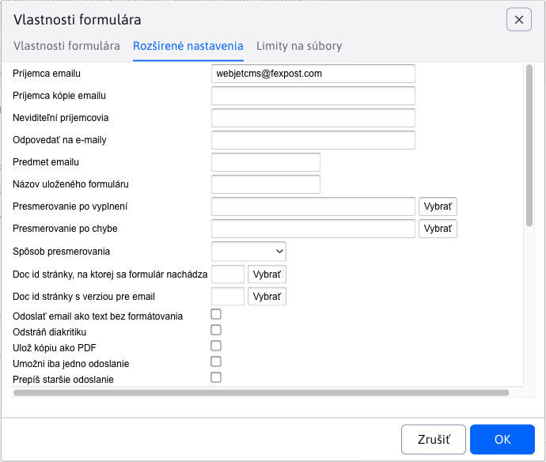

# Zoznam formulárov

Aplikácia formuláre slúži na pokročilú správu vyplnených formulárov. Každá web stránka môže obsahovať formulár, ktorý návštevník vyplní. Môžu to byť žiadosti o pracovné miesto, žiadosti o podrobnejšie informácie a podobne.

Formuláre môžu byť odoslané na email adresu, pričom v email správe formulár vyzerá rovnako ako na web stránke, je možné ho vytlačiť a ďalej spracovať.

Naviac, všetky formuláre sa ukladajú do databázy, v administračnej časti Web JET je možné sa k nim kedykoľvek vrátiť. Položky vo formulároch je možné usporadúvať podľa ľubovoľného stĺpca a exportovať do programu MS Excel.


Kliknutím na ikonu oka môžete formulár zobraziť do podoby, v akej je na web stránke a vytlačiť ho.

V editácii formuláru môžete meniť pole poznámka (v ktorom si môžete evidovať spracovanie/stav formuláru). Jednotlivé vyplnené polia sú len na čítanie, nie je možné ich po odoslaní meniť. V karte údaje sú jednotlivé položky vyplneného formuláru, v karte Prihlásený používateľ údaje používateľa, ktorý formulár odoslal (ak bol pri jeho odoslaní prihlásený).


## Export údajov

Formulárové záznamy je možné exportovať do formátu ```xlsx``` a ```csv```. V karte Pokročilé je možné nastaviť nasledovné možnosti exportu:

- Aktuálne vyfiltrované dáta - ak máte v tabuľke dáta filtrované podľa určitého stĺpca exportujú sa iba tieto údaje.
- Všetky dáta - exportujú sa všetky dáta bez ohľadu na nastavený filter v zobrazenej tabuľke.
- Zatiaľ neexportované dáta - exportujú sa len dáta, ktoré zatiaľ neboli exportované (majú prázdnu hodnotu v stĺpci Dátum posledného exportu). Môžete tak jednoducho postupne exportovať len novo pridané dáta.
- Iba označené riadky - exportujú sa iba označené riadky v tabuľke.

Po exporte sa automaticky nastaví stĺpec Dátum posledného exportu na aktuálny dátum a čas.


## Pokročilé možnosti nastavenia

Formuláru je možné nastaviť niektoré skryté hodnoty, ktoré ovplyvnia jeho spracovanie. Štandardne nie je potrebné špeciálne nastavovať ani jednu z týchto hodnôt.

- ```recipients``` - zoznam príjemcov emailu. Môže obsahovať viac príjemcov oddelených čiarkou.
  - **Upozornenie:** z dôvodu zamedzenia odosielania emailov cez systém na cudzie adresy (`mail relay server`) kontroluje systém, či zadaná cieľová email adresa sa nachádza v tele pôvodnej stránky. Ak teda emailovú adresu dynamicky meníte, musí sa nachádzať v tele stránky.
- ```ccEmails``` - zoznam email adries oddelených čiarkami na ktoré má byť zaslaná kópia emailu.
- ```bccEmails``` - zoznam email adries oddelených čiarkami na ktoré má byť zaslaná skrytá kópia emailu.
- ```subject``` - predmet emailu. Ak nie je vyplnené automaticky sa použije podľa web stránky.
- ```email / e-mail``` - pole určujúce emailovú adresu odosielateľa emailu. Ak sa jedná o kontaktný formulár je ideálne ak sa takto volá priamo pole, kde návštevník stránky zadáva email.
- ```name / firstname / lastname / meno / priezvisko / jmeno / prijmeni``` - pole určujúce meno odosielateľa emailu. Ak sa jedná o kontaktný formulár je ideálne ak sa takto volá priamo pole, kde návštevník stránky zadáva svoje meno.
- ```savedb``` - názov pod ktorým sa formulár uloží do databázy.
- ```forward``` - url adresa, na ktorú sa má vykonať presmerovanie po uložení formuláru. Ak nie je zadané presmeruje sa na pôvodnú stránku.
- ```forwardFail``` - url adresa, na ktorú sa má vykonať presmerovanie, ak sa formulár nepodarí odoslať. Ak nie je zadané, použije sa rovnaká hodnota ako má ```forward```.
- ```forwardType``` - typ presmerovania po spracovaní formuláru.
    - Ak nie je hodnota zadaná tak sa formulár spracuje a následne sa vykoná presmerovanie na zadanú stránku s nastaveným parametrom stavu odoslania (napr.` formSend=true`).
    - Hodnota ```forward``` znamená, že na cieľovú stránku sa vykoná interné presmerovanie. Cieľová stránka má tak prístup k identickým parametrom ako formulár a môže vykonať dodatočnú akciu. Keďže sa jedná o interné presmerovanie v adresnom riadku prehliadača zostane hodnota ```/formmail.do```.
    - Hodnota ```addParams``` vykoná presmerovanie na cieľovú stránku s pridaním jednotlivých parametrov do URL. V takomto prípade presmerovanie vykoná prehliadač a v adresnom riadku zostane adresa cieľovej stránky. Keďže ale parametre sú pridané do URL adresy je limitovaný ich počet dĺžkou URL čo je štandardne 2048 znakov.
- ```useFormDocId``` - doc ID stránky na ktorej sa formulár nachádza. Štandardne sa systém túto stránku snaží určiť na základe ```refereru```, alebo posledne zobrazenej stránky v `session`. Pre presné určenie je možné zadať túto hodnotu. Ak nie je zadaná WebJET ju automaticky doplní pri zobrazení formuláru.
- ```useFormMailDocId``` - doc ID stránky s verziou pre email. Stránku systém potrebuje na to, aby vedel vygenerovať emailovú podobu. Ak je zadaná hodnota none nepoužije sa určenie web stránky pre email. Ak hodnota nie je zadaná vôbec použije sa hodnota zadaná parametrom ```useFormDocId```. Hodnota je užitočná v tom prípade, ak na všetkých stránkach máte jeden kontaktný formulár vkladaný napr. v pätičke. Pri generovaní emailu sa ako kód použije kód samotnej stránky, v ktorej sa ale formulár nenachádza. Takto je možné povedať aby pre email použil inú stránku.
- ```forceTextPlain``` - ak parameter existuje je email odoslaný ako ```text/plain``` verzia, inak je odoslaný ako ```multipart```.
- ```formMailEncoding``` - typ kódovania znakov emailu. Štandardne sa použije kódovanie rovnaké ako má web stránka. Ak je ako hodnota nastavené ASCII tak je z textu odstránená diakritika.
- ```fieldsEmailHeader``` - ak má vygenerovaný email obsahovať špeciálnu hlavičku je možné do tohto poľa zadať čiarkou oddelený zoznam názvov polí, ktorých hodnoty sa nastavia do hlavičky.
- ```formmail_overwriteOldForms``` - ak je prihlásený používateľ a toto pole je nastavené na hodnotu ```true```, tak ak už daný používateľ formulár odoslal, bude jeho hodnota prepísaná novou verziou. Formulár sa takto bude v databáza od jedného používateľa nachádzať len raz.
- ```formmail_allowOnlyOneSubmit``` - ak je prihlásený používateľ a toto pole je nastavené na hodnotu ```true```, tak ak už daný používateľ formulár odoslal, systém mu nedovolí ďalšie odoslanie. Formulár sa takto bude v databáza od jedného používateľa nachádzať len raz.
- ```formmail_sendUserInfoDocId``` - ak je nastavené na hodnotu ```docId``` niektorej web stránky, tak po úspešnom uložení formuláru je na email návštevníka (z poľa email / e-mail) zaslaný email s textom danej web stránky. Môže sa jednať napríklad o poďakovanie za vyplnenie formuláru, alebo ďalšie inštrukcie postupu.
- ```isPdfVersion``` - ak je nastavené na true, tak systém po uložení formuláru vygeneruje aj jeho PDF verziu do adresára ```/WEB-INF/formfiles/ID_FORMULARU_pdf.pdf```, pričom hodnota ```ID_FORMULARU``` je ```id``` formuláru v databáze.

## Nastavenie potvrdenia emailovej adresy

Formuláru je možné nastaviť **potvrdenie e-mailovej adresy** ( ```double opt-in``` ). Dosiahnete tak potvrdenie odoslania formuláru kliknutím na odkaz v e-maile a teda **overíte**, že návštevník, ktorý formulár vyplnil, zadal **skutočne platnú e-mailovú adresu**.

Pre zapnutie potvrdenia emailovej adresy je potrebné nastaviť:

1. Vo vlastnostiach formuláru, konkrétne v rozšírených nastaveniach  je potrebné zvoliť možnosť **Vyžadovať potvrdenie súhlasu e-mailom**. 
2. Vytvoriť stránku pre potvrdenie súhlasu, v nej musí byť vložená aplikácia `!INCLUDE(sk.iway.iwcm.components.form.DoubleOptInComponent)!`, ktorá súhlas na základe parametrov v databáze potvrdí. Stránka môže byť použitá pre viacero rôznych formulárov, môže mať URL adresu napríklad `/potvrdenie-double-optin/`.
3. Vytvoriť stránku s textom e-mailu napr. "Pre potvrdenie platnosti email adresy kliknite na nasledovný odkaz" a vložiť odkaz na stránku, kde bude potvrdenie súhlasu. Odkaz musí obsahovať parametre `!FORM_ID!,!OPTIN_HASH!`, teda napr. `/potvrdenie-double-optin/?formId=!FORM_ID!&hash=!OPTIN_HASH!`.  ID tejto stránky nastaviť do poľa ```Doc ID``` notifikácie pre používateľa.

Po kliknutí na odkaz v emaile sa vo formulári nastaví pole Dátum potvrdenia súhlasu, tak viete identifikovať formuláre, ktoré majú súhlas potvrdený. Zároveň formuláre, ktoré nemajú potvrdený súhlas sú zobrazené červenou farbou.


## Udalosť pri odoslaní formuláru

Po odoslaní formuláru cez AJAX je publikovaná udalosť `WJ.formSubmit`, na ktorú je možné počúvať, napr. ako:

```javascript
    window.addEventListener("WJ.formSubmit", function(e) { console.log("DataLayer, submitEvent: ", e); dataLayer.push({"formSubmit": e.detail.formDiv, "formSuccess": e.detail.success}); });
```

## Možné konfiguračné premenné

- ```formmailAllowedRecipients``` - Zoznam koncových častí email adries na ktoré je možné odoslať formuláre, napríklad: ```@interway.sk,podpora@demo.webjet.sk```. Štandardne prázdne, čo znamená, že formulár je možné odoslať na ľubovoľnú adresu
- ```formMailEncoding``` - znaková sada pre odosielanie emailov z formulárov. Štandardne nastavené na prázdnu hodnotu, čo znamená, že sa použije rovnaké kódovanie znakov ako je nastavené pre web stránky.
- ```spamProtection``` - ak je nastavené na ```true```, bude zapnutá ochrana proti spamu vo formulároch. Štandardne nastavené na ```true```.
- ```spamProtectionJavascript``` - ak je nastavené na ```all``` (budú chránené všetky formuláre) alebo ```formmail``` (chránené budú len formuláre odosielané na email), budú formuláre chránené ```javascriptom```, pre deaktivovanie funkcie je potrebné zadať ```none```. Štandardne nastavené na ```all```.
- ```spamProtectionSendInterval``` - čas v sekundách počas ktorého nie je možné znova odoslať formulár na email. Štandardne nastavené na 30.
- ```spamProtectionDisabledIPs``` - zoznam začiatkov IP adries oddelených čiarkou (alebo znak `*` pre všetkých), pre ktoré je spam ochrana vypnutá.
- ```formMailSendPlainText``` - ak je nastavene na ```true``` je email z formuláru odoslaný ako čistý text (nie HTML formát).
- ```formMailRenderRadioCheckboxText``` - ak je nastavene na ```true``` bude zobrazovať výberové a zaškrtávacie polia ako text ```[X]``` alebo ```[ ]```.
- ```formMailCropForm``` - ak je nastavené na ```true``` bude sa odosielať len časť obalená do ```tagov``` form.
- ```formmailHttpsDomains``` - Zoznam domén oddelených čiarkou, pre ktoré sa budú formuláre vždy odosielať cez zabezpečené httpS spojenie.
- ```checkFormValidateOnInit``` - Nastavenie validácie formuláru pri jeho inicializácii, pri nastavení na ```false``` sa pri zobrazení nevaliduje celý formulár, pri nastavení na ```true``` sa validuje.
- ```formMailFixedSenderEmail``` - Ak je nastavené na email adresu, použije sa ako fixná hodnota emailu odosielateľa. Na rozdiel od ```emailProtectionSenderEmail``` nenastaví pôvodný email do poľa ```reply-to```, takže odosielateľ nie je žiadno notifikovaný pri chybnom doručení (čo kvôli bezpečnosti môže byť niekedy potrebné).
- ```formmailShowClassicErrorMessage``` - Ak je nastavene na ```true``` bude zobrazovať klasické validačné hlásenie formuláru hore nad formulárom namiesto hlásenia pri jednotlivých poliach.
- ```formmailScrollTopAfterSend``` - Ak je nastavene na ```true``` posunie sa stránka po odoslaní na vrch formuláru (aby bolo vidno hlásenie o odoslaní).
- ```formmailResetFormAfterSend``` - Ak je nastavene na ```true``` po úspešnom odoslaní sa vyčistí formulár.
- ```formmailSendUserInfoSenderName``` - Pošle sa ako meno odosielateľa v e-maile pri odosielaní stránky podľa zadaného ```formmail_sendUserInfoDocId```. Ak je prázdne, pošle sa meno autora stránky, ktorej obsah sa posiela do e-mailu.
- ```formmailSendUserInfoSenderEmail``` - Pošle sa ako e-mail odosielateľa v e-maile pri odosielaní stránky podľa zadaného ```formmail_sendUserInfoDocId```. Ak je prázdne, pošle sa e-mail autora stránky, ktorej obsah sa posiela do e-mailu.