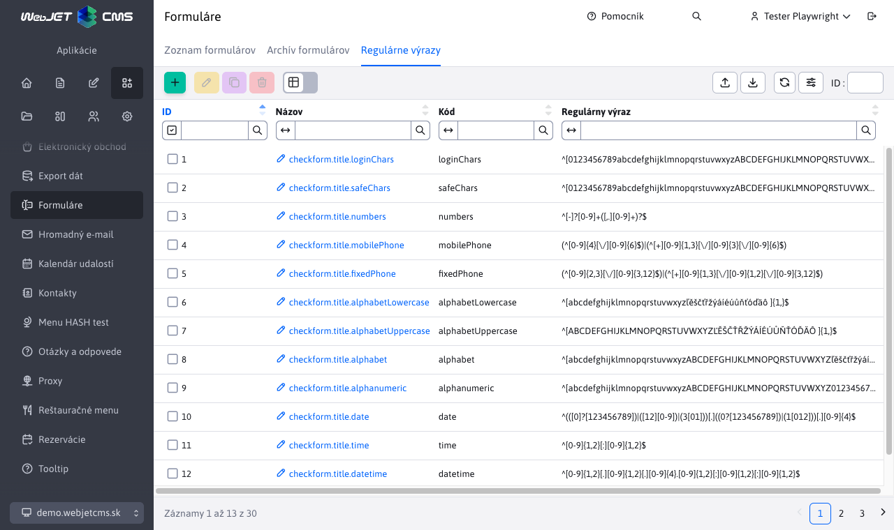
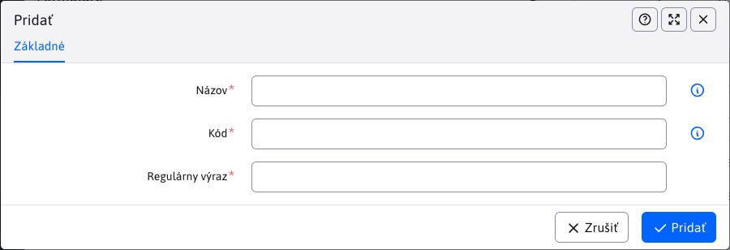

# Regulárne výrazy

Aplikácia Formuláre obsahuje uzol Regulárne výrazy, cez ktoré je možné definovať pravidlá pre kontrolu vyplnenia polí. Pravidlá sa definujú pomocou regulárneho výrazu.

Editor obsahuje nasledovné polia.

- Názov - Názov, alebo lepšie prekladový kľúč, pravidla. Názov by mal byť výstižný a jasný pre používateľa (napr. minimálne 8 znakov).
- Kód - Kódové označenie, môže obsahovať len písmená bez medzier. V HTML kóde sa použije ako CSS trieda na vstupnom poli.
- Regulárny výraz - [Regulárny výraz](https://www.w3schools.com/jsref/jsref_obj_regexp.asp) pravidla.

