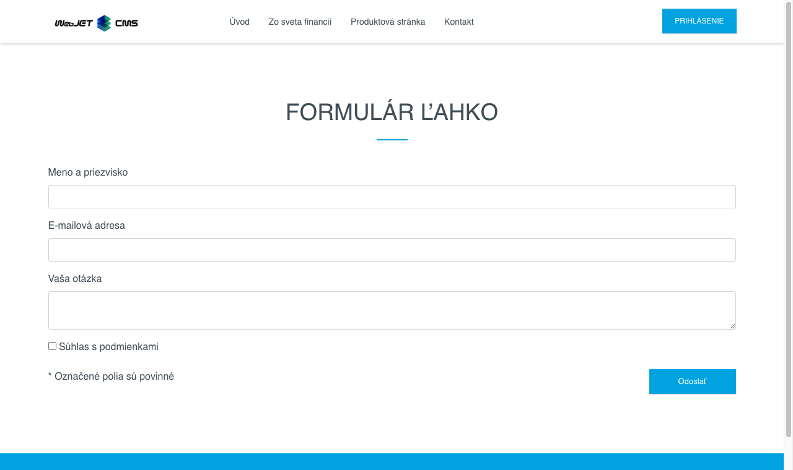
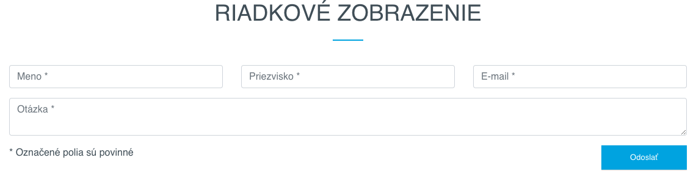
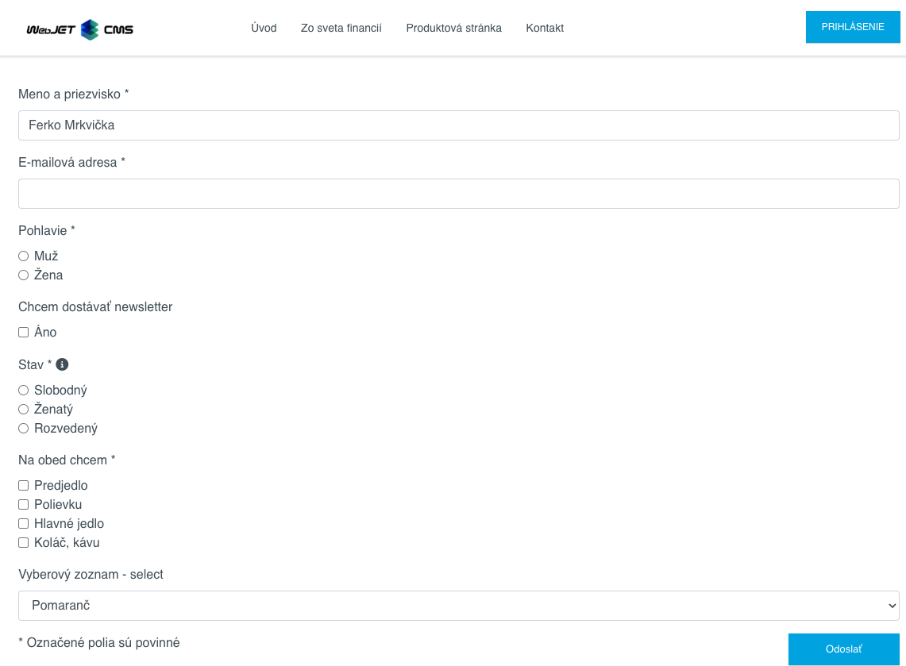

# Formulár ľahko

Aplikácia formulár ľahko slúži na jednoduchú tvorbu formulárov. Výhoda je v jednoduchosti vytvorenia formuláru jednoduchým vkladaním pripravených vstupných polí s možnosťou zadania iného názvu poľa, označenia povinnosti vyplnenia a nastavenia textu vysvetlivky (```tooltip```). S výstupným HTML formátom sa autor formuláru nemusí zaoberať, je pripravený podľa dizajnu webu pre jednotlivé typy vstupných polí.

## Štýl a nastavenia

Formuláru je potrebné nastaviť nasledovné hodnoty.

- Unikátne meno formuláru - zadané meno formuláru by malo byť unikátne pre celý web, pod týmto menom sa formulár uloží do aplikácie Formuláre.
- Email adresa príjemcu - zoznam email adries oddelených čiarkami na ktoré má byť zaslaný vyplnený formulár.
- Riadkové zobrazenie - polia formuláru sa zobrazia v riadku vedľa seba (inak je každé pole na novom riadku). Pre vytvorenie nového riadku vložte do formuláru pole Nový riadok.
- Text na začiatku e-mailu - text, ktorý sa pridá do emailu pred polia formuláru.
- Text na konci e-mailu - text, ktorý sa pridá do emailu za polia formuláru.
- Odoslať email ako text bez formátovania - ak zaškrtnete je email odoslaný ako neformátovaná text verzia (vo formáte meno poľa: hodnota), inak je odoslaný ako formátovaný HTML text v podobe ako je zobrazený na web stránke.
- Šifrovací kľúč - ak chcete hodnoty formuláru zašifrovať, môžete zadať šifrovací kľúč.
- Pridať technické informácie - ak zaškrtnete pridajú sa do emailu aj technické informácie (názov stránky, adresa stránky, dátum a čas odoslania, informácia o prehliadači).


Štandardne sa polia formuláru zobrazujú pod sebou:



Po zvolení možnosti Riadkové zobrazenie sa polia môžu zobrazovať v riadku vedľa seba. Pre vytvorenie nového riadku vložte do formuláru pole ```Nový riadok```:



## Položky

V karte položky môžete pridať nové pole formuláru, presúvať poradie polí (pomocou drag & drop) a mazať pole formuláru kliknutím na ikonu mazania.


Pole (položku) formuláru pridáte kliknutím na tlačidlo Nová položka, ktorá je zobrazená pod zoznamom existujúcich polí. Vo výberovom poli Typ poľa si môžete vybrať z definovaných polí formuláru. Väčšina polí umožňuje zadať nasledovné polia:

- Názov - predstavuje meno poľa formuláru (zobrazený názov), ak ponecháte prázdne použije sa názov z výberového menu Typ poľa. Pre informačné polia (popisky) zadajte text, ktorý chcete zobraziť.
- Hodnota - pred vyplnená hodnota, ktorá sa zobrazí v poli pri jeho načítaní.
- Zástupný text - pre štandardné textové polia reprezentuje hodnotu zástupného textu (```placeholder```), ktorý sa zobrazí, keď je pole prázdne.
- Povinné pole - zaškrtnutím sa pole označí ako povinné pre odoslanie formuláru.
- Tooltip - ak zadáte hodnotu zobrazí sa pri názve poľa informačná bublina (vysvetlivka) s textom zadaným v tomto poli. Spôsob zobrazenia záleží od dizajnu web stránky (typicky vyžaduje podporu [FontAwesome](https://fontawesome.com) pre zobrazenie ikony).

**Poznámka:** ak je v poli ```Hodnota``` prázdny text a je zadaný text v ```Zástupný text```, tak sa pri zobrazení formuláru na web stránke nezobrazí názov poľa samostatne ale len ako zástupný text. Umožňuje to vytvoriť menší formulár z pohľadu jeho priestoru na web stránke.

Pre **skupiny polí (napr. Skupina výberových alebo zaškrtávacích polí)** sa v poli Hodnota definuje zoznam možností. Ako rozdeľovač možností sa hľadá znak ```|```, ak sa nenájde hľadá sa znak ```,```, ak sa nenájde použije sa medzera. Môžete teda zadať napr. ```Slobodný,Ženatý,Rozvedený```, alebo ak v možnosti potrebujete zadať čiarku tak použite oddeľovač ```|``` ako ```Predjedlo|Polievku|Hlavné jedlo|Koláč, kávu``` (možnosť ```Koláč, káva``` bude jedna položka).

Pre **Výberový zoznam - select** je možné zadať aj rozdielny text pre zobrazenú informáciu a zvolenú hodnotu. Zobrazený text a hodnota sa oddeľuje znakom ```:```. Príklad: ```Pomaranč:orange,Jablko:apple``` vypíše výberové pole (select) s textovými hodnotami Pomaranč alebo Jablko ale pri výbere sa vo formulári uloží hodnota ```orange``` alebo ```apple```.



## Informácia pre web dizajnéra

HTML kód zobrazenia polí a formuláru sa definuje v Nastavenia-Editácia textov. Textové kľúče majú prefix ```components.formsimple.```.


Základný kód formuláru je v kľúčoch:

- ```components.formsimple.form.start``` - HTML kód začiatku formuláru (otvárací form tag)
- ```components.formsimple.form.end``` - HTML kód konca formuláru (zatvárací form tag)
- ```components.formsimple.requiredLabelAdd``` - text, ktorý sa pridá k textu label elementu pre povinné pole (typicky znak *)
- ```components.formsimple.tooltipCode``` - HTML kód pre generovanie ${tooltip} náhrady
- ```components.formsimple.techinfo``` - HTML kód pre generovanie technických informácií do emailu

Jednotlivé položky definujete cez kľúče:

- ```components.formsimple.label.NAZOV``` - názov položky (typicky hodnota label elementu)
- ```components.formsimple.input.NAZOV``` - HTML kód položky
- ```components.formsimple.hide.NAZOV``` - zoznam polí, ktoré sa pre túto položku v administrácii nezobrazia (možné hodnoty: label,required,tooltip,placeholder)
- ```components.formsimple.firstTimeHeading.NAZOV``` - nadpis nad poľom, zobrazí sa len pri prvom výpise poľa s týmto názvom (používa sa pre výberové a zaškrtávacie polia)

Príklad:

```html
//najjednoduchsi typ pola
components.formsimple.label.meno=Meno
components.formsimple.input.meno=<div class="form-group"><label for="${id}">${label}${tooltip}</label> <input class="${classes}form-control" data-name="${labelSanitized}" id="${id}" name="${id}" placeholder="${placeholder}" type="text" maxlength="20" />${cs-error}</div>

//pole, ktoremu sa nezobrazi moznost zadat ze sa jedna o povinne pole (moznost .hide)
components.formsimple.label.popiska=Popiska (info text)
components.formsimple.input.popiska=<div class="form-group"><label for="${id}">${label}${tooltip}</label></div>
components.formsimple.hide.popiska=required

//ukazka pouzitia nadpisu nad vyberovym polom, hodnota .firstTimeHeading sa zobrazi len pred prvym polom
components.formsimple.label.radio=Výberové pole
components.formsimple.input.radio=<div class="form-check"><input class="${classes}form-check-input" data-name="${labelSanitized}" id="${id}" name="${id}" type="radio" value="${value}"/> <label for="${id}" class="form-check-label">${value}${tooltip}</label> ${cs-error}</div>
components.formsimple.firstTimeHeading.radio=<div class="form-group mt-3 mb-0"><label class="first-time">${label}</label></div>
components.formsimple.hide.radio=placeholder

//ukazka pouzitia ${iterable} pre vypis zoznamu vyberovych poli. Z pola Hodnota sa vytvori zoznam, ako oddelovac sa hlada znak | ak sa nenajde pouzije sa , a ak sa ani ta nenajde pouzije sa ako oddelovac medzera
//v kluci components.formsimple.iterable.radiogroup sa definuje HTML kod opakovaneho zaznamu, ten sa vlozi na miesto ${iterable}
components.formsimple.label.radiogroup=Skupina výberových polí
components.formsimple.input.radiogroup=<div class="form-group"><label for="${id}">${label}${tooltip}</label>${iterable} ${cs-error}</div>
components.formsimple.iterable.radiogroup=<div class="form-check"><input class="${classes}form-check-input" data-name="${labelSanitized}" id="${id}-${counter}" name="${id}" placeholder="${placeholder}" type="radio" value="${value}"/> <label for="${id}-${counter}" class="form-check-label">${value}</label></div>
components.formsimple.hide.radiogroup=placeholder

//ukazka pouzitie ${iterable} pre vypis SELECT pola
components.formsimple.label.select=Výberový zoznam - select
components.formsimple.input.select=<div class="form-group"><label for="${id}">${label}${tooltip}</label><select name="${id}" id="${id}" class="form-control form-select">${iterable} </select>${cs-error}</div>
components.formsimple.iterable.select=<option value="${value}">${value-label}</option>
```

V kóde je možné použiť nasledovné značky, ktoré sa pri zobrazení formuláru nahradia:

- ```${formname}``` - meno formuláru bez medzier, diakritiky, malými písmenami, používa sa pre form element do atribútu name (to by malo ešte začínať výrazom formMail pre použitie v štandardnom validačnom mechanizme)
- ```${savedb}``` - rovnaká hodnota ako ```formname```, používa sa pre prehľadnosť v URL odoslania formuláru
- ```${id}``` - ID elementu generované z jeho názvu (pole Hodnota v administrácii), bez medzier, diakritiky, malými písmenami
- ```${label}``` - text pre label element, hodnota z poľa názov v administrácii
- ```${labelSanitized}``` - text pre label element, hodnota z poľa názov v administrácii, upravené špeciálne znaky aby ho bolo možné použiť v HTML atribúte
- ```${value}``` - text z poľa hodnota v administrácii
- ```${placeholder}``` - zástupný text, zobrazí sa keď má pole prázdnu hodnotu
- ```${classes}``` - dodatočné CSS štýly, aktuálne ```required``` ak je zaškrtnuté Povinné pole v administrácii
- ```${tooltip}``` - HTML kód pre tooltip, hodnota z poľa Tooltip v administrácii
- ```${cs-error}``` - generovaný HTML kód pre chybovú hlášku
- ```${iterable}``` - na uvedené miesto sa vloží opakujúci zoznam polí (napr. skupina výberových polí), pričom kód, ktorý sa opakuje je definovaný kľúčom ```components.formsimple.iterable.MENO_POLA```
- ```${counter}``` - poradové číslo pre opakujúci záznam, je potrebný na nastavenie unikátneho ```id``` a ```for``` atribútu
- ```${value-label}``` - textová hodnota (label) pre opakujúci záznam, ak obsahuje inú hodnotu pre ```value``` a pre ```label``` (napr v ```option``` tagu). Používateľ zadáva možné hodnoty ako ```label:value```, teda ako napr. ```Pomaranč:orange,Jablko:apple``` pre zobrazenie uvedených možností.
- ```{enumeration-options|ID_CISELNIKA|MENO_VALUE|MENO_LABEL}``` - napojenie získania zoznamu ```option``` hodnôt z aplikácie číselník. Zadané je ID číselníka, názov stĺpca pre hodnotu a názov stĺpca pre text.

V zobrazení do emailu sa hodnota poľa tooltip nahrádza za prázdny znak (aby v emaile nebol zbytočne nefunkčný tooltip).