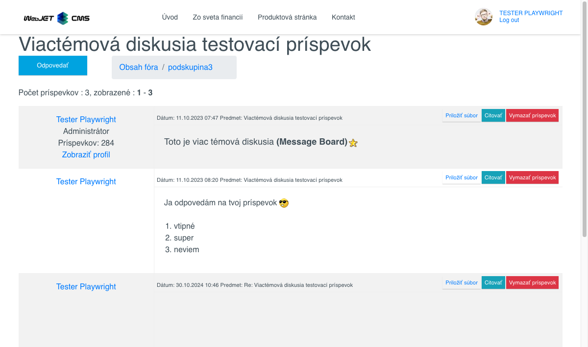
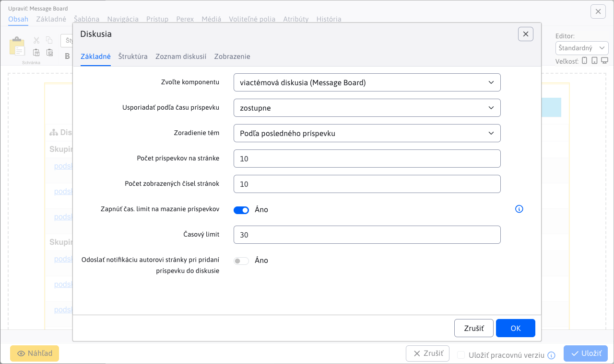

# Fórum/Diskusia

Aplikácia Fórum/Diskusia, ktorá umožňuje do stránky vložiť diskusiu, má nasledovné možnosti zobrazenia:
- Diskusné fórum - jednoduchá diskusia pod článkom.
- Nástenka diskusií - viactémová diskusia (```Message board```), kde sa diskusia delí na skupiny a pod-témy, ktoré budú obsahovať jednotlivé príspevky. Pod-témy môže pridávať aj používateľ.

## Diskusné fórum

"Diskusné fórum" je typ jednoduchej diskusie.


Nastavenie aplikácie pozostáva z dvoch kariet **Parametre aplikácie** a **Zoznam diskusií**


### Karta - Parametre aplikácie

Karta parametre aplikácie obsahuje niekoľko dodatočných parametrov a obmedzení :
- **Zvoľte komponentu** - výber medzi "Diskusným fórom" a "Nástenkou diskusií" (výber typu diskusie).
- **Usporiadať podľa času príspevku** - zostupné alebo vzostupné usporiadanie.
- **Spôsob zobrazenia textu stránky**
    - Vložený rámec (`iframe`) - pri zobrazení kompletného výpisu diskusie, sa obsah pôvodnej stránky zobrazí do rámca.
    - Zobrazí sa perex - pri zobrazení kompletného výpisu diskusie, sa zobrazí iba perex pôvodnej stránky.
    - Nezobrazí sa vôbec - zobrazí sa iba výpis diskusie.
    - Normálne - pri zobrazení kompletného výpisu diskusie, sa zobrazí aj kompletné znenie pôvodnej stránky
    - Celé fórum, vrátane textov - do stránky sa vloží kompletný výpis celej diskusie.
- **Stránkovať diskusiu** - pri povolení stránkovať diskusiu sa objaví ešte dodatočný parameter **Počet príspevkov na stránke**, ktorý určí, ako sa bude stránkovať a jeho prednastavená hodnota je 10.
- **Odoslať notifikáciu autorovi stránky pri pridaní príspevku do diskusie** - ak je možnosť zvolená, autor stránky kde sa daná diskusia nachádza bude e-mailom informovaný o každom pridanom príspevku do diskusie (výnimka je iba v prípade, že samotný autor stránky pridal príspevok).

!>**Upozornenie:** ak chcete aby **každý** autor stránky s diskusiou dostával notifikáciu, môžete to nastaviť konfiguračnou premennou  ```forumAlwaysNotifyPageAuthor```, ktorú nastavíte na hodnotu ```true```. Ak ju nastavíte na hodnotu ```false```, bude to záležať od nastavenia jednotlivých diskusii. **To isté platí aj pre Nástenku diskusií**

Ak chcete aby vždy autor stránky s diskusiou dostával notifikáciu, môžete nastaviť konfiguračnú premennú  ```forumAlwaysNotifyPageAuthor``` na hodnotu ```true```.

### Karta - Zoznam diskusií

Karta zoznam diskusií je vnorená stránka so zoznamom všetky diskusií (Diskusné fórum aj Nástenka diskusií). O zozname diskusií sa dozviete viac tu [Zoznam diskusií](forum-list.md).

## Nástenka diskusií

"Nástenka diskusií", tiež označovaná ako ```Message board```, je typ viactémovej diskusie. Do stránky sa dá vložiť ako aplikácia. Diskusia sa delí na skupiny (sekcie) a na pod-témy. Pre každú pod-tému sa eviduje počet pridaných príspevkov, počet videní a dátum pridania posledného príspevku, ktoré sú zobrazené pod názvom témy.


Návštevník teda môže vytvoriť novú tému a následne do témy sa pridávajú diskusné príspevky. Vytvára sa tak určitá stromová štruktúra diskusných príspevkov.



Nastavenie aplikácie pozostáva z dvoch kariet **Parametre aplikácie** a **Zoznam diskusií**.



### Karta - Parametre aplikácie

Karta parametre aplikácie obsahuje niekoľko dodatočných parametrov:
- **Zvoľte komponentu** - výber medzi "Diskusným fórom" a "Nástenkou diskusií" (výber typu diskusie).
- **Smer usporiadania** - zostupné alebo vzostupné usporiadanie.
- **Zoradenie tém** a to
    - Podľa posledného príspevku.
    - Podľa dátumu vytvorenia témy.
- **Počet príspevkov na stránke** - zadajte počet príspevkov, ktoré sa zobrazia na jednej stránke. Prednastavená hodnota je 10.
- **Počet zobrazených čísel stránok** - určuje počet priamych číselných odkazov na stránky zo stránkovaného zoznamu. Prednastavená hodnota je 10.
- **Zapnúť čas. limit na mazanie príspevkov** - zapnite ho, ak chcete umožniť mazanie príspevkov len pokým neuplynie časový limit. Na vymazanie príspevku má právo iba jeho autor.
- **Časový limit (min)** - uveďte číselnú hodnotu v min. Prednastavená hodnota je 30 minút.
- **Odoslať notifikáciu autorovi stránky pri pridaní príspevku do diskusie** - ak je možnosť zvolená, autor stránky kde sa daná diskusia nachádza bude e-mailom informovaný o každom pridanom príspevku do diskusie (výnimka je iba v prípade, že samotný autor stránky pridal príspevok).

!>**Upozornenie:** ak chcete aby vždy autor stránky s diskusiou dostával notifikáciu, môžete nastaviť konfiguračnú premennú  ```forumAlwaysNotifyPageAuthor``` na hodnotu ```true```.

### Zoznam diskusií

Karta zoznam diskusií je vnorená stránka so zoznamom všetky diskusií (Diskusné fórum aj Nástenka diskusií). O zozname diskusií sa dozviete viac tu [Zoznam diskusií](forum-list.md).