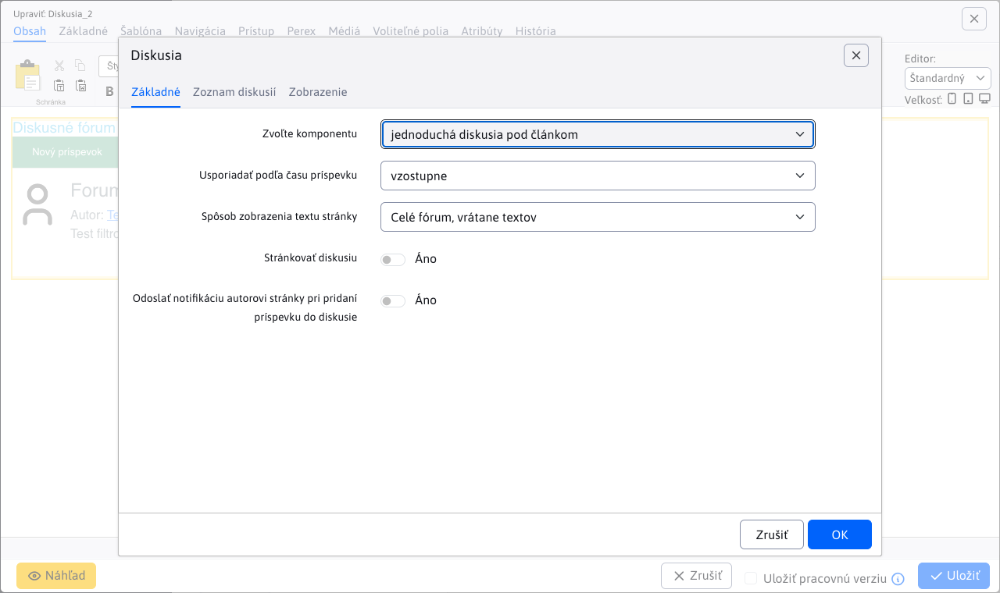

# Nastavenie aplikácie v stránke

Aplikácia Fórum/diskusia, umožňuje do stránky vložiť diskusiu, má nasledovné možnosti zobrazenia:

- Diskusné fórum - jednoduchá diskusia pod článkom
- `Message board` - viac témová diskusia kde sa diskusia delí skupiny na podtémy, ktoré budú obsahovať jednotlivé príspevky. Podtémy môže pridávať aj používateľ.

## Diskusné fórum

Diskusné fórum je typ jednoduchej diskusie.


Nastavenie aplikácie pozostáva z dvoch kariet ```Parametre aplikácie``` a ```Zoznam diskusií```



### Parametre aplikácie

Tab parametre aplikácie obsahuje niekoľko dodatočných parametrov a obmedzení :

- ```Zvoľte komponentu```, výber medzi Diskusným fórom a `Message board` (výber typu diskusie).
- ```Usporiadať podľa času príspevku```, zostupné alebo vzostupné usporiadanie.
- ```Spôsob zobrazenia textu stránky```
    - Vložený rámec (iframe) - pri zobrazení kompletného výpisu diskusie, sa obsah pôvodnej stránky zobrazí do rámca.
    - Zobrazí sa perex - pri zobrazení kompletného výpisu diskusie, sa zobrazí iba perex pôvodnej stránky.
    - Nezobrazí sa vôbec - zobrazí sa iba výpis diskusie.
    - Normálne - pri zobrazení kompletného výpisu diskusie, sa zobrazí aj kompletné znenie pôvodnej stránky
    - Celé fórum, vrátane textov - do stránky sa vloží kompletný výpis celej diskusie.
- ```Stránkovať diskusiu```, pri povolení stránkovať diskusiu sa objaví ešte dodatočný parameter ```Počet príspevkov na stránke```, ktorý určí, ako sa bude stránkovať a jeho prednastavená hodnota je 10.

### Zoznam diskusií

Karta zoznam diskusií je vnorená stránka so zoznamom všetky diskusií (diskusné fórum aj message board). O zozname diskusií sa dozviete viac tu ['Zoznam diskusií'](forum-list.md).

## Message board

`Message board` je typ viactémovej diskusie. Do stránky sa dá vložiť ako aplikácia. Diskusia sa delí skupiny (sekcie) a na podtémy. Pre každú pod tému sa eviduje počet pridaných príspevkov, počet videní a dátum pridania posledného príspevku, ktoré sú zobrazené pod názvom témy.

Návštevník teda môže vytvoriť novú tému a následne do témy sa pridávajú diskusné príspevky. Vytvára sa tak určitá stromová štruktúra diskusných príspevkov.


Nastavenie aplikácie pozostáva z dvoch kariet ```Parametre aplikácie``` a ```Zoznam diskusií```


### Parametre aplikácie

Karta parametre aplikácie obsahuje niekoľko dodatočných parametrov:

- ```Zvoľte komponentu```, výber medzi Diskusným fórom a Message board (výber typu diskusie).
- ```Smer usporiadania```, zostupné alebo vzostupné usporiadanie.
- ```Zoradienie tém``` a to
    - Podľa posledného príspevku.
    - Podľa dátumu vytvorenia témy.
- ```Počet príspevkov na stránke```, zadajte počet príspevkov, ktoré sa zobrazia na jednej stránke. Prednastavená hodnota je 10.
- ```Počet zobrazených čísel stránok```, určuje počet priamych číselných odkazov na stránky zo stránkovaného zoznamu. Prednastavená hodnota je 10.
- ```Zapnúť čas. limit na mazanie príspevkov```, zapnite ho, ak chcete umožniť mazanie príspevkov len pokým neuplynie časový limit. Na vymazanie príspevku má právo iba jeho autor.
- ```Časový limit (min)```, uveďte číselnú hodnotu v min. Prednastavená hodnota je 30 minút.

### Zoznam diskusií

Karta zoznam diskusií je vnorená stránka so zoznamom všetky diskusií (diskusné fórum aj message board). O zozname diskusií sa dozviete viac tu ['Zoznam diskusií'](forum-list.md).