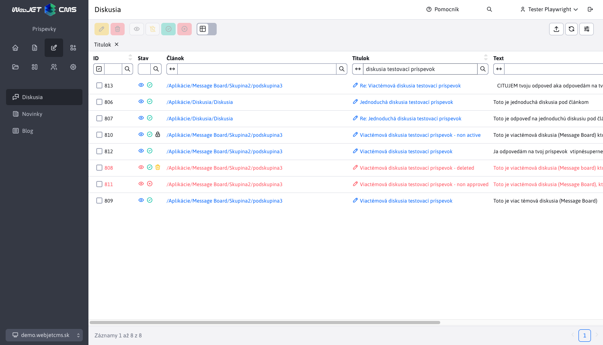
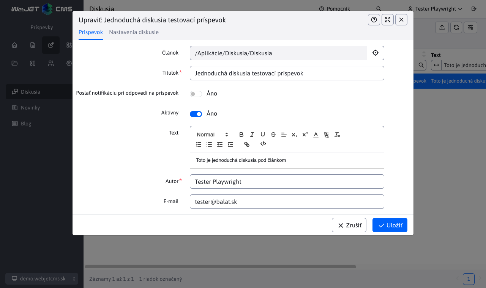
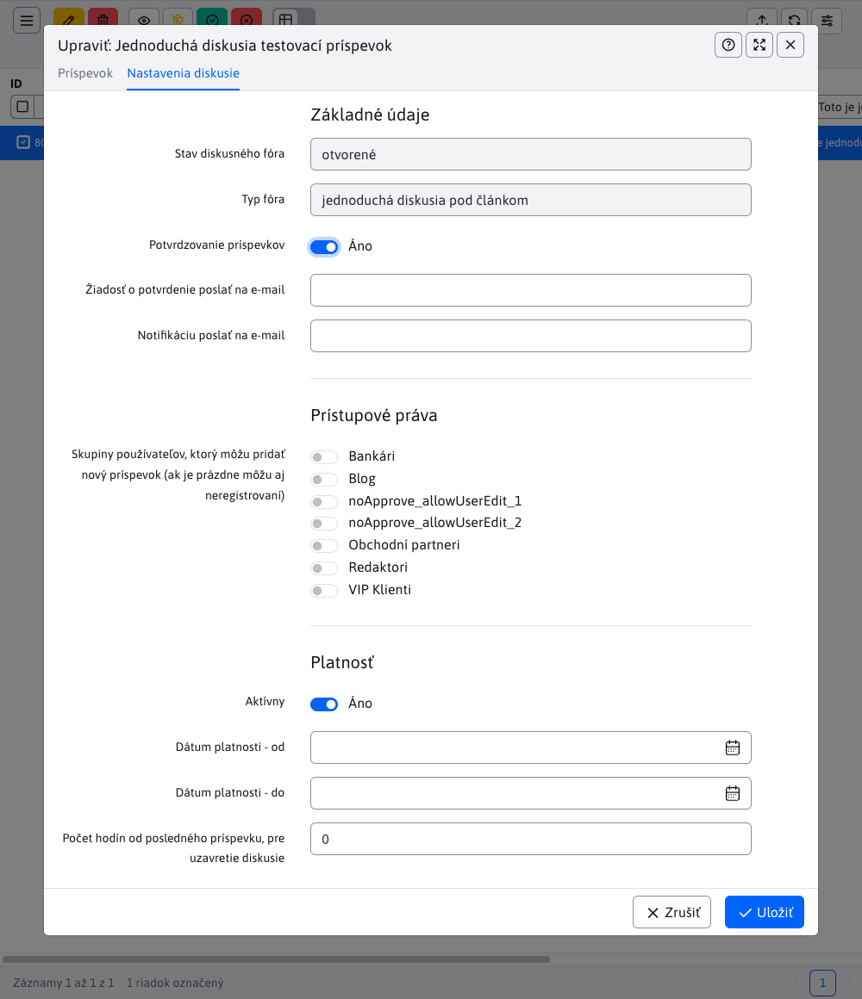
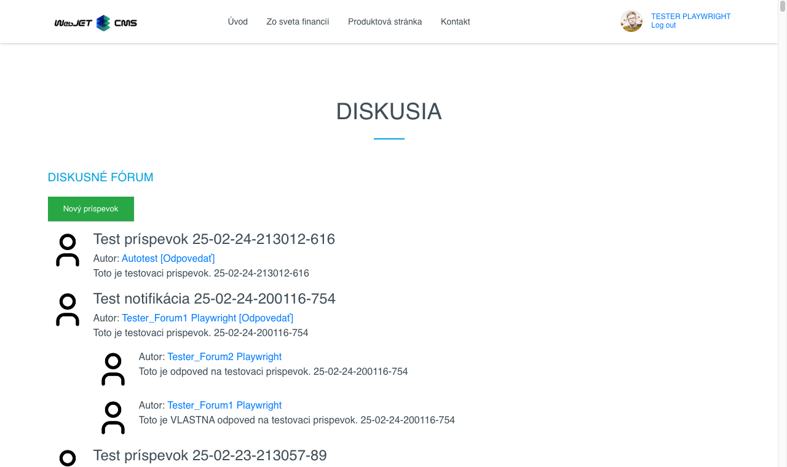
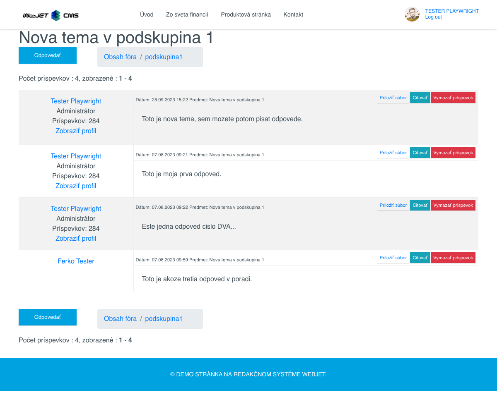
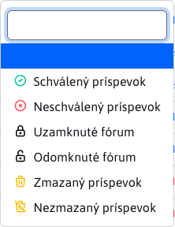
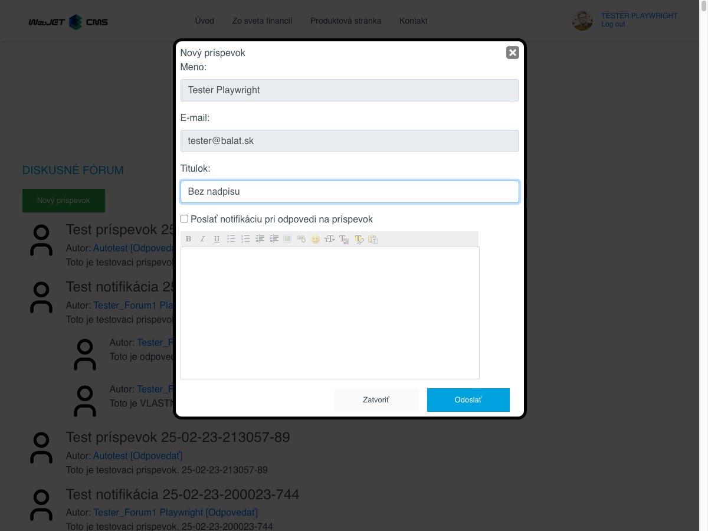
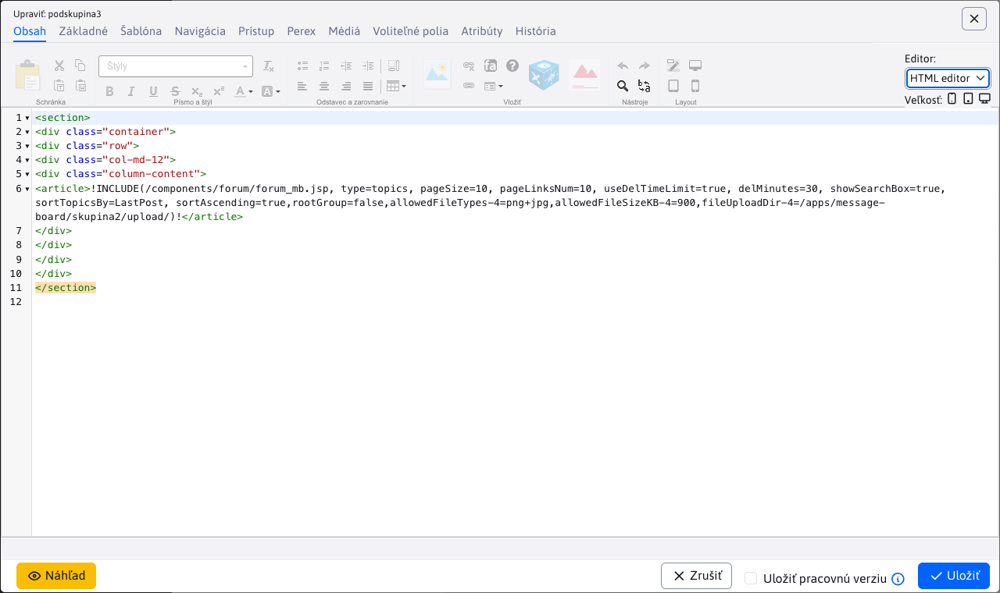

# Zoznam diskusií

Zoznam diskusií sa nachádza v sekcií Príspevky. Obsahuje zoznam všetkých príspevkov, ktoré patria pod ```Diskusné fóra``` a ```Message board```.



## Editácia príspevku

Na editáciu príspevku slúži tlačidlo , ktoré vyvolá editor a je aktívne iba ak je označený aspoň jeden príspevok. Editor môže byť vyvolaný aj kliknutí na hodnotu stĺpca ```Titulok``` v tabuľke.



Editácia príspevku sa nachádza v karte editor **Základné** a obsahuje polia:

- ```Článok```, web stránka, ku ktorej je diskusia pripojená
- ```Titulok```, predmet/názov príspevku
- ```Poslať notifikáciu pri odpovedi na príspevok```, môžete nastaviť zaslanie notifikačného email-u
- ```Aktívny```, môžete nastaviť aktivitu príspevku
- ```Text```, samotný text príspevku
- ```Autor```, meno autora príspevku
- ```E-mail```, email adresa autora príspevku, posiela sa naň notifikácia v prípade zvolenej možnosti odpovedi na príspevok

## Editácia fóra

Editácia celého fóra sa nachádza v karte editora **Nastavenia**. Otvorenie samotného editora je opísané v predchádzajúcej sekcii (editácia príspevku). To znamená, že každý príspevok fóra zdieľa rovnaké nastavenia pre celé fórum v tejto karte.

Samotná karta **Nastavenia** obsahuje parametre diskusného fóra a delí sa na 3 sekcie.



### Sekcia - Základné údaje

Obsahuje základné údaje o diskusnom fóre v poliach:

-   ```Stav diskusného fóra```, informuje o aktivite diskusie. V prípade, že je presiahnuté niektoré z obmedzení, alebo je manuálne vypnutá aktivita, bude stav diskusného fóra: "uzavreté" (viac v sekcií **Platnosť**)
-   ```Typ fóra```, má hodnotu "jednoduchá diskusia pod článkom" alebo "viactémová diskusia (Message Board)"
-   ```Oznamy - podtémy môžu vytvárať len administrátori```, **Pozor**, toto pole sa zobrazí iba v prípade "Message Board-u". Ak je táto možnosť zvolená, oznamy/podtémy budú môcť vytvárať iba administrátori (viac v sekcií **Prístupové práva**)
-   ```Potvrdzovanie príspevkov```, ak označíte túto možnosť, tak pri každom pridaní nového príspevku, sa na uvedenú adresu odošle mail s textom príspevku a odkazom na túto tabuľku, v ktorej sa príspevok automatický vyfiltruje
-   ```Žiadosť o potvrdenie poslať na e-mail```, pole obsahujúce email kam sa žiadosti o potvrdenie odošlú. Samotné pole sa zobrazí iba v prípade, ak je možnosť ```Potvrdzovanie príspevkov``` vybraná. V takomto prípade bude editor vyžadovať zadanie tohto emailu.
-   ```Notifikáciu poslať na e-mail```, toto pole má rovnakú úlohu ako pole obsahuje emailovú adresu, na ktorú sa odošle email vždy, keď akýkoľvek príspevok pribudne do diskusného fóra.

### Sekcia - Prístupové práva

Sekcia obsahuje nastavenia prístupových práv. Presnejšie výber ```Skupiny používateľov, ktorý môžu pridať nový príspevok (ak je prázdne môžu aj neregistrovaní)```. Vybrané môžu byť všetky skupiny, žiadna skupina alebo ich kombinácia.

**!! Pozor** , v prípade fóra typu "Message Board-u", máte možnosť zvoliť aj ```Skupiny administrátorov```. Ak ste v sekcií **Základné údaje** zvolili možnosť ```Oznamy - podtémy môžu vytvárať len administrátori```, tak výberom týchto skupín administrátorov určite, kto bude môcť vytvárať podtémy.

### Sekcia - Platnosť

Sekcia obsahuje polia:

-   ```Aktívny```, môžete nastaviť aktivitu diskusného fóra. Tá je podmienená aj nasledovnými dátumovými a hodinovými obmedzeniami.
-   ```Dátum platnosti (od)```, nastavte dátum a čas, odkedy má byť fórum aktívne.
-   ```Dátum platnosti (do)```, nastavte dátum a čas, konca platnosti fóra.
-   ```Počet hodín od posledného príspevku, pre uzavretie diskusie```, pokiaľ nastavíte hodnotu väčšiu ako 0, bude sa obmedzenie aktívne.

## Zobrazenie príspevku

Na zobrazenie príspevku slúži tlačidlo  alebo priamo kliknutie na hodnotu stĺpca ```Článok``` v tabuľke.

Tlačidlo je aktívne iba ak je označený aspoň jeden príspevok a funguje v závislosti od typu diskusie pod ktorú patrí príspevok.

**Diskusné fórum**

V prípade že príspevok patrí pod Diskusné fórum, stlačenie ikony  alebo odkazu v stĺpci  ```Článok``` má rovnaký výsledok. Budete presmerovaný na Diskusné fórum, kde budete vidieť všetky príspevky, nie len ten cez ktorý ste sa tam dostali. To znamená, že konkrétny príspevok nebude filtrovaný.



**Message board**

V prípade že príspevok patrí pod `Message board`, funkcia sa bude líšiť v závislosti čo stlačíte.

-   Ak využijete linku v stĺpci ```Článok```, budete presmerovaný na hlavnú stránku danej diskusie typu Message board, kde uvidíte zoznam všetkých tém diskusie. Odtiaľ sa viete presmerovať priamo na danú tému kliknutím na jej názov.


-   Ak využijete tlačidlo , budete presmerovaný priamo na tému diskusie, kde bude zoznam príspevkov. Opäť, konkrétny príspevok nebude filtrovaný ale uvidíte celý zoznam.



## Akcie nad fórami a príspevkami

Táto kapitola rozoberá možné akcie, ktoré môžete vykonať nad príspevkom fóra alebo nad celým fórom.

Treba si uvedomiť, že **jednotlivé akcie sa navzájom neovplyvňujú**. V praxi to znamená, že už vymazaný príspevok môže byť aj zamietnutý a taktiež aj uzamknutý. Alebo akákoľvek kombinácia týchto akcií.

### Mazanie a obnovenie príspevku

Na vymazanie príspevku slúži tlačidlo  a je aktívne iba ak je označený aspoň jeden príspevok. Mazanie má dva režimy:

- Označené ako zmazané - príspevok nebude vymazaný z databázy, iba označený ako vymazaný a stále bude v tabuľke dostupný. Takýto príspevok môže byť znovu obnovený a to tlačidlom obnovenia .
- Reálne zmazanie z databázy - príspevok bude vymazaný z databázy a už nikdy nebude prístupný.

To, ktorý mód mazania sa na pozadí použije závisí na nastavenej konfiguračnej premennej ```forumReallyDeleteMessages```. Ak je táto konfiguračná premenná nastavená na hodnotu ```true``` vykoná sa aj zmazanie záznamu z databázy.

**!! Pozor**
  - akcia mazania aj akcia obnovenia sú rekurzívne akcie. To znamená, že nie je vymazaný/obnovený iba samotný príspevok ale celá vetva pod ním, takže aj všetky odpovede na tento príspevok a odpovede na odpovede ...
  - vymazané príspevky sa v diskusií ďalej nezobrazujú a po obnovení sa opäť zobrazia aj s nahratými súbormi

### Mazanie a obnovenie fóra

Ak sa rozhodnete vymazať celé fórum, budú s ním vymazané aj všetky príspevky, ktoré pod neho patria. Celé fórum je užívateľom skryté a nie je možné sa na neho vrátiť ani pomocou zapamätanej url adresy.

Ak sa rozhodnete obnoviť celé fórum, budú s ním obnovené aj všetky príspevky. Fórum bude užívateľom opäť prístupné aj so všetkými príspevkami a nahratými súbormi.

### Schválenie a zamietnutie príspevku

Na schválenie príspevku slúži tlačidlo  a na zamietnutie príspevku slúži tlačidlo . Obe tieto tlačidlá sú aktívne iba v prípade, že je označený aspoň jeden príspevok. Tieto akcie nie sú limitované a príspevok je možné kedykoľvek schváliť alebo zamietnuť.

**!! Pozor**
  - akcia schválenia aj akcia zamietnutia sú rekurzívne akcie. To znamená, že nie je schválený/zamietnutý iba samotný príspevok ale celá vetva pod ním, takže aj všetky odpovede na tento príspevok a odpovede na odpovede ...
  - zamietnuté príspevky sa v fóre ďalej nezobrazujú a po ich schválení sa vo fóre opäť objavia aj s nahratými súbormi

### Schválenie a zamietnutie fóra

Ak sa rozhodnete zamietnuť celé fórum, budú s ním zamietnuté aj všetky príspevky, ktoré pod neho patria. Celé fórum je užívateľom skryté a nie je možné sa na neho vrátiť ani pomocou zapamätanej url adresy.

Ak sa rozhodnete schváliť celé fórum, budú s ním schválené aj všetky príspevky. Fórum bude užívateľom opäť prístupné aj so všetkými príspevkami a nahratými súbormi.

### Uzamknutie a odomknutie príspevku

Na uzamknutie príspevku je potrebné nastaviť hodnotu poľa ```Aktívny``` na false (nezvoliť možnosť). Pole sa nachádza v editore príspevku, presnejšie v karte **Základné**. Pri výbere možnosti ```Aktívny``` (nastavenie hodnoty na true) sa príspevok fóra odomkne.

**!! Pozor**
  - akcia uzamknutia (nastavenie príspevku ako aktívne) a akcia uzamknutia (nastavenie fóra ako neaktívne) sú rekurzívne akcie. To znamená, že nie je uzamknutý/odomknutý iba samotný príspevok ale celá vetva pod ním, takže aj všetky odpovede na tento príspevok a odpovede na odpovede ...
  - uzamknuté príspevky sa v diskusií ďalej zobrazujú a s nahranými súbormi ale nie je možné na nich odpovedať, citovať ich, vymazávať alebo nahrávať k ním súbory po odomknutí sa všetky funkcie užívateľom opäť povolia

### Uzamknutie a odomknutie fóra

Uzamknutie celého fóra sa vykonáva nastavením hodnoty poľa ```Aktívny``` na false (nezvolenie možnosti). Pole sa nachádza v editore príspevku, presnejšie v karte **Nastavenia** a v sekcií **Platnosť**.  Pri výbere možnosti ```Aktívny``` (nastavenie hodnoty na true) sa celé fórum odomkne.

Ak sa rozhodnete uzamknúť celé fórum, alebo sa uzamkne po uplynutí doby platnosti, fórum je ďalej zobrazené užívateľom, ale nie je možné ho akokoľvek upravovať. To znamená, že užívatelia nemôžu pridávať/mazať príspevky ani nahrávať súbory. Fórum je označené na červeno a s ikonou indikujúcou uzamknutie fóra.

Ak sa rozhodnete odomknúť celé fórum, alebo nastane doba platnosti, celé fórum bude odomknuté a opäť sa bude dať upravovať ako aj všetky príspevky v tomto fóre (všetky príspevky budú zachované aj nahrané súbory a všetky možnosti budú opäť užívateľom povolené).

## Stav diskusie

Tabuľka obsahuje špeciálny stĺpec ```Stav```, ktorý obsahuje ikony indikujúce stav danej diskusie (viditeľný na obrázku v sekcií ['Zoznam diskusií](#zoznam-diskusií)). Každý záznam (nezáležiac od stavu) obsahuje ikonu "oka", na ktorú sa dá kliknúť a má rovnakú funkciou ako tlačidlo oka  na zobrazenie príspevku (viac v sekcií ["Zobrazenie príspevku"](#zobrazenie-príspevku)).

Zvyšné stavové ikon už majú aj význam. Zoznam týchto ikon ako aj s ich popisom nájdeme v pri filtrovaní nad stĺpcom ```Stav```.



Z tohto zoznamu ešte ikona reprezentujúca Zmazaný príspevok funguje ako tlačidlo (ako v prípade ikony oka) a má rovnakú funkcionalitu, ako zodpovedajúce tlačidlo na obnovenie príspevku (viac v sekcií ["Mazanie a obnovenie príspevku"](#mazanie-a-obnovenie-príspevku)).

Ako bolo spomenuté s sekcií ['Akcie nad fórami a príspevkami](#akcie-nad-fórami-a-príspevkami), jednotlivé stav sa navzájom neovplyvňujú a preto môže byť príspevok uzamknutý a súčasne vymazaný alebo neschválený a súčasne uzamknutý. Takúto kombináciu stavov môžete vidieť na nasledujúcom obrázku.


## Práca s fórom

V tejto sekcii si rozoberiem užívateľskú prácu s fórom v závislosti od jeho typu. Alebo inak povedané možnosti užívateľa pri práci s fórom a príspevkami/odpoveďami.

Bližšie informácie o tom ako sa fórum správa v jednotlivých stavoch (samotné fórum a príspevky, nie možnosti užívateľa vo fóre) sú v sekcií ['Akcie nad fórami a príspevkami](#akcie-nad-fórami-a-príspevkami).

### Jednoduchá diskusia

Pokiaľ ide o fórum typu jednoduchá diskusia, užívateľ má iba 2 možnosti a to :
- pridanie nového príspevku
- odpoveď na existujúci príspevok

Bežný užívateľ nevidí príspevky, ktoré sú buď vymazané alebo neschválené (ani odpovede na tieto príspevky). Uzamknuté príspevky však vidí.

**Pridanie nového príspevku**

Pridávať nový príspevok môže v jednoduchej diskusií ktokoľvek. Ak ide o prihláseného užívateľa, jeho meno a e-mail sa do formulára nastavia automaticky. V prípade neprihláseného užívateľa, bude fórum vyžadovať zadanie aspoň mena (e-mail nie je povinný). Novo pridaný príspevok sa automatický uloží na vrchu zoznamu (alebo na jeho konci - môže to závisieť od nastaveného smeru poradia).

Platí, že pridávanie nového príspevku je možné iba ak **fórum nie je uzamknuté**, takže je aktívne. V opačnom prípade užívateľ uvidí všetky príspevky aj odpovede, ale nedokáže pridávať nove príspevky.



**Odpoveď na existujúci príspevok**

Pri odpovedi na existujúci príspevok platia rovnaké pravidlo o užívateľovi ako pri pridávaní nového príspevku. Odpovedať sa dá iba na príspevok (množstvo nie je limitované) ale nedá sa odpovedať na odpoveď.

Platí, že možnosť odpovedať na príspevky GLOBÁLNE je dostupná iba ak **fórum nie je uzamknuté**, takže je aktívne. V uzamknutom fóre sa okrem pridávania nového príspevku nedá ani odpovedať na príspevky, takže je iba na čítanie.

Platí, že možnosť odpovedať na jednotlivé príspevky (LOKÁLNE) je dostupné iba ak  **príspevok nie je uzamknutý**, takže aktívny. Ak sú iba niektoré príspevky uzamknuté, sú viditeľné aj s ich odpoveďami ale ďalšie odpovede na takýto príspevok sa nedajú pridať.

### Viactémová diskusia (Message Board)

Pokiaľ ide o fórum typu viactémová diskusia (Message Board), užívateľ má 4 možnosti a to :
- odpovedanie na príspevok
- odpovedanie na odpoveď
- priloženie súboru k odpovedi/citácií
- vymazanie odpovedi

Bežný užívateľ nevidí príspevky, ktoré sú buď vymazané alebo neschválené (ani odpovede na tieto príspevky). Uzamknuté príspevky však vidí.

**Odpovedanie na príspevok**

Odpovedanie na príspevok má rovnaké pravidlá, ako to bolo opísané pri odpovedi na príspevok u jednoduchej diskusie.

Taktiež ako u jednoduchej diskusii platí, že pridávanie nového príspevku (odpovede) je možné iba ak **fórum nie je uzamknuté**, takže je aktívne. V opačnom prípade užívateľ uvidí všetky príspevky aj odpovede, ale nedokáže pridávať nove príspevky (odpovede).

**Odpovedanie na odpovede (Citácia)**

Ak sme priamo v nejakej diskusií, tak reagovanie na tému diskusie nazývame odpoveď (ako to je opísane hore). Ak však odpovedáme už na odpovede, nazývame to **citovanie**. Citovať je možné všetky príspevky a dokonca aj iné citácie. V praxi to môže vyzerať nejak takto:

```
príspevok
|_odpoveď 1, na príspevok
| |_odpoveď (citácia) 1, na odpoveď 1
| |_odpoveď (citácia) 2, na odpoveď 1
|   |_odpoveď (citácia) 1, na citáciu 2
|_odpoveď 2, na príspevok
```

Vzniká nám strom odpovedí a citácií na odpovede či citácií na iné citácie. Takýto strom môže mať niekoľko úrovní (nie je to obmedzené).

Platí, že možnosť citovať odpovede GLOBÁLNE je dostupná iba ak **fórum nie je uzamknuté**, takže je aktívne. Uzamknuté fórum je iba na čítanie.
Platí, že možnosť citovať odpovede LOKÁLNE je dostupná iba ak **odpoveď (aka príspevok) na príspevok nie je uzamknutá**, takže odpoveď je aktívna. Ak sú iba niektoré odpovede uzamknuté, sú viditeľné aj s ich citáciami ale ďalšie citácie na takéto odpovede sa nedajú pridať.

Ak nie sú všetky podmienky splnené, príslušné tlačidlo na vykonanie akcie sa nezobrazí.

**Priloženie súboru k odpovedi/citácií**

Súbory je možné priložiť k odpovedi ako aj k citácií.

Platí že:
- priložiť súbor/y môže **iba prihlásený užívateľ**
- užívateľ musí patriť do skupiny, ktorá má povolené priloženie súboru
- užívateľ smie priložiť súbor **iba k vlastným odpovediam/citáciám**
- priložených môže byť neobmedzený počet súborov
- súbor musí spĺňať nastavené limity ako aj typ
- **!!** v prípade uzamknutého celého fóra alebo iba niektorých odpovedí/citácií platí rovnaká logika ako v prípade odpovedania na príspevok alebo citácií

Ak nie sú všetky podmienky splnené, príslušné tlačidlo na vykonanie akcie sa nezobrazí.

To, kto môže nahrávať súbory, aké súbory a akej veľkosti sa nastavuje vo web stránke s diskusným fórom ako je to zobrazené na obrázku nižšie.



**Vymazanie odpovedi/citácie**

Fórum poskytuje možnosť vymazať ako odpoveď, tak aj citáciu. Bližšie informácie k samotnej akcií sú v sekcií ['Mazanie a obnovenie príspevku'](#mazanie-a-obnovenie-príspevku).

Platí že:
- vymazať odpoveď/citáciu môže **iba prihlásený užívateľ**
- užívateľ smie vymazať iba tie príspevky, ktoré sám vytvoril

Ak nie sú všetky podmienky splnené, príslušné tlačidlo na vykonanie akcie sa nezobrazí.

### Pohľad Administrátora vs pohľad užívateľa

Platí, že administrátor môže pri práci s fórom čokoľvek a to bez obmedzenia. To znamená:
- vidí všetky fóra a to aj tie vymazané a neschválené (bežný užívateľ ich nevidí)
- v jednoduchej diskusií môže pridávať príspevky aj odpoveď na príspevky neobmedzene (užívateľ je limitovaný stavom fóra alebo príspevku)
- vo viactémovej diskusií môže odpovedať/citovať/nahrávať/vymazávať neobmedzene (užívateľ je limitovaný stavom fóra, odpovedí/citácií atd...)

Jediná limitácia Administrátora je fakt, že vo viactémovej diskusií nevidí vymazané/neschválené odpovede/citácie (aka príspevky). Dôvod je aby mu tieto príspevky nezavadzali pri čítaní diskusie. Administrátor má stále možnosť takéto príspevky upraviť. Viac o týchto úpravách sa dočítate v sekcií  ['Akcie nad fórami a príspevkami'](#akcie-nad-fórami-a-príspevkami).
