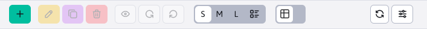
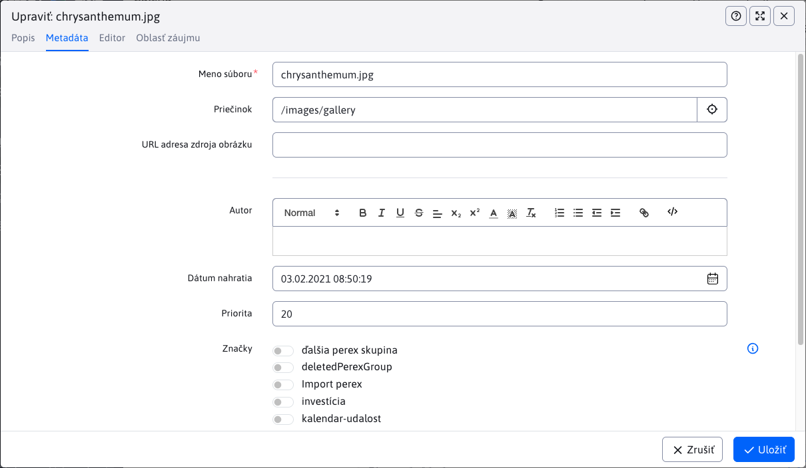
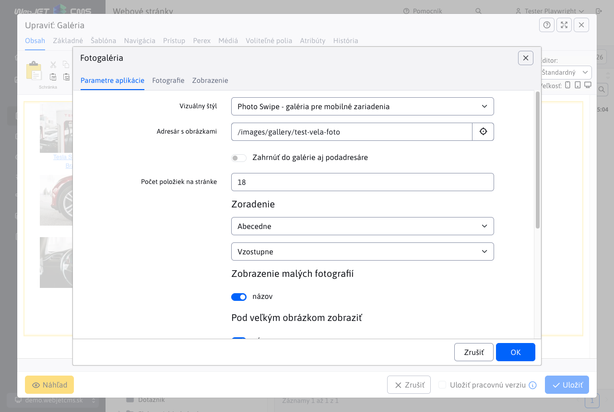
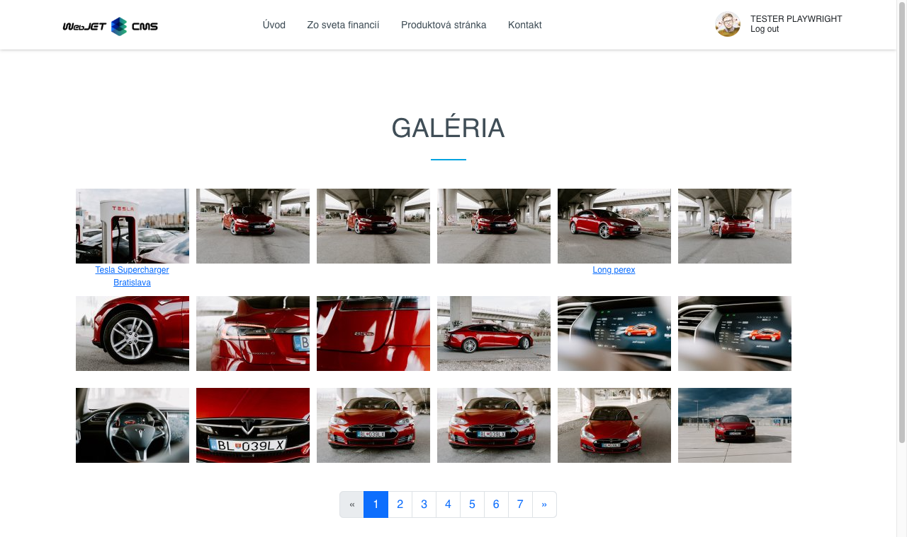

# Galéria

Aplikácia galéria umožňuje jednoduchým spôsobom vytvárať galériu fotografií. Obrázky z digitálneho fotoaparátu stačí nahrať do galérie. WebJET fotografie automaticky zmenší na požadovaný formát. Z každej fotky sa vytvárajú 3 kópie:

- Náhľadový obrázok - fotka v malom rozlíšení, cca 160x120 bodov, používa sa v zozname obrázkov
- Obrázok v bežnom rozlíšení – fotka v rozlíšení pre bežný monitor, teda cca 600x400 bodov – táto fotka sa zobrazí po kliknutí na náhľadový obrázok
- Originál fotka – primárne slúži ako kópia nahratej fotky pre možnosť pregenerovania rozmerov menších obrázkov. Podľa nastavenia galérie ale je možné originál fotku stiahnuť pre získanie najkvalitnejšej verzie.

Rozmery náhľadového obrázka a obrázka v bežnom rozlíšení je možné nastavovať vo vlastnostiach priečinka a prípadne kedykoľvek zmeniť (obrázky sa automaticky vygenerujú z originálnej fotky).

## Práca s aplikáciou galéria

Administrácia galérie je podobne ako web stránky rozdelená na dva stĺpce. V prvom je štruktúra priečinkov a v druhom sa zobrazujú samotné fotografie. Ikony na pridanie, editáciu, mazanie atď sa vzťahujú k príslušnému stĺpcu.


V stromovej štruktúre je možné [vyhľadávať](../../webpages/README.md#vyhľadávanie-v-stromovej-štruktúre) podobne ako vo web stránkach. Vyhľadávajú sa len priečinky uložené v databáze, čiže tie s plnou ikonou <i class="ti ti-folder-filled" role="presentation"></i>.

### Správa štruktúry

V stĺpci priečinky je možné prechádzať a pridať/editovať/zmazať priečinok stromovej štruktúry galérie.


Okrem iných obsahuje nastavenie priečinka tieto polia:

- Názov galérie - názov galérie, pri vytváraní sa podľa tohto názvu vytvorí priečinok. Pre už vytvorenú galériu ak názov zmeníte súbory zostanú v pôvodnom priečinku, tento názov je len "virtuálny".
- Spôsob zmeny veľkosti
  - Zobrazenie na mieru - veľkosť obrázka je nastavená tak, aby rozmer neprekračoval nastavenú veľkosť
  - Orezať na mieru - obrázok je orezaný tak, aby vypĺňal zadané rozmery, pričom ak sa nezhoduje pomer strán je orezaný.
  - Presný rozmer - veľkosť obrázka je nastavená presne podľa priečinka, pričom ak je pomer strán rozdielny dôjde k deformácii obrázka.
  - Presná šírka - veľkosť obrázka použije zadanú šírku a výšku vypočíta podľa pomeru strán. Výška ale môže byť väčšia ako zadaný rozmer.
  - Presná výška - veľkosť obrázka použije zadanú výšku a šírku vypočíta podľa pomeru strán. Šírka ale môže byť väčšia ako zadaný rozmer.
  - Negenerovať zmenšeniny - galéria použije len originálny obrázok a nebude generovať náhľadové obrázky. Náhľadové obrázky je následne možné generovať podľa potreby s využitím ```/thumb``` prefixu.

V karte vodotlač je možné nastaviť vkladanie značky/loga do obrázku vo forme vodotlače. Je možné použiť aj vektorový SVG obrázok, ktorého rozmer sa prispôsobuje rozmeru generovaného obrázka podľa nastavenia v konf. premennej ```galleryWatermarkSvgSizePercent``` a ```galleryWatermarkSvgMinHeight```.

V stromovej štruktúre sa zobrazia priečinky:

- z ```/images/gallery```.
- z ```/images/{PRIECINOK}/gallery``` pričom ```{PRIECINOK}``` je ľubovoľný priečinok. Ak z nejakého dôvodu potrebujete oddeliť galériu pre nejaký projekt/mikro-stránku.
- z databázovej tabuľke ```gallery_dimension``` existuje záznam s nastavením rozmerov galérie pre cestu v stĺpci ```image_path``` (ktorá ale začína na /images).

Pri používaní doménových aliasov (nastavená konf. premenná ```multiDomainAlias:www.domena.com=ALIAS```) sa predvolene zobrazí/otvorí priečinok ```/images/ALIAS/gallery```. Kvôli spätnej kompatibilite sa zobrazia aj iné priečinky galérie (napr. ```/images/gallery```), nezobrazia sa ale také, ktoré v mene priečinka obsahujú doménový alias inej domény.

Priečinky majú nasledovné ikony:

- <i class="ti ti-folder-filled" role="presentation"></i> plná ikonka priečinku = štandardný priečinok, má nastavené rozmery galérie
- <i class="ti ti-folder" role="presentation"></i> prázdna ikonka priečinku = priečinok nemá nastavené rozmery galérie, typicky sa jedná o ```{PRIECINOK}```, viď vyššie.

### Správa fotografií

Nové fotografie do galérie nahráte kliknutím na ikonu Pridať v stĺpci Obrázky (viac obrázkov vyberiete podržaním klávesy CTRL) alebo priamo pretiahnutím z vášho počítača.

Nástrojová lišta obsahuje ikony ```SML``` na nastavenie veľkosti zobrazených fotografií (ich veľkosť sa mení len pre zobrazenie v administrácii), prípadne posledná možnosť zobrazí obrázky v štandardnej tabuľke, kde môžete napr. využiť funkciu Editácia bunky.



Kliknutím na fotografiu ju označíte, následne môžete zvoliť funkciu kliknutím na nástrojovú lištu (upraviť, zmazať, zobraziť, otočiť...). Pre rýchle zobrazenie editora môžete kliknúť priamo na názov súboru.

Editor obsahuje nasledujúce karty:

**Popis**

Krátky a dlhý popis fotografie v rôznych jazykoch.

Tieto popisy sú dôležité pre medzinárodných používateľov. Krátky popis poskytuje rýchly náhľad na obsah fotografie, zatiaľ čo dlhý popis poskytuje detailnejšie informácie. Popisy sa automaticky zobrazujú podľa zvoleného jazyka stránky.


**Metadáta**

Obsahuje doplnkové údaje:

  - **Meno súboru**: Unikátny názov súboru fotografie, ktorý umožňuje jej identifikáciu v systéme.
  - **Priečinok**: Cesta alebo umiestnenie v rámci úložiska, kde je fotografia uložená. Pomáha organizovať a vyhľadávať fotografie.
  - **Autor**: Meno alebo pseudonym osoby, ktorá fotografiu vytvorila.
  - **Dátum nahratia**: Dátum a čas, kedy bola fotografia nahraná do systému. Pomáha sledovať chronológiu a umožňuje vyhľadávať fotografie podľa času ich nahrania.
  - **Priorita**: Úroveň dôležitosti alebo preferencie, ktorá sa môže použiť na usporiadanie fotografií v galérii. Nižšia priorita znamená, že fotografia bude zobrazená na poprednejších miestach.
  - **URL adresa zdroja obrázku**: URL adresa odkiaľ sme získali daný obrázok.



**Editor obrázkov**

Obsahuje editor obrázkov kde jednoducho môžete fotku otočiť, orezať, upraviť veľkosť, doplniť text a použiť rôzne efekty, viac info [v časti Editor obrázkov](../../image-editor/README.md)


**Oblasť záujmu**

Nastavuje [oblasť záujmu](../../../frontend/thumb-servlet/interest-point.md) na fotografii pre zobrazenie napr. v zozname noviniek a podobne.

Používa sa, ak potrebujeme mať pôvodnú fotografiu, ale z nej zobrazovať len určitý výrez - nespravíme orezanie fotografie, ale len nastavíme oblasť záujmu.


## Vloženie aplikácie do web stránky

Vkladanie galérie do stránky je tiež veľmi jednoduché. Vyberiete si aplikáciu galéria. V karte "Parametre aplikácie" stačí zadať adresár v ktorom sa obrázky galérie nachádzajú, možnosť prehľadávania podadresárov, počet obrázkov na na stránke atď.



Máte možnosť vybrať vizuálny štýl galérie:

- ```Photo Swipe``` - responzívna galéria s možnosťou posúvania fotiek prstom, kompatibilná s mobilnými zariadeniami.
- ```PrettyPhoto``` - staršia verzia zobrazenia, posúvanie fotiek je riešené kliknutím na ikonu šípky vľavo/vpravo.

Karta "Fotografie" slúži na vloženie ďalších fotiek do galérie, alebo vytvorenie nového priečinka.

Ku každej fotografii je v administrácii možné nastaviť názov a perex (dlhý popis/anotácia). Názov môže zobrazovať pri obrázku v zozname a perex pri zobrazení veľkého obrázku (po kliknutí na obrázok v zozname).

Výsledná galéria na web stránke môže vyzerať nasledovne:



## Možné konfiguračné premenné

- ```imageMagickDir``` - Ak je nastavené použije sa na zmenu veľkosti obrázkov príkaz ```convert``` z balíka ```ImageMagick``` (predvolená hodnota: ```/usr/bin```).
- ```galleryAlwaysUseImageMagick``` - ak je nastavené na ```true```, tak zmena veľkosti obrázkov rozmeru < 500 bodov sa tiež bude vykonávať volaním externého programu ```ImageMagick``` (predvolená hodnota: ```true```).
- ```galleryWatermarkSaturation``` - Nastavuje transparentnosť vodotlače vo výslednom obrázku. Číslo 0-100, 0 znamená úplnú priesvitnosť, 100 nepriesvitnosť. (predvolená hodnota: 70).
- ```galleryWatermarkGravity``` - Pozícia vodotlače vo výslednom obrázku. Možnosti podľa svetových strán v angličtine: ```NorthWest, North, NorthEast, West, Center, East, SouthWest, South, SouthEast``` (predvolená hodnota: ```Center```).
- ```galleryEnableWatermarking``` - Vypne / zapne vodotlač pre obrázky. Vodotlač môže výrazne spomaľovať veľké importy obrázkov kvôli rekurzívnemu hľadaniu nastavenia vodotlače. (predvolená hodnota: ```true```).
- ```galleryEnableExifDate``` - Pri nahratí fotky sa získa ako jej dátum dátum vytvorenia z ```exif``` informácie, pre vypnutie je potrebné nastaviť túto premennú na false (predvolená hodnota: ```true```).
- ```galleryStripExif``` - Ak je nastavené na ```true``` tak sa z fotky odstraňujú ```exif``` informácie, primárne sa jedná o jej otočenie pre korektné zobrazenie zmenšenín (predvolená hodnota: ```true```).
- ```galleryImageQuality``` - Parameter kvality obrázkov pre konverziu cez ```ImageMagick```, zapisuje sa vo formáte ```šírka_px:kvalita;šírka_px:kvalita```, teda napr. ```0:30;100:50;400:70```, použije sa najlepší alebo koncový interval (predvolená hodnota:).
- ```galleryVideoMode``` - Nastavenie režimu konverzie videa pre foto galériu, možné hodnoty: ```all```=vygeneruje sa malé aj veľké video, ```big```=vygeneruje sa len veľké video, ```small```=vygeneruje sa len malé video (predvolená hodnota: ```big```).
- ```thumbServletCacheDir``` - Cesta k adresáru pre cache ```/thumb``` obrázkov, pre server s vysokým množstvom obrázkov odporúčame presunúť na iné miesto ako /WEB-INF/ kvôli rýchlosti štartu aplikačného servera (predvolená hodnota: ```/WEB-INF/imgcache/```).
- ```defaultVideoWidth``` - Prednastavená šírka videa (predvolená hodnota: ```854```).
- ```defaultVideoHeight``` - Prednastavená výška videa (predvolená hodnota: ```480```).
- ```defaultVideoBitrate``` - Prednastavený ```bitrate``` videa (predvolená hodnota: ```2048```).
- ```galleryConvertCmykToRgb``` - Ak je nastavené na ```true``` tak sa zisťuje, či je fotka v ```CMYK``` a ak áno, konvertuje sa do RGB (predvolená hodnota: ```false```).
- ```galleryConvertCmykToRgbInputProfilePath``` - Cesta (RealPath) k vstupnému ```ICC``` profilu na disku (predvolená hodnota:).
- ```galleryConvertCmykToRgbOutputProfilePath``` - Cesta (RealPath) k výstupnému ```ICC``` profilu na disku (predvolená hodnota:).
- ```galleryUseFastLoading``` - Ak je nastavené na ```true``` použije sa pre výpis galérie zjednodušený test súborov, zrýchľuje zobrazenie na sieťových file systémoch (predvolená hodnota: ```false```).
- ```galleryCacheResultMinutes``` - Počet minút počas ktorých sa cachuje zoznam obrázkov v galérii, zmena sa deteguje podľa zmeny dátumu adresára (dostupné len na OS Linux) (predvolená hodnota: 0).
- ```imageAlwaysCreateGalleryBean``` - Ak je zapnuté na ```true``` bude sa záznam v ```gallery``` DB tabuľke vytvárať aj pre obrázky mimo foto galérie (predvolená hodnota: false).
- ```galleryUploadDirVirtualPath``` - ak je nastavené na ```true``` použije sa URL adresa web stránky ako adresár pre upload súborov (normálne sa používa len štruktúra adresárov bez názvu web stránky) (predvolená hodnota: false).
- ```wjImageViewer``` - Konfigurácia typu zobrazenia náhľadu obrázku vloženého do stránky, môže byť ```wjimageviewer``` alebo ```photoswipe``` (predvolená hodnota: photoswipe).
- ```galleryWatermarkApplyOnUpload``` - Slúži na automatické aplikovanie vodotlače pri nahratí obrázkov do galérie (predvolená hodnota: false).
- ```galleryWatermarkApplyOnUploadDir``` - Adresár kde sú umiestnené obrázky pre automatickú vodotlač pri nahratí. Názov obrázku musí byť ```default.png```, pri multidomain je možnosť mať pre každú doménu iný, v tváre ```doména.png``` (napr. ```www.interway.sk.png```) (predvolená hodnota: ```/templates/{INSTALL_NAME}/assets/watermark/```).
- ```galleryWatermarkApplyOnUploadExceptions``` - Zoznam názvov ciest pre ktoré sa nebude aplikovať vodoznak pri nahratí súboru do WebJETu (predvolená hodnota: ```logo,nowatermark,system,funkcionari```).
- ```galleryWatermarkSvgSizePercent``` - Výška v percentách ktorú bude zaberať SVG vodoznak z výšky obrázku (predvolená hodnota: 5).
- ```galleryWatermarkSvgMinHeight``` - Minimálna výška SVG vodoznaku v bodoch (predvolená hodnota: 30).