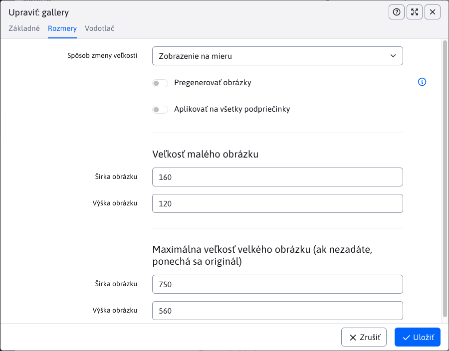
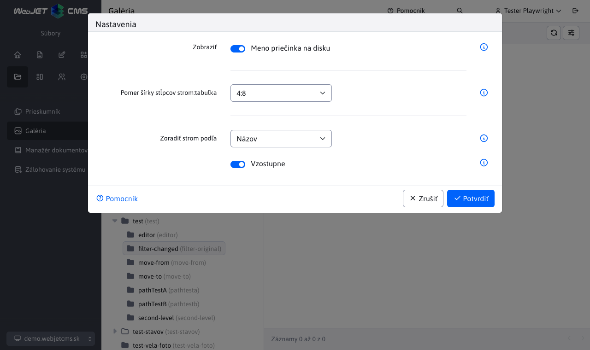

# Správa štruktúry

V tejto sekcii môžete spravovať štruktúru galérie. Môžete vytvárať nové priečinky, presúvať, mazať a upravovať existujúce priečinky alebo ich filtrovať podľa názvu.

V stromovej štruktúre sa zobrazia priečinky:

- z `/images/gallery`.
- z `/images/{PRIECINOK}/gallery` pričom `{PRIECINOK}` je ľubovoľný priečinok. Ak z nejakého dôvodu potrebujete oddeliť galériu pre nejaký projekt/mikro-stránku.
- z databázovej tabuľky `gallery_dimension` existuje záznam s nastavením rozmerov galérie pre cestu v stĺpci `image_path` (ktorá ale začína na /images).

Pri používaní doménových aliasov (nastavená konf. premenná `multiDomainAlias:www.domena.com=ALIAS`) sa predvolene zobrazí/otvorí priečinok `/images/ALIAS/gallery`. Kvôli spätnej kompatibilite sa zobrazia aj iné priečinky galérie (napr. `/images/gallery`), nezobrazia sa ale také, ktoré v mene priečinka obsahujú doménový alias inej domény.

Priečinky majú nasledovné ikony:

- <i class="ti ti-folder-filled" role="presentation"></i> plná ikonka priečinku = štandardný priečinok, má nastavené rozmery galérie
- <i class="ti ti-folder" role="presentation"></i> prázdna ikonka priečinku = priečinok nemá nastavené rozmery galérie, typicky sa jedná o `{PRIECINOK}`, viď vyššie.

## Karta Základné

Na tejto karte môžete upravovať základné informácie o priečinku a to:

- **Názov galérie** - názov galérie, pri vytváraní sa podľa tohto názvu vytvorí priečinok. Pre už vytvorenú galériu ak názov zmeníte súbory zostanú v pôvodnom priečinku, tento názov je len "virtuálny".
- **Anotácia** - krátky sumár/popis galérie
- **Autor**
- **Dátum a čas vytvorenia** - dátum a čas vytvorenia galérie, prednastavený je aktuálny dátum a čas, ale môžete ho zmeniť
- **Nadradený priečinok** - nastavenie nadradeného priečinka (najvyšší je priečinok `/images/gallery`, prípadne `/images/{PRIECINOK}/gallery`)
- **Cesta** - hodnota reprezentuje cestu ku galérii ako kombináciu nadradených priečinkov a názvu galérie, napríklad `/images/gallery/novy_priecinok`. Táto hodnota sa automaticky aktualizuje pri zmene nadradeného priečinka. Nedá sa zmeniť ručne.
- **Aktualizovať cestu ku galérii vo webových stránkach** - špeciálna možnosť, ktorá sa objaví **IBA** v prípade úpravy už existujúceho priečinka, keď bola zmenená hodnota poľa **Nadradený priečinok**.

## Karta Rozmery

Karta ponúka možnosti, ktoré sa aplikujú na obrázky galérie:

- **Spôsob zmeny veľkosti**
  - **Zobrazenie na mieru** - veľkosť obrázka je nastavená tak, aby rozmer neprekračoval nastavenú veľkosť
  - **Orezať na mieru** - obrázok je orezaný tak, aby vypĺňal zadané rozmery, pričom ak sa nezhoduje pomer strán je orezaný.
  - **Presný rozmer** - veľkosť obrázka je nastavená presne podľa priečinka, pričom ak je pomer strán rozdielny dôjde k deformácii obrázka.
  - **Presná šírka** - veľkosť obrázka použije zadanú šírku a výšku vypočíta podľa pomeru strán. Výška ale môže byť väčšia ako zadaný rozmer.
  - **Presná výška** - veľkosť obrázka použije zadanú výšku a šírku vypočíta podľa pomeru strán. Šírka ale môže byť väčšia ako zadaný rozmer.
  - **Negenerovať zmenšeniny** - galéria použije len originálny obrázok a nebude generovať náhľadové obrázky. Náhľadové obrázky je následne možné generovať podľa potreby s využitím `/thumb` prefixu.
- **Pregenerovať obrázky** - ak je možnosť zvolená, nanovo vygeneruje veľkosti všetkých obrázkov v galérii podľa aktuálnych nastavení
- **Aplikovať na všetky podpriečinky** - ak je možnosť zvolená, nastavenie sa použije aj na všetky podradené priečinky
- **Veľkosť malého obrázku** - šírka a výška obrázku
- **Maximálna veľkosť veľkého obrázku (ak nezadáte, ponechá sa originál)** - šírka a výška obrázku

## Karta Vodotlač

V karte vodotlač je možné nastaviť vkladanie značky/loga do obrázku vo forme vodotlače. Je možné použiť aj vektorový SVG obrázok, ktorého rozmer sa prispôsobuje rozmeru generovaného obrázka podľa nastavenia v konf. premennej `galleryWatermarkSvgSizePercent` a `galleryWatermarkSvgMinHeight`.

Viac sa dočítate v samostatnej dokumentácii [Nastavenie vodotlače](watermark.md).

## Premiestnenie priečinku Galérie

Priečinok je možné premiestniť 2 spôsobmi:

- **editáciou** - v editácii priečinka zmenou hodnoty **Nadradený priečinok**
- `drag and drop` - premiestnenie priečinka v štruktúre

Následky premiestnenia priečinku:

- pridanie **presmerovania** - automaticky sa pridá presmerovanie z pôvodnej cesty priečinka na novú cestu
- aktualizácia **web stránok** - aktualizovanie cesty priamo v tele webovej stránky. Je to časovo nákladná akcia
  - pri **editácii** sa zobrazí možnosť **Aktualizovať cestu ku galérii vo webových stránkach** a ak je zvolená, aktualizujú sa všetky webové stránky, ktoré obsahujú cestu k tejto galérii
  - pri **drag and drop** sa aktualizujú všetky webové stránky automaticky bez možnosti výberu

## Nastavenie zobrazenia stromovej štruktúry

V prípade potreby môžete v stromovej štruktúre kliknutím na ikonu <i class="ti ti-adjustments-horizontal"></i> Nastavenia zobraziť dialógové okno nastavení:

- **Meno priečinka na disku** - zobrazí meno priečinka na disku, ktoré môže byť odlišné od Názvu galérie zadanej v nastavení galérie.
- **Pomer šírky stĺpcov strom:tabuľka** - Nastaví pomer šírky stĺpcov zobrazenej stromovej štruktúry a datatabuľky pre lepšie využitie šírky monitora. Štandardný pomer je 4:8. Upozornenie: pri niektorých pomeroch a nevhodnej veľkosti monitora môže dôjsť k nesprávnemu zobrazeniu nástrojovej lišty/tlačidiel.
- **Zoradiť strom podľa** - Výber parametra adresára, podľa ktorého sa má strom priečinkov usporiadať. Výberové pole podporuje nasledujúce parametre
  - **Názov**
  - **Dátum vytvorenie**
  - **Naposledy upravené**
- **Zoradiť strom smerom** - Prepínanie medzi smerom usporiadania stromu priečinkov. Výberom možnosti sa použije smer **Vzostupne** a nezvolením možnosti sa použije smer **Zostupne**.

