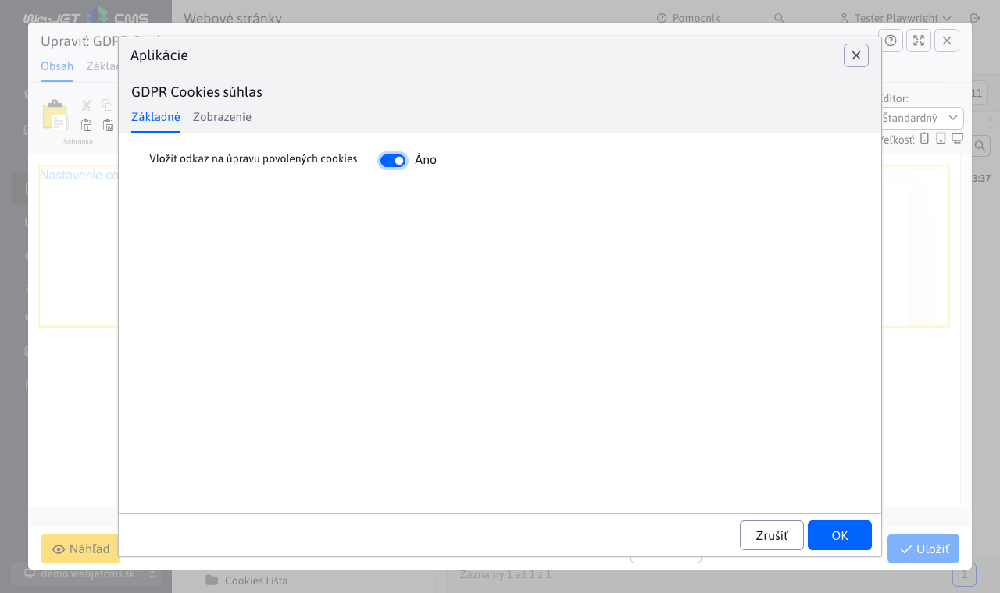
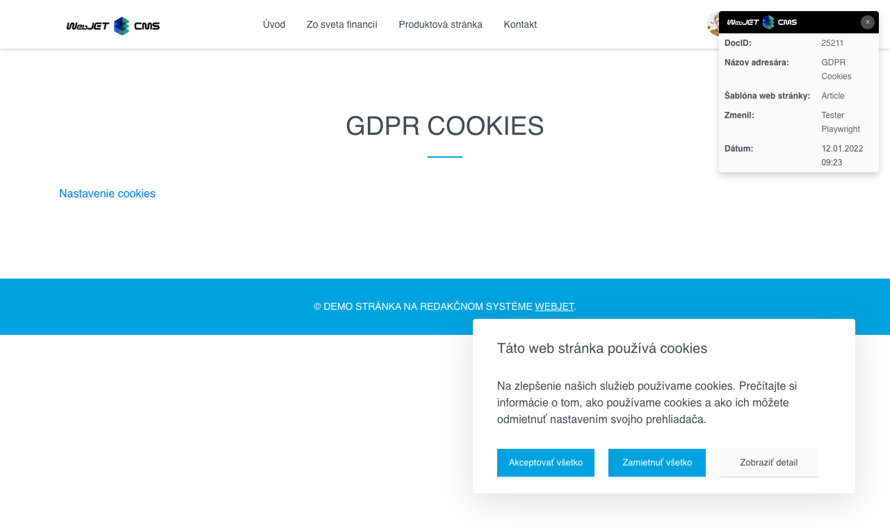

# GDPR Cookies súhlas

Vloží do stránky nastavenie cookies pre návštevníka s možnosťou výberu kategórií, ktoré návštevník môže povoliť alebo zamietnuť. Pre korektné vkladanie marketingových skriptov je potrebné využiť aplikáciu Skripty, ktorá je napojená na povolené cookies.

GDPR Cookies poskytujú podrobnú kontrolu nad tým, aké typy cookies môžu byť uložené. Používateľ môže konkrétne nastaviť, s akými kategóriami cookies súhlasí (napr. nutné, marketingové cookies).

## Nastavenia aplikácie

- **Vložiť odkaz na úpravu povolených cookies**: Umožňuje pridať odkaz, ktorý používateľom poskytne možnosť upraviť svoje preferencie pre povolené cookies.
  

## Zobrazenie aplikácie

