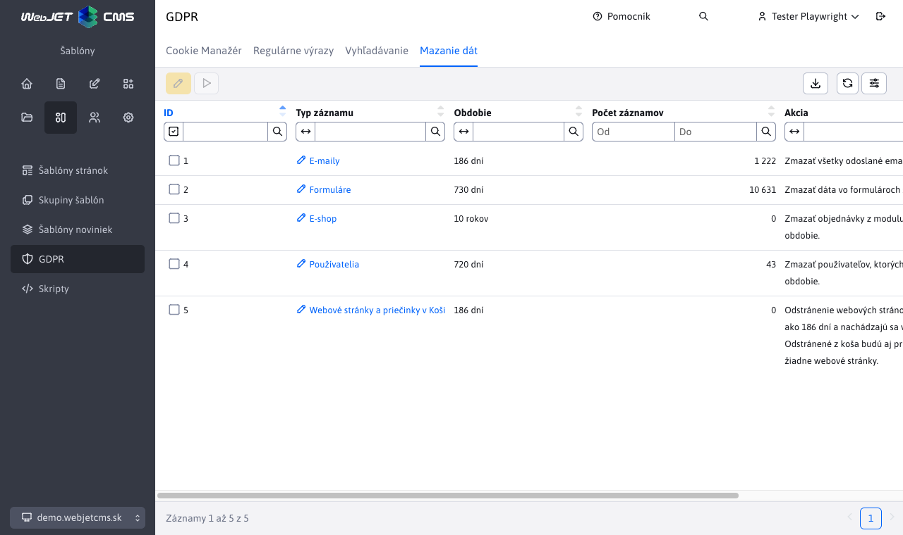
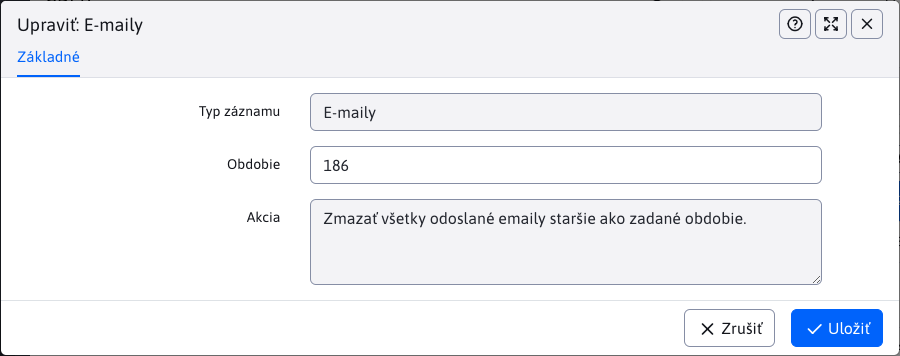

# Mazanie dát

Aplikácia GDPR obsahuje uzol **Mazanie dát**, ktorý slúži na odstraňovanie starých dát z databázy podľa nastavených retenčných období.

Umožňuje trvalo zmazať:

- **účty neaktívnych používateľov** - používateľov, ktorí neboli prihlásení za posledných X dní, predvolene `730` dní,
- **formuláre** - záznamy staršie ako X dní, predvolene `730` dní,
- **objednávky z elektronického obchodu** - záznamy staršie ako X rokov, predvolene `10` rokov,
- **e-maily** - odoslané e-maily z hromadného e-mailingu, predvolene staršie ako `186` dní,
- **webové stránky a priečinky v Koši** - stránky a priečinky webových stránok nachádzajúce sa v Koši, predvolene staršie ako `186` dní podľa konfiguračnej premennej `gdprDeleteDocAndGroupsAfterDays`.

V dátovej tabuľke nie je možné vytvárať nové záznamy, ich počet je fixne daný funkčnosťou WebJET CMS. Pri úprave je možné zmeniť iba číselnú hodnotu **Obdobie**, ktorá udáva, za aké obdobie budú dané hodnoty pri spustení mazania zmazané. Stĺpce **Typ záznamu** a **Akcia** sú iba informačné.

Mazanie spustíte výberom jedného alebo viacerých riadkov a kliknutím na tlačidlo **Spustiť**. Potvrdzovací dialóg zobrazí zoznam vybraných typov záznamov.

Pri type **Webové stránky a priečinky v Koši** sa vykoná trvalé odstránenie z Koša. Mazanie zahŕňa staré stránky, staré priečinky vrátane ich podpriečinkov a stránok a tiež priečinky, ktoré po odstránení starých položiek zostanú prázdne. Odstránené stránky a priečinky už nebude možné z Koša obnoviť.

!> **Upozornenie:** mazanie stránok a priečinkov z Koša je nevratné. Pred spustením si overte, že zvolené obdobie je správne.

## Automatizovaná úloha

Automatizovaná úloha `sk.iway.iwcm.components.gdpr.GdprDataDeleting` bez parametrov spustí všetky typy mazania vrátane stránok a priečinkov v Koši.

Ak má úloha spracovať iba vybrané typy, je možné zadať čiarkou oddelený zoznam hodnôt:

| Hodnota parametra | Typ záznamu |
| --- | --- |
| `sendedEmails` | E-maily |
| `oldFormData` | Formuláre |
| `oldBasketOrders` | Objednávky z elektronického obchodu |
| `unusedUsers` | Účty neaktívnych používateľov |
| `oldDocAndGroups` | Webové stránky a priečinky v Koši |

## Konfiguračné premenné

| Premenná | Predvolená hodnota | Popis |
| --- | --- | --- |
| `gdprDeleteUserAfterDays` | `730` | Počet dní neaktivity používateľa pred zmazaním účtu |
| `gdprDeleteFormDataAfterDays` | `730` | Počet dní pre zmazanie starých formulárových dát |
| `gdprDeleteUserBasketOrdersAfterYears` | `10` | Počet rokov pre zmazanie starých objednávok |
| `gdprDeleteEmailsAfterDays` | `186` | Počet dní pre zmazanie odoslaných e-mailov |
| `gdprDeleteDocAndGroupsAfterDays` | `186` | Počet dní pre zmazanie stránok a priečinkov v Koši |

Stránky a priečinky v Koši sa mažú na základe dátumu ich vytvorenia - mažú sa tie, ktoré boli vytvorené pred viac ako nastaveným počtom dní.

Mazanie stránok a priečinkov z Koša je dostupné aj v aplikácii [Čistenie databázy](../../../sysadmin/data-deleting/README.md#databázové-záznamy) v sekcii Nastavenia.

## Auditovanie

Všetky činnosti používateľa WebJETu pri mazaní dát sú auditované (typ `GDPR_DELETE_*`) a je možné získať informáciu o tom, aké bolo ID operácie, kto, kedy a koľko dát zmazal.
