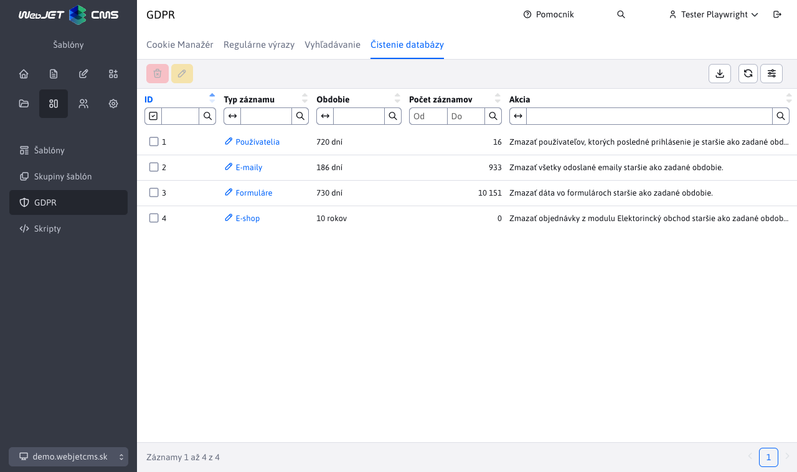

# Mazanie dát

Aplikácia GDPR obsahuje uzol „Mazanie dát“, ktorý slúži na odstraňovanie starých dát z databázy.

Umožňuje zmazať:

-	účty **neaktívnych používateľov** (tí, ktorí neboli prihlásený za posledných X dní, základne nastavené na 730dní = 2roky)
-	**formuláre** (záznamy staršie ako X dní, základne nastavené na 730dní = 2roky
-	**objednávky z elektronického obchodu** (záznamy staršie ako X dní, základne nastavené na 10 rokov)
-	**emaily** (mazanie dát z hromadného e-mailingu, základne nastavené na 186 dní)



V data tabuľke nie je možné vytvárať nové záznamy, ich počet je fixne daný funkčnosťou WebJET CMS. Pri úprave je možné zmeniť iba číselnú hodnotu **Obdobie**, ktorá udáva za aké obdobie budú dané hodnoty pri vykonaní akcie **Vymazať dáta** zmazané.


Všetky činnosti používateľa WebJETu pri mazaní dát sú auditované (typ ```GDPR_DELETE_*```) a je možné získať informáciu o tom aké bolo ID operácie, kto, kedy a koľko dát zmazal.