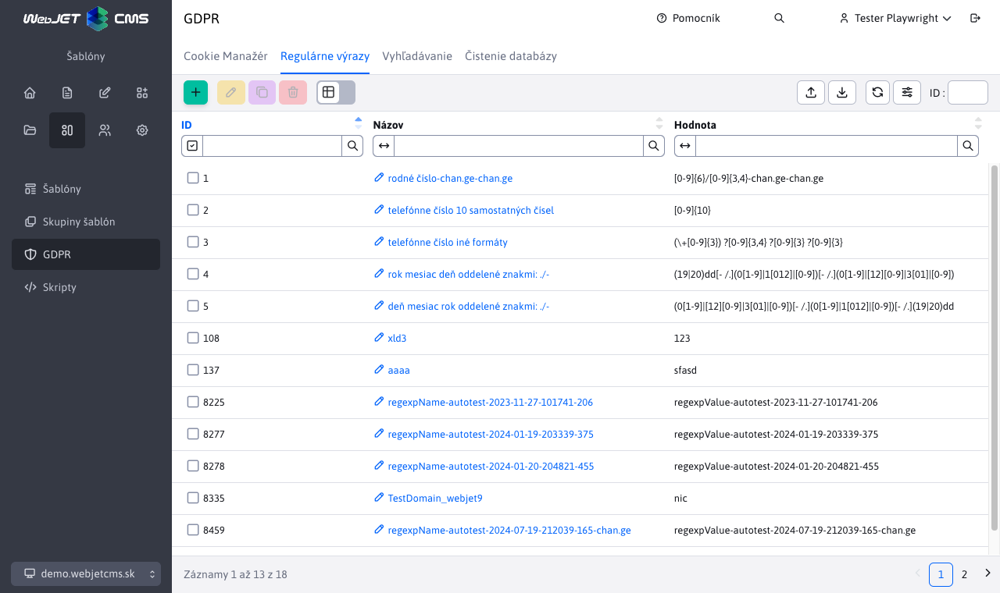
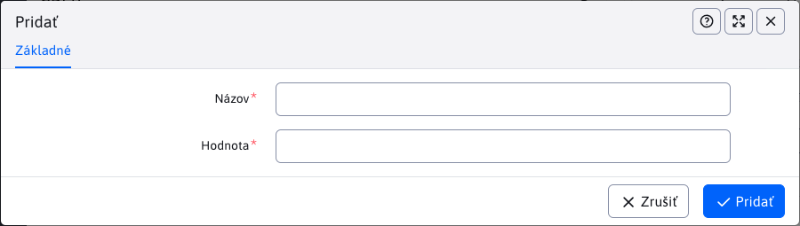

# Správa regulárnych výrazov

Modul GDPR obsahuje uzol "Správa regulárných výrazov", ktorý slúži na vytváranie a upravovanie regulárných výrazov pre jednotlivé typy hľadaných údajov.

V ľavom hornom rohu sa nachádza séria tlačidiel pre vytvorenie/úpravu/duplikovania/mazanie regulárnych výrazov, export regulárnych výrazov do excelu a ich import z excelu.

Pri vytváraní,editovaní,duplikovaní regulárného výrazu sa v editore zadáva názov a hodnota regulárneho výrazu.

