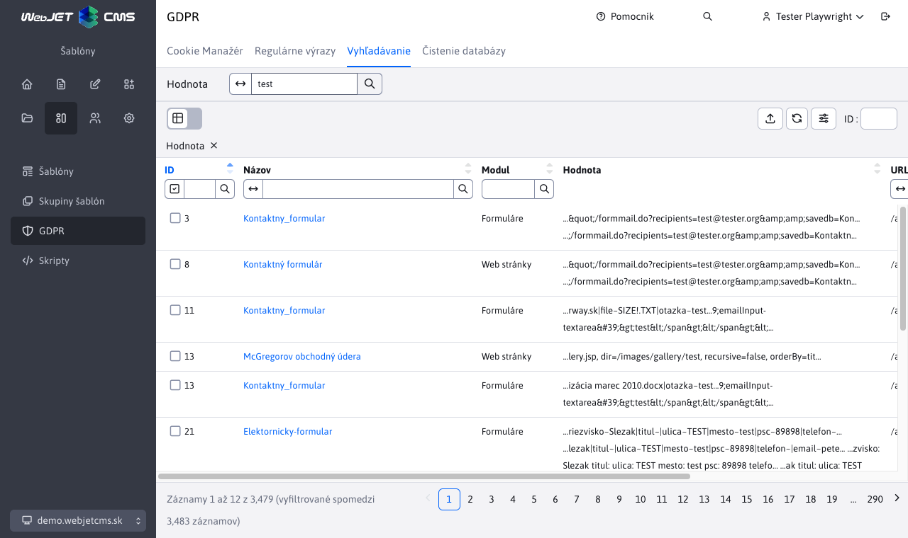

# Vyhľadávanie

Aplikácia GDPR obsahuje uzol „Vyhľadávanie“, ktorý slúži na vyhľadanie dát v častiach/aplikáciách „Formuláre“, „Web stránky“, „Otázky a odpovede“ a „Fórum / diskusia“.

V ľavom hornom rohu, sa nachádza pole pre zadanie vyhľadávaného textu. Po zadaní sa zobrazia záznamy spomedzi spomenutých aplikácií, ktoré obsahujú v názve alebo v hodnote zadaný výraz.

