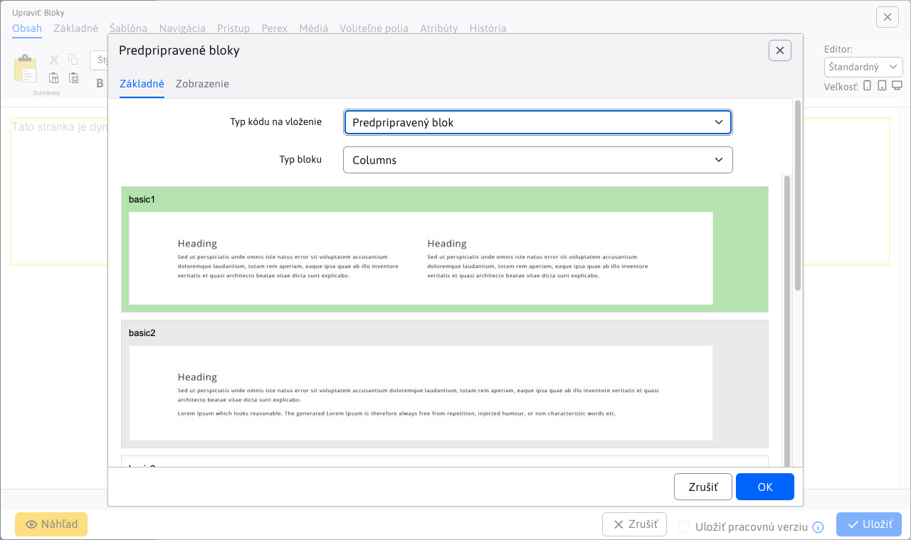

# Predpripravené bloky (HTMLBox)

Modul HTMLBox umožňuje jednoducho vložiť na stránku predpripravené bloky (HTML objekty), ako sú tabuľky, texty, kontaktné formuláre a ďalšie. Môžete tiež vložiť obsah inej stránky do aktuálnej stránky (napríklad opakujúci sa formulár).

Bloky zobrazíte kliknutím na ikonu  v editore stránky, čím otvoríte dialóg s kategóriami blokov, alebo pridaním aplikácie **Predpripravené bloky**.

Typy blokov (HTML objektov), ktoré môžete vložiť skrz **Typ kódu na vloženie**:

- **Predpripravený blok**
- **Web stránka**
- **Hlavná šablóna**
- **Pod-šablóna**

## Predpripravený blok

Zobrazia sa bloky pripravené dizajnérom webu. Tieto bloky sa načítavajú zo súborov v priečinku `/components/INSTALL_NAME/htmlbox/objects`, kde `INSTALL_NAME` je názov vašej inštalácie (nastavuje sa v premennej `installName`). Ak tento priečinok neexistuje, použijú sa štandardné bloky z `/components/htmlbox/objects`.

V priečinku môžu byť aj podpriečinky. Každý blok je uložený v `.html` súbore a pre správne zobrazenie je potrebné vytvoriť aj `.jpg` súbor s ukážkou bloku s rovnakým názvom.

Štandardne sú dostupné tieto skupiny/kategórie blokov:

- `Columns`
- `Contact`
- `Content`
- `Download`
- `Header`

## Web stránka

Táto možnosť umožňuje vložiť obsah ľubovoľnej web stránky pomocou výberu v poli `Doc ID`.

**Spôsob vloženia:**

- **Priamo do stránky (kópia):** Vloží sa kópia textu vybranej web stránky.
- **Dynamickým odkazom:** HTML kód bloku sa vloží ako dynamický odkaz. Ak sa obsah bloku upraví, zmena sa automaticky prejaví vo všetkých vložených častiach.

Obsah aktuálne zvolenej web stránky sa zobrazuje v náhľade v dolnej časti okna.

## Hlavná šablóna

Táto možnosť obsahuje stránky generované z adresára **Systém → Šablóny**. Pre rozlíšenie majú hlavné šablóny prefix **Hlavná šablóna** a podpriečinky (do úrovne 1) prefix **Pod-šablóna**. Každý adresár v **Šablónach** predstavuje jeden zoznam vo výberovom poli modulu.

**Spôsob vloženia:**

- **Priamo do stránky (kópia):** Vloží sa kópia textu vybranej web stránky.
- **Dynamickým odkazom:** HTML kód bloku sa vloží ako dynamický odkaz. Ak sa obsah bloku upraví, zmena sa automaticky prejaví vo všetkých vložených častiach.

## Statické vs dynamické vloženie

**Dynamické vloženie:**
Vloží sa odkaz na obsah. Pri neskoršej úprave obsahu (napr. jednej stránky) sa zmena prejaví na všetkých miestach, kde bol obsah vložený dynamicky.

**Statické vloženie:**
Obsah sa duplikuje a vloží ako kópia. Úpravy sa následne týkajú len konkrétneho miesta v danej web stránke.

## Zobrazenie aplikácie

