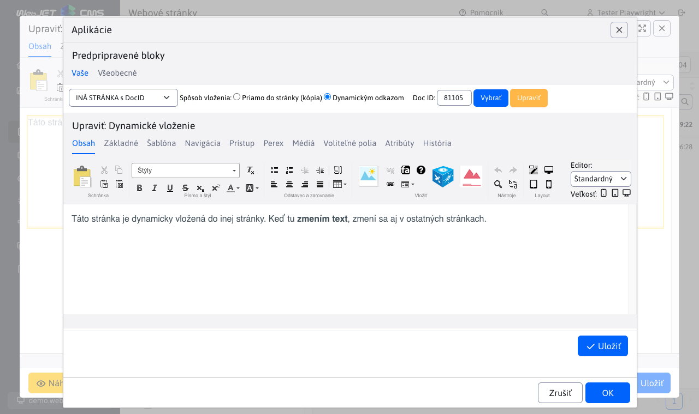
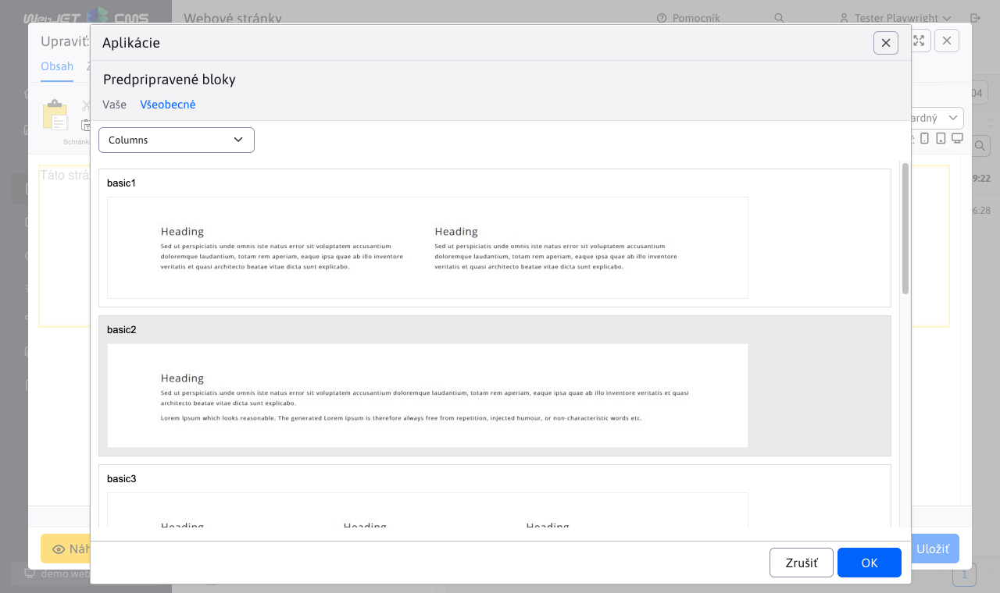
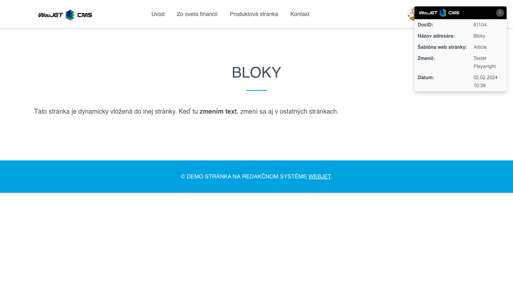

# Predpripravené bloky

Editor stránky ponúka možnosť vkladania prednastavených blokov (```HTML``` objektov) na stránku. Napr. tabuľka, text, kontaktný formulár atď. Viete vložiť aj obsah inej stránky do aktuálnej stránky (napr. opakujúci sa formulár).

Zobrazenie blokov vykonáte kliknutím na ikonu   v editore stránky, ktorá zobrazí dialógové okno s kategóriami blokov.

## Karta - Vaše

V záložke **Vaše** sa nachádzajú stránky generované z adresára **Systém** -> **Šablóny**. Každý adresár v adresári **Šablóny** reprezentuje jeden zoznam vo výberovom poli modulu. Obsah je možné vložiť dynamicky alebo staticky. Ak sa vloží dynamicky, tak sa pri neskoršej úprave daného obsahu (jednej stránky) zmena prejaví na všetkých miestach, kde bol daný obsah vložený dynamicky. Pri vložení staticky sa obsah duplikuje a vloží ako kópia, ktorá sa upravuje
vždy už len na konkrétnom mieste v danej web stránke.

Karta Vaše sa zobrazí ako zvolená pri otvorení ak obsahuje priečinok Systém->Šablóny pod priečinky alebo sú v priečinku viac ako 2 stránky.

### Nastavenie aplikácie - OSTATNÉ

Zoznam dostupných blokov je čítaných z priečinka Šablóny (štandardne v pod-priečinku Systém, ID priečinka sa nastavuje v konf. premennej `tempGroupId`)
  - Dynamický blok - HTML kód bloku sa vloží dynamickým odkazom, ak sa obsah bloku upraví automaticky sa zmení vo všetkých vložených častiach
  - Statický blok - HTML kód bloku sa vloží priamo do stránky ako kópia, zmena pôvodného bloku nijak neovplyvní vloženú verziu
  - Výber stránky
    - Zobrazuje sa zoznam dostupných blokov, napr. Normálna stránka, Stránka s nadpisom a 2 stĺpcami atď.


### Nastavenie aplikácie - INÁ STRÁNKA s ```DocID```

Umožňuje vybrať na vloženie ľubovoľnú web stránku
- Spôsob vloženia
  - Priamo do stránky - vloží sa kópia textu vybranej web stránky
  - Dynamickým odkazom - HTML kód bloku sa vloží dynamickým odkazom, ak sa obsah bloku upraví automaticky sa zmení vo všetkých vložených častiach
- ```DocID``` - výber ID stránky na vloženie



### Priečinky

Ak priečinok Systém/Šablóny vo web stránkach obsahuje podpriečinky vo výberovom poli sa zobrazia názvy priečinkov, čiže okrem Ostatné/Iná stránka s DocID sa vo výberovom poli zobrazia jednotlivé priečinky s pripravenými blokmi.

## Karta - Všeobecné

V záložke **Všeobecné** sa nachádzajú všetky pred-pripravené prvky a moduly, ktoré si redaktor nemôže meniť prípadne pridávať – odoberať. Je to pred-pripravený zoznam obsahujúci obsahové prvky web stránky, ktoré má redaktor web sídla k dispozícii.

### Nastavenia aplikácie

Zobrazené sú bloky pripravené dizajnérom web sídla, čítané zo súborov v priečinku `/components/INSTALL_NAME/htmlbox/objects` kde `INSTALL_NAME` je meno inštalácie (konf. premenná `installName`). Ak priečinok neexistuje, čítajú sa štandardné bloky z priečinka `/components/htmlbox/objects`. V priečinku môžu byť aj pod-priečinky, jednotlivé bloky sú v `html` súboroch. S rovnakým názvom je potrebné vytvoriť aj `jpg` súbor s ukážkou bloku.

Štandardne sú dostupné nasledovné skupiny/kategórie blokov:

- `Columns`
- `Contact`
- `Content`
- `Download`
- `Header`



## Zobrazenie aplikácie

