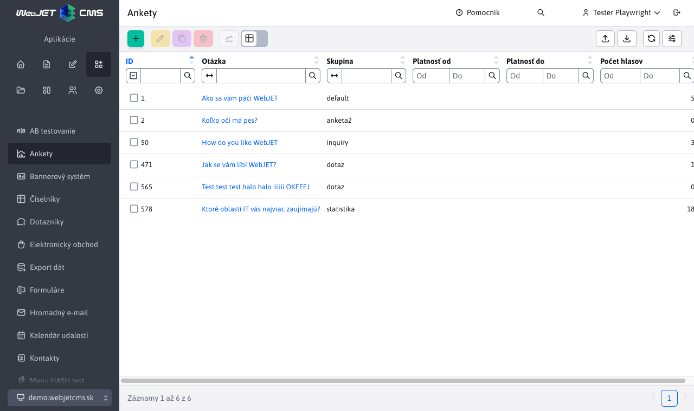
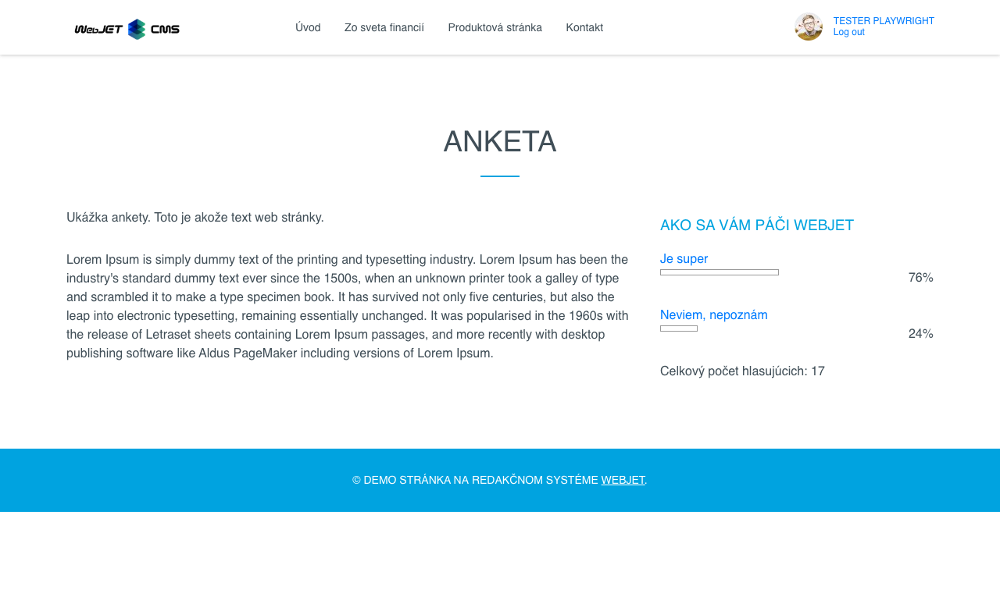
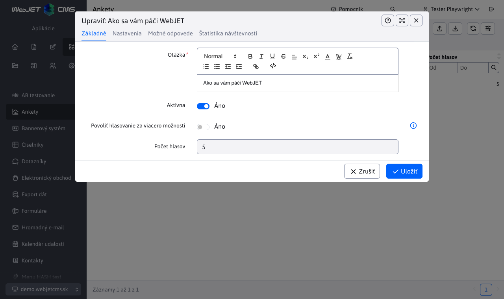
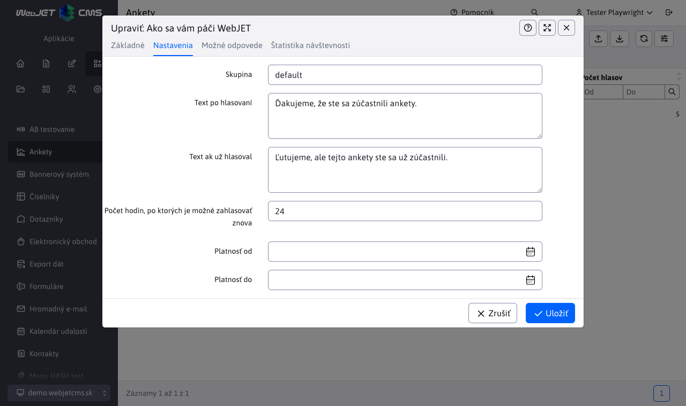
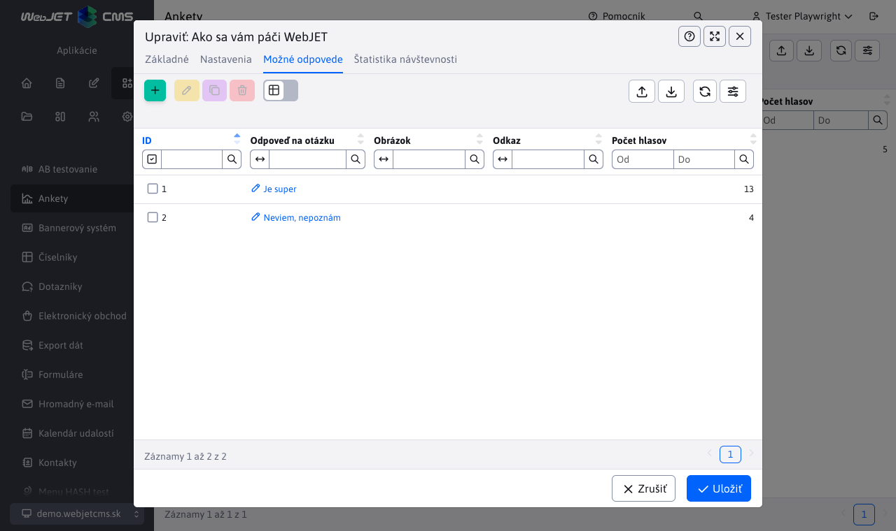
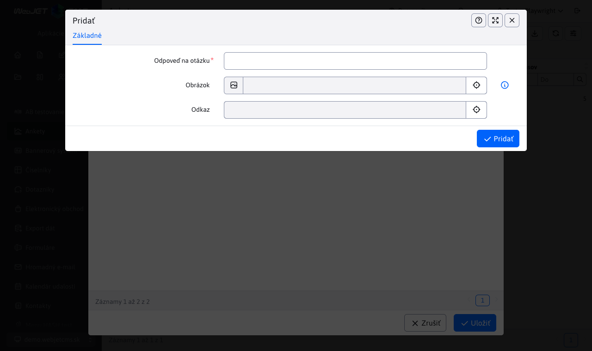
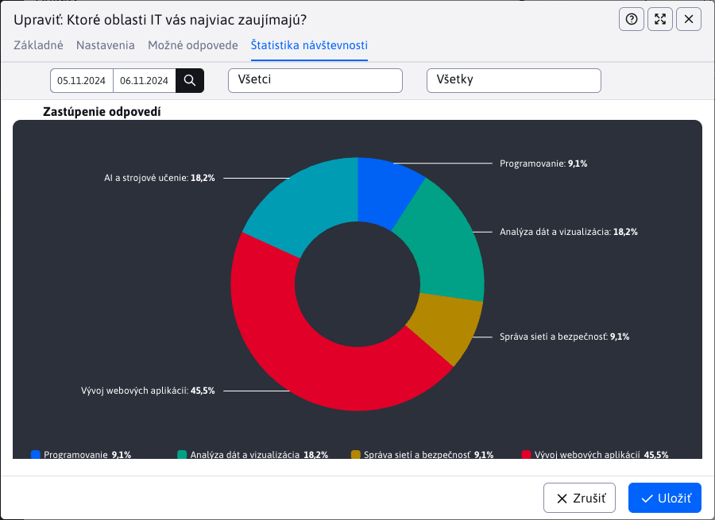

# Anketa

Aplikácia Anketa, umožňuje vytváranie/upravovanie/duplikovanie a mazanie ankiet.



Zobrazenie na web stránke odporúčame v užšom stĺpci, napr. v pravom:



Editor ankety obsahuje 4 karty, ktoré si teraz opíšeme.

## Základné

V karte **Základné** sa nachádzajú polia:

- Otázka - reprezentuje otázku ankety.
- Aktívna - zapne/vypne zobrazovanie ankety na web stránke.
- Povoliť hlasovanie za viacero možností - ak je zapnuté návštevník na stránke môže hlasovať naraz za viac možností (možnosti označí vyberovým poľom a následne odošle hlas).
- Počet hlasov - pole zobrazuje aktuálne celkový počet hlasujúcich, je editovateľné pre prípad, že by ste chceli anketu manipulovať.



## Nastavenia

V karte **Nastavenia** sú polia:

- Skupina - ankety môžete radiť do skupín (napr. hlavná stránka, produkty atď) a následne na stránke zobrazovať anketu z vybranej skupiny. Zadajte znak ```*``` pre zobrazenie už existujúcich skupín.
- Text po hlasovaní - text, ktorý sa zobrazí návštevníkovi po úspešnom hlasovaní v ankete.
- Text ak už hlasoval - text, ktorý sa zobrazí návštevníkovi pri chybe hlasovania (napr. ak už návštevník v ankete hlasoval).
- Počet hodín, po ktorých je možné zahlasovať znova - zadaný počet hodín nebude návštevník môcť opakovane hlasovať. Pre neprihláseného návštevníka je informácia o hlasovaní držaná v cookies. Technicky to znamená, že môže opakovane hlasovať pri použití inkognito režimu prehliadača, alebo s využitím viacerých prehliadačov.
- Platnosť od, Platnosť do - dátumové obmedzenie zobrazovania ankety na web stránke.



## Možné odpovede

V karte **Možné odpovede** je vnorená data tabuľku, v ktorej môžeme pridávať/upravovať/duplikovať a mazať možné odpovede pre aktuálne otvorenú anketu (otázku).



Definovanie odpovede obsahuje nasledovné polia:

- Odpoveď na otázku - možná odpoveď na otázku, z ktorej si návštevník vyberá pri hlasovaní.
- Obrázok - ak nastavíte odkaz na obrázok zobrazí sa v ankete na web stránke vedľa textu s možnosťou odpovede.
- Odkaz - ak nastavíte možnosť odpovede sa zobrazí ako odkaz, kliknutím na text odpovede sa návštevníkovi zobrazí zadaná web stránka.
- Počet hlasov - pole zobrazuje aktuálne počet hlasujúcich za danú odpoveď, je editovateľné pre prípad, že by ste chceli anketu manipulovať.



Ak odpovede budete vytvárať hneď pri vytváraní ankety ale anketu neuložíte, tak všetky odpovede na túto neuloženú anketu sa stratia.

## Štatistika

Karta **Štatistika** ponúka rýchly prístup k štatistikám danej ankety. Okrem tabuľky s odpoveďami jednotlivých používateľov ponúka aj grafy.



Ide však iba o vnorenú verziu samostatne stránky [Štatistika ankety](./inquiry-stat.md). Ak si chcete prezrieť štatistiky ankety na samostatnej stránke, stačí označiť želanú anketu a stlačiť tlačidlo .