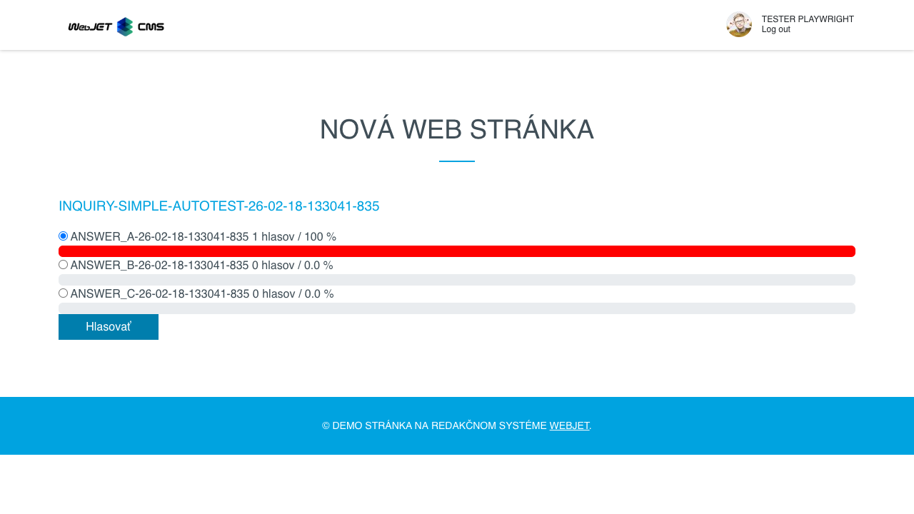
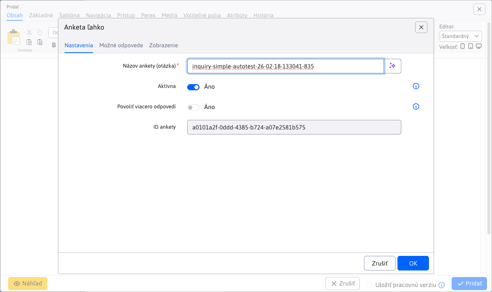
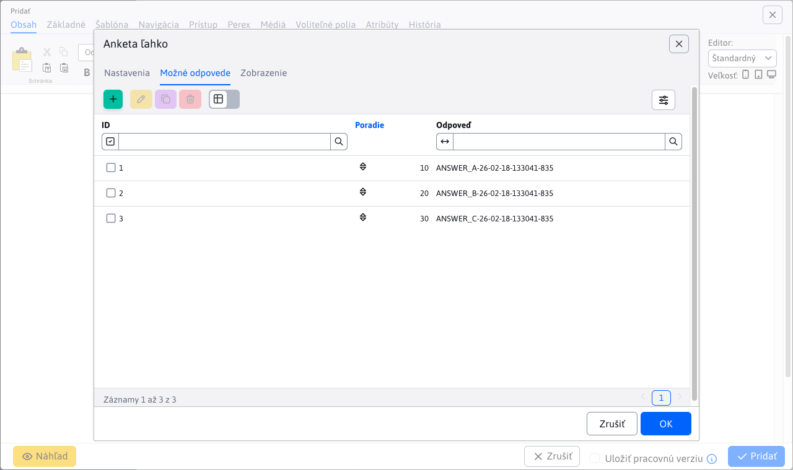

# Anketa ľahko

Aplikácia **Anketa ľahko** je jednoduchšia a rýchlejšia forma ankety. Vytvorte si anketu jednoduchým zadaním otázky a definovaním možných odpovedí.

## Karta - Nastavenia

Karta obsahuje základné nastavenia:

- **Názov ankety (otázka)** - názov ankety, ktorý bude zobrazený používateľom
- **Aktívna** - povoliť alebo nepovoliť hlasovanie, v prípade neaktívneho stavu zobrazuje iba výsledky
- **Povoliť viacero odpovedí** - ak je povolené, návštevník môže pri hlasovaní označiť viacero odpovedí
- **ID ankety** - generované nezmeniteľné ID ankety

## Karta - Možné odpovede

Karta obsahuje vnorenú tabuľku na definovanie a správu možných odpovedí.

