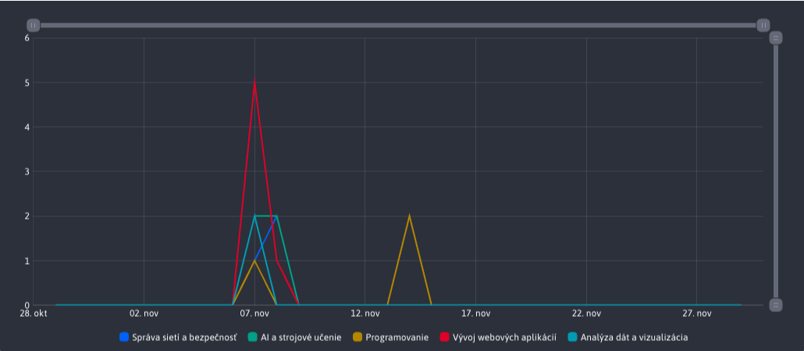

# Štatistika ankety

Sekcia **Štatistika ankety** ponúka plný prehľad o hlasovaní jednotlivých používateľov v danej ankete. Okrem tabuľky s dátami poskytuje aj grafy, ako rýchly a prehľadný spôsob analýzy dát.

Hlavička stránky obsahuje aj časť so samotnou otázkou, ktorá si zachováva rovnakú štruktúru ako bola vytvorená.

## Filtrovanie dát

K filtrovaniu všetkých dát (používateľkyých odpovedí v ankete) sa primárne využíva externý filter v hlavičke stránky.

### Dátumové filtrovanie

Umožňuje filtrovať podľa dátumu, kedy používateľ hlasoval v danej ankete. Ak žiaden dátum nie je zadaný, prednastavený je rozsah 1 mesiac.

### Filtrovanie podľa používateľa

Umožňuje filtrovať podľa toho, kto hlasoval v ankete. Zoznam možnosti obsahuje každého používateľa, ktorý hlasoval v ankete a 3 prednastavené možnosti :
- Všetci
- Prihlásený
- Neprihlásený

### Filtrovanie podľa odpovedi

Umožňuje filtrovanie podľa odhlasovanej odpovedi ankety. Viet si tak odfiltrovať dáta iba pre konkrétnu odpoveď a pozrieť. Zoznam možnosti obsahuje všetky možné odpovede, ktoré boli pre danú anketu vytvorené.

## Tabuľka

Tabuľka obsahuje všetky odfiltrované záznamy o používateľských hlasovaniach. Tieto dáta je možne v tabuľke ďalej filtrovať (zoradieť) podľa potreby, **ale** tieto akcie nad tabuľkou neovplyvňujú dáta použité v grafoch.

## Graf Zastúpenie odpovedí

Graf **Zastúpenie odpovedí** poskytuje rýchly prehľad o tom, za ktoré odpovede používatelia najviac hlasovali v zvolenom časovom rozsahu.

## Graf Odpovede podľa dní

Graf **Odpovede podľa dní** poskytuje rýchly prehľad o tom, v ktoré dni používatelia najviac hlasovali v danej ankete, za v zvolený časový rozsah.

