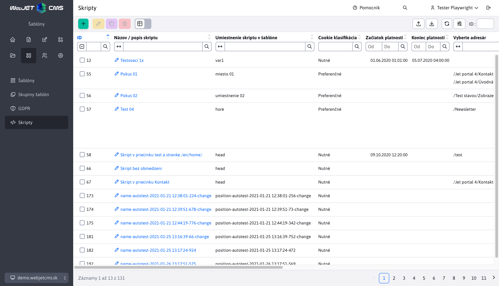
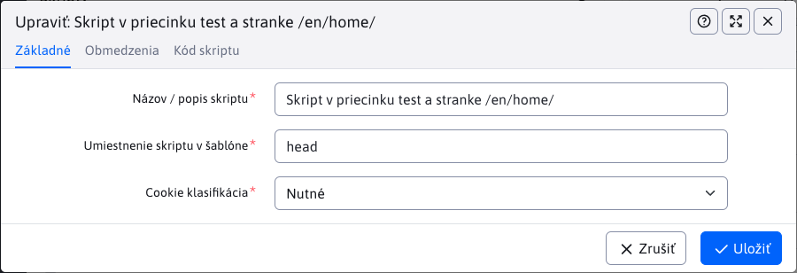
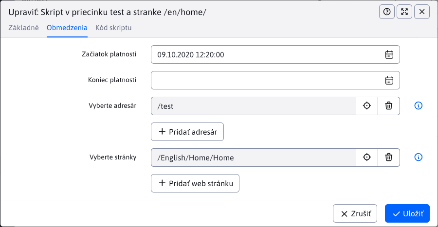

# Skripty

Aplikácia „Skripty“ umožňuje vytváranie skriptov, ktoré môžete následné pridávať do ľubovoľných stránok alebo skupiny stránok. Skripty je možné vkladať podľa súhlasu [návštevníka s cookies/GDPR klasifikáciou](../gdpr/cookiesmanger.md).



Editor pozostáva z 3 kariet **Základné**, **Obmedzenia** a **Kód skriptu**.

## Základné

Karta "Základné" obsahuje základné nastavenia ktoré sú všetky povinné.

- **Názov / popis skriptu** – vaše pomenovanie/identifikácia skriptu.
- **Umiestnenie skriptu v šablóne** – výberové pole typu ```autocomplete``` so zoznamom už zadaných pozícii skriptov v HTML kóde. Ak hodnota (napr. `after_body`) nie je zobrazená môžete ju zadať.
- **Cookie klasifikácia** – výberové pole s typmi cookies podľa ktorých je povolené vloženie skriptu do stránky
  - **Vložiť vždy** - skript sa vloží do stránky vždy bez ohľadu na povolené cookies/GDPR súhlas
  - **Nutné** – skript sa vkladá ak sú povolené Nutné cookies
  - **Preferenčné** – skript sa vkladá ak sú povolené Preferenčné cookies, napr. jazykové nastavenia.
  - **Marketingové** – skript sa vkladá ak sú povolené Marketingové cookies - sledujúce používateľov na zobrazovanie personalizovaných reklám.
  - **Štatistické** – skript sa vkladá ak sú povolené Štatistické cookies - zhromažďujú údaje pre analýzu návštevnosti.
  - **Neklasifikované** – skript sa vkladá ak sú povolené Neklasifikované cookies, teda tie, ktoré neboli priradené do kategórie.



## Obmedzenia

Karta obmedzení skriptov.

- **Začiatok platnosti** – dátum a čas, odkedy je skript platný.
- **Koniec platnosti** – dátum a čas, dokedy je skript platný.
- **Vyberte adresár** – skript bude vložený do stránok v zvolených priečinkoch a ich pod-priečinkoch.
- **Vyberte stránky** – skript bude vložený do vybraných web stránok.

Ak nezadáte začiatok ani koniec platnosti skriptu, tak takýto skript bude stále platný.



## Kód skriptu

Pole pre zadanie samotného kódu skriptu (HTML zápis).

```html
<script>
// Sem vložte váš kód skriptu
</script>
```


Keď si danú stránku kam sa mal skript vložiť otvoríte, v zdrojovom kóde stránky si viete overiť, či bol skript úspešne vložený.

## Integrácia v šablóne

Technické vloženie skriptu do HTML kódu zabezpečuje [kód šablóny](../../../frontend/thymeleaf/tags.md#vkladanie-skriptov). Pre Thymeleaf šablóny je to kód:

```html
<div data-iwcm-script="head"/>
```

a pre staršie JSP šablóny kód:

```jsp
<iwcm:insertScript position="head"/>
```

kde výraz `head` definuje pole **Umiestnenie skriptu v šablóne**. Čiže na uvedené miesto sa vložia všetky skripty, ktoré majú nastavené pole Umiestnenie skriptu v šablóne na hodnotu `head`.