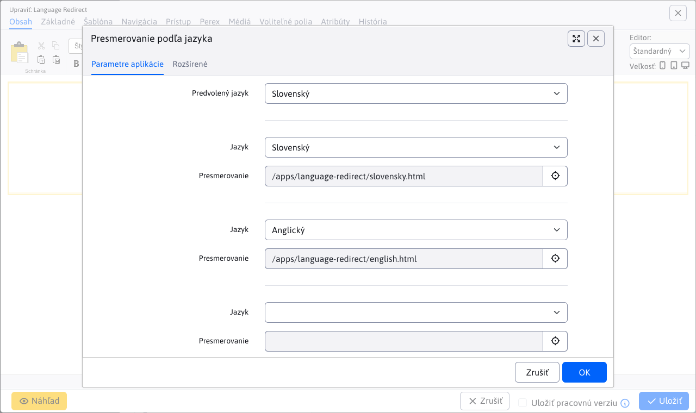

# Presmerovanie podľa jazyka

Aplikácia umožňuje automatické presmerovanie návštevníkov na jazykovú verziu stránky na základe jazyka ich prehliadača. Deteguje jazyk z HTTP hlavičky `Accept-Language` a presmeruje používateľa na príslušnú URL adresu podľa nakonfigurovaných pravidiel.

## Účel

Táto aplikácia je určená pre viacjazyčné webové stránky, kde chcete návštevníkov automaticky rozdeliť do príslušných jazykových variantov. Napríklad:

- Návštevník so slovenským prehliadačom bude presmerovaný na `/sk/`
- Návštevník s anglickým prehliadačom bude presmerovaný na `/en/`
- Ak sa jazyk nedeteguje, použije sa predvolený jazyk

## Inštalácia

Aplikáciu **Presmerovanie podľa jazyka** vložíte cez zoznam aplikácii do web stránky v koreňovom priečinku - typicky webová stránka s URL adresou `/`.

## Nastavenia aplikácie

Aplikácia má dve karty nastavení: **Základné** a **Pokročilé**.

### Základné nastavenia



#### Predvolený jazyk

Určuje jazyk, ktorý sa použije v prípade, že sa jazyk prehliadača nedeteguje alebo nie je nájdené žiadne priradenie v konfigurácii. Predvolená hodnota je `sk`.

#### Priradenia jazykov na URL adresy

Môžete nakonfigurovať **až 8 párov** priradenia jazyka na URL adresu presmerovania. Každý pár pozostáva z:

1. **Jazyk** – výber jazyka z dostupných jazykov vášho dizajnu (rovnaký zoznam ako pri editácii šablóny)
2. **Presmerovanie** – URL adresa, na ktorú sa používateľ presmeruje (vybraný jazyk)

Ak je pole jazyka prázdne, dané priradenie sa ignoruje. Pole pre URL môžete vybrať pomocou výberu odkazu.

**Príklad konfigurácie:**

| # | Jazyk | Presmerovanie |
| - | ----- | --------- |
| 1 | sk | /sk/ |
| 2 | en | /en/ |
| 3 | cs | /cs/ |
| 4–8 | (prázdne) | (prázdne) |

### Pokročilé nastavenia


#### Len koreňová URL

Ak je táto možnosť zapnutá, presmerovanie sa vykoná **len na koreňovej URL adrese** stránky (napr. `/` alebo `/index.html`). Na ostatných stránkach sa presmerovanie nevykoná. Použite ak je aplikácia vložená v nejakej spoločnej časti ako hlavička alebo pätička. Odporúčame ale aplikáciu vložiť priamo do stránky s URL adresou `/`, nebude sa tak zbytočne vykonávať na iných webových stránkach.

#### Rešpektovať jazykový cookie

Ak je táto možnosť zapnutá (predvolené), aplikácia skontroluje prítomnosť **jazykového cookie s názvom `lng`**. Ak používateľ má toto cookie nastavené, jeho hodnota sa použije namiesto detegovaného jazyka z prehliadača.

**Výhoda:** Používatelia budú presmerovaný na stránku v jazykovej mutácii, ktorá im bola naposledy zobrazená.

## Ako to funguje

Proces presmerovania prebieha v nasledujúcom poradí:

1. **Kontrola koreňovej URL** – Ak je zapnutá možnosť *Len koreňová URL* a aktuálna URL nie je koreňová, presmerovanie sa nevykoná.
2. **Kontrola jazykového cookie** – Ak je zapnuté *Rešpektovať jazykový cookie* a cookie `lng` existuje, použije sa jeho hodnota ako jazyk.
3. **Detekcia jazyka** – Ak neexistuje cookie, aplikácia deteguje jazyk z HTTP hlavičky `Accept-Language`. Parsed je prvý jazyk s najvyššou prioritou, odstránia sa regionálne varianty (napr. `en-US` → `en`) a quality faktory (napr. `;q=0.7`).
4. **Vyhľadanie URL** – Aplikácia prejde všetkých 8 nakonfigurovaných priradení a hľadá zhodu s detegovaným jazykom.
5. **Fallback na predvolený jazyk** – Ak nie je nájdené priradenie pre detegovaný jazyk, skúsi sa priradenie pre **predvolený jazyk**.
6. **Presmerovanie** – Ak je nájdená URL adresa, vykoná sa HTTP presmerovanie na túto adresu. V opačnom prípade sa stránka načíta normálne.

### Detekcia jazyka

Aplikácia kontroluje hodnotu HTTP hlavičky `Accept-Language` nasledovne:

- Rozdelí hodnotu podľa čiary ( `,` ) a vezme prvý jazyk
- Odstráni quality faktor (napr. `;q=0.8`)
- Odstráni regionálnu časť (napr. `en-US` → `en`, `sk_SK` → `sk`)
- Výsledok prevedie na malé písmená

**Príklady:**

| Hlavička | Detegovaný jazyk |
| -------- | ---------------- |
| `sk-SK,sk;q=0.9,en-US;q=0.5` | sk |
| `en-GB,en;q=0.9` | en |
| `cs-CZ,cs;q=0.8,en;q=0.7` | cs |
| (prázdna) | predvolený jazyk |

## Príklady použitia

### Príklad 1: Jednoduché rozdelenie na SK a EN

Pre viacjazyčnú stránku so slovenskou a anglickou verziou:

```txt
Predvolený jazyk: sk
Mapping 1: sk → /sk/
Mapping 2: en → /en/
```

### Príklad 2: Viaceré jazyky s rešpektovaním cookie

Pre stránku so slovenskou, českou a anglickou verziou, kde si môžu používatelia meniť jazyk manuálne:

```txt
Predvolený jazyk: sk
Mapping 1: sk → /sk/
Mapping 2: en → /en/
Mapping 3: cs → /cs/
Len koreňová URL: ✓
Rešpektovať jazykový cookie: ✓
```

### Príklad 3: Len presmerovanie na koreň

Pre prípad, keď chcete presmerovať len návštevníkov prichádzajúcich na úvodnú stránku:

```txt
Len koreňová URL: ✓
Rešpektovať jazykový cookie: ✓
Mapping 1: en → /english/
```

## Dôležité poznámky

- Aplikácia musí byť vložená na stránku **pred** obsahom, ktorý má byť presmerovaný.
- Ak je aplikácia vložená na vnútornú stránku a je zapnutá možnosť *Len koreňová URL*, presmerovanie sa nevykoná.
- Hodnota cookie `lng` má prednosť pred detekciou jazyka z prehliadača.
- Ak nie je nájdené žiadne priradenie pre detegovaný jazyk ani pre predvolený jazyk, presmerovanie sa nevykoná a stránka sa načíta normálne.
- Možnosti jazykov v editore sa dynamicky načítavajú z konfigurácie dizajnu stránky pomocou `LayoutService.getLanguages()`.
