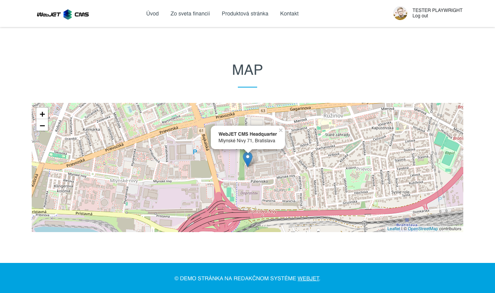

# Mapa

Vloží do stránky interaktívnu mapu (`Google maps` alebo `Open Street Map`) podľa zadaných GPS súradníc, alebo adresy. Pre použitie `Google maps` je potrebné mať zakúpený API kľúč od `Google` nastavený v konf. premennej `googleMapsApiKey`.

## Nastavenia aplikácie

### Karta - Nastavenia

V tejto časti je možné nastaviť polohopisné atribúty:

- **Adresa**
- **Zemepisná šírka**, **Zemepisná dĺžka**

Je povinné nastaviť buď adresu alebo zemepisnú šírku a zemepisnú dĺžku. Miesto možno nastaviť kliknutím na mapu upresnením bodu. Týmto krokom sa na mape zobrazí `pin` a prepíšu hodnoty Zemepisnej šírky a zemepisnej dĺžky.

Karta taktiež obsahuje náhľad mapy, kde je možné vidieť zadané údaje a nastavenia.

!>**Upozornenie:** náhľad mapy sa neaktualizuje automaticky pri zmene adresy alebo súradníc, je nutné kliknúť na tlačidlo **Zobraziť** pre zobrazenie zmien v náhľade.

### Karta - Nastavenie mapy

Karta slúži na nastavenie veľkosti mapy a ďalších parametrov.

Prepínaním parametra **Chcem zadať dynamickú veľkosť** sa rozhodujeme, či veľkosť mapy zadať v percentách (mapa sa bude dynamicky prispôsobovať veľkosti obrazovky) alebo v pixeloch (mapa bude mať pevnú veľkosť).

Ďalšie nastavenia:

- **Priblíženie (0 - 21)**, čím väčšie číslo v rozsahu zadáte, tým väčšie priblíženie mapy bude
- **Povoliť približovanie scrollovaním**, povolením možnosti sa umožní priblížiť mapu pomocou kolieska myši
- **Zobraziť ovládacie prvky na mape**, povolením možnosti sa zobrazia ovládacie prvky na priblíženie a posúvanie mapy

!>**Upozornenie:** kliknutím na tlačidlo **Zobraziť náhľad mapy** sa prepnete do karty **Nastavenia**, kde sa zobrazí aktualizovaný náhľad mapy.

### Karta - Popis pinu

Karta slúži na nastavenie popisu pinu, ktorý sa zobrazí po kliknutí na mape.

Dostupné nastavenia:

- **Zobraziť adresu**, povolením možnosti sa zobrazí adresa, ktorá bola zadaná v karte **Nastavenia** (ak nie je zadaná adresa, zobrazia sa súradnice)
- **Chcem zadať vlastný text**, povolením možnosti sa zobrazí pole na zadanie vlastného textu, ktorý sa zobrazí v popise pinu
- **Odsadenie zhora**, nastavením hodnoty v pixeloch sa nastaví odsadenie popisu pinu od horného okraja mapy
- **Odsadenie zľava**, nastavením hodnoty v pixeloch sa nastaví odsadenie popisu pinu od ľavého okraja mapy
- **Povoliť zavretie popisu**, povolením možnosti sa umožní zavrieť popis pinu kliknutím na krížik v pravom hornom rohu popisu

!>**Upozornenie:** kliknutím na tlačidlo **Zobraziť náhľad mapy** sa prepnete do karty **Nastavenia**, kde sa zobrazí aktualizovaný náhľad mapy.

