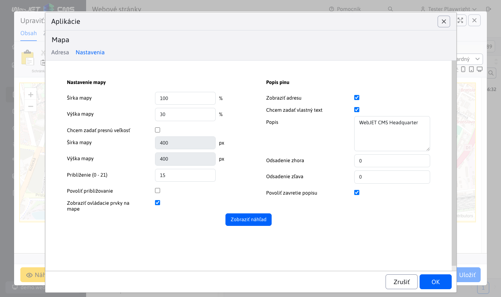

# Mapa

Vloží do stránky interaktívnu mapu (Google maps alebo Open Street Map) podľa zadaných GPS súradníc, alebo adresy. Pre použitie Google maps je potrebné mať zakúpený API kľúč od Google nastavený v konf. premennej googleMapsApiKey.

## Nastavenia aplikácie

### Adresa
V tejto časti je možné nastaviť polohopisné atribúty:
- Adresa
- Zemepisná šírka, Zemepisná dĺžka

Je povinné nastaviť buď adresu alebo zemepisnú šírku a zemepisnú dĺžku. 
Miesto možno nastaviť kliknutím na mapu upresnením bodu.
Týmto krokom sa na mape zobrazí pin a prepíšu hodnoty Zemepisnej šírky a zemepisnej dĺžky. 

### Nastavenia 
V tejto časti je možné nastaviť rozmerové a vizuálne atribúty:

- Šírka mapy (v percentách)
- Výška mapy (v percentách)

Po zaškrtnutí poľa Chcem zadať presnú veľkosť:
- Šírka mapy (v pixeloch)
- Výška mapy (v pixeloch)
- Priblíženie (v rozmedzí 0 - 21)
- Povoliť približovanie
- Zobraziť ovládacie prvky na mape
- Zobraziť adresu
- Popis
- Odsadenie zhora
- Odsadenie zľava
- Povoliť zavretie popisu

Po zmene atribútov je možné zobraziť náhľad pomocou tlačidla

## Zobrazenie aplikácie

