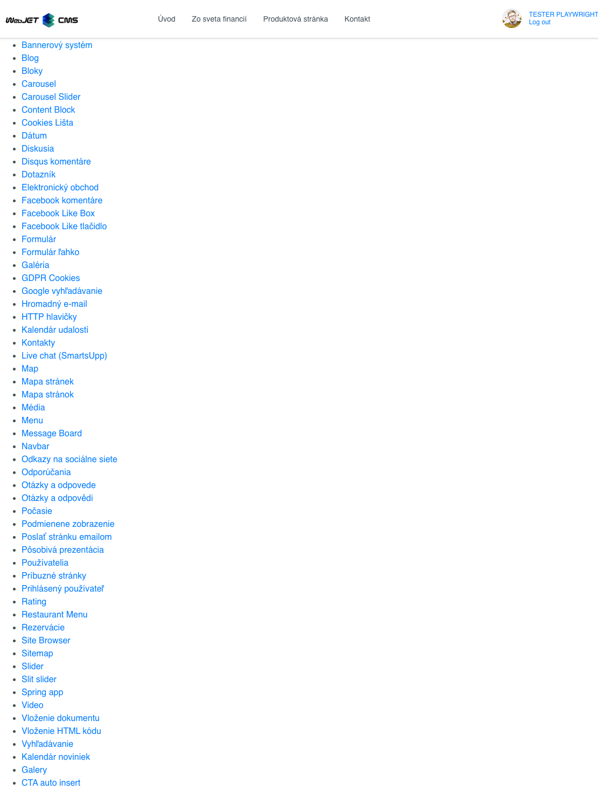
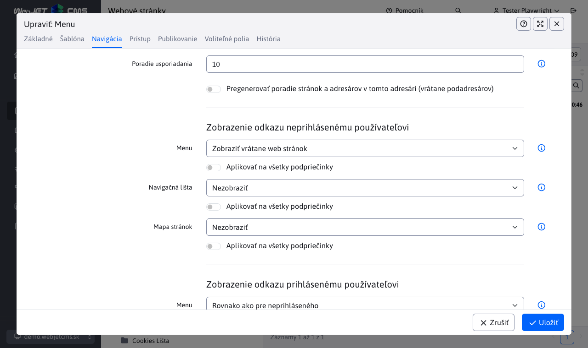

# Menu

Aplikácia menu generuje navigačné menu pre celé web sídlo (tzv. horné menu, alebo ľavé menu). Grafická podoba menu sa definuje pomocou kaskádových štýlov (CSS). Príklady zobrazenia horného a ľavého menu:

Horné menu:

Ľavé menu:

Zobrazenie položky v menu je závislé od nastavenia poľa Menu v karte Navigácia adresára web stránok. Má nasledovné možnosti:

- Zobraziť - položka sa v navigačnom menu zobrazí.
- Nezobraziť - položka sa v navigačnom menu nezobrazí (a to vrátane pod-priečinkov).
- Zobraziť bez podpriečinkov - položka sa v navigačnom menu zobrazí, ale nebudú zobrazené jej ďalšie pod-priečinky (výhoda je v tom, že pod-priečinkom nie je potrebné nastavovať spôsob zobrazenia).
- Zobraziť vrátane web stránok - v navigačnom menu sa zobrazí priečinok a zobrazia sa aj web stránky z priečinka ako samostatné položky. Štandardne pri možnosti Zobraziť sa nezobrazujú web stránky z adresára ako samostatné menu položky.

Pri zobrazení vrátane web stránok môžete ešte samostatne každej web stránke nastaviť možnosť zobrazenia v menu. Možnosť je rovnako v karte Navigácia a obsahuje možnosti:

- Zobraziť - web stránka sa v menu zobrazí.
- Nezobraziť - web stránka sa v menu nezobrazí.

## Nastavenie aplikácie

Vo vlastnostiach aplikácie je možné nastaviť:

  - Koreňový adresár - výber koreňového adresára
  - Posun od koreňového adresára - počet úrovní adresárov od koreňového adresára o ktoré sa výpis má posunúť. Používa sa v prípade, keď máte horné menu s hlavnými položkami a ľavé menu s podpoložkami - menu podpoložiek má nastavený posun o 2 aby sa nevypísali do menu hlavné položky ale až podpoložky.
  - Maximálna hĺbka menu - -1 menu bez obmedzenia hĺbky generovania.
  - Generované CSS štýly
    - Žiadne (čisté XHTML)
    - Základné - generuje triedu open na otvorenú položku
    - Všetky - generuje radu tried: zobrazovanú úroveň, či položka obsahuje podpoložky, id adresára, ci je položka otvorená alebo zatvorená
  - Generovať prázdny span - generuje prázdny html tag span do odkazu
  - Rozbaliť všetky položky - všetky úrovne menu budú rozbalené
  - Nastaviť premenné - táto funkcionalita sa využíva keď chceme generovať nadpis špecifickej úrovne do menu mapr. cez !WRITE(!ROOT_GROUP_NAME!)!
  - ID štýlu hlavného UL elementu - ID elementu
  - Názov adresára pre MenuInfo
  - Vložiť perex - obalí nazov názov a prida za to text perexu
  - Vložiť perex od úrovne - vloží perex až od definovanej úrovne

## MenuInfo

Slúži na vkladanie popisov k sekcii alebo reklamných bannerov do menu (megamenu).

Do poľa MenuInfo zadávate názov adresára, ktorý ak sa nájde nevygeneruje sa do menu ako štandardný odkaz ale sa do menu vygeneruje obsah hlavnej stránky tohto adresára. Generuje sa titulok a obsah stránky.

**Príklad:**

Pri editácii menu komponenty zadáte do poľa MenuInfo názov adresára napr. Informácie. V štruktúre web sídla ktorá sa generuje do menu vytvoríte adresár Informácie. Doplníte potrebné údaje do stránky a stránku vypublikujete. Titulok a obsah stránky Informácie sa budú zobrazovať v generovanom menu namiesto štandardného odkazu.