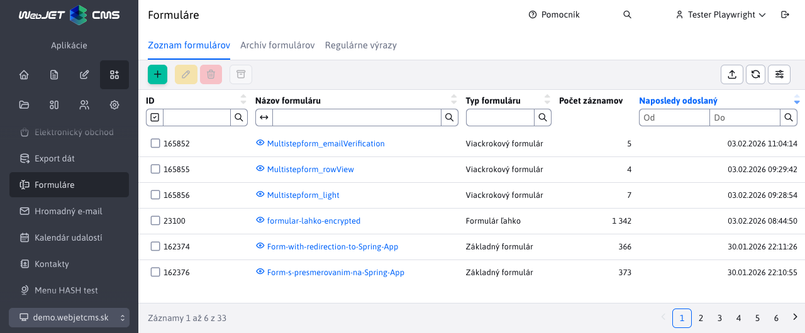
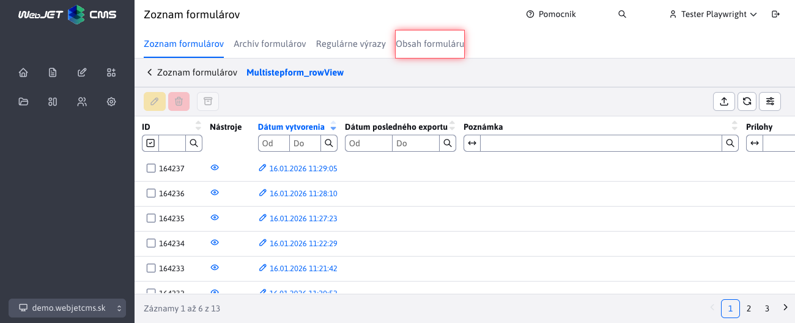
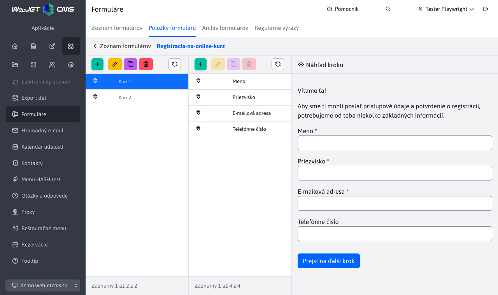
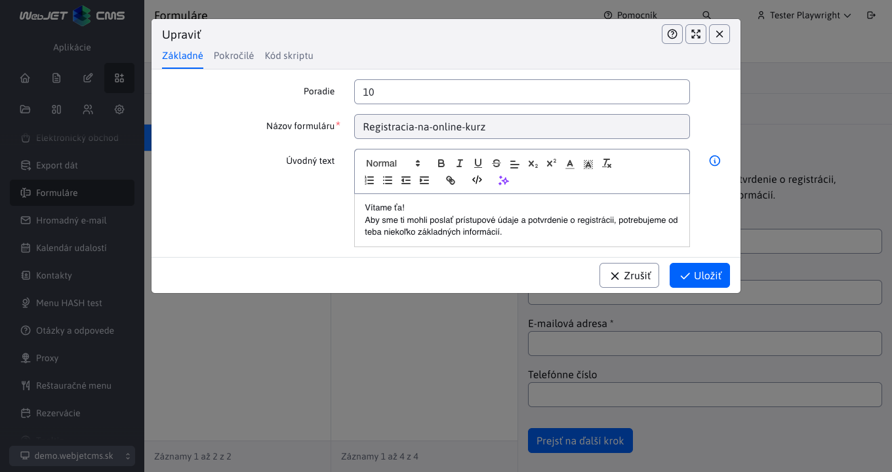
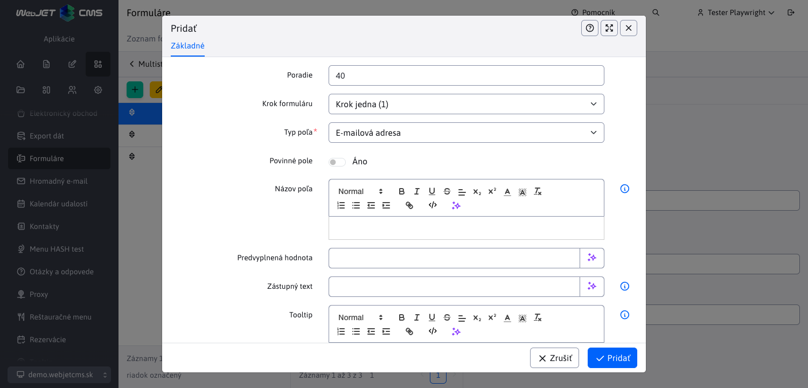

# Položky formuláru

Cez kartu položky formulára viete vytvárať viackrokové formuláre. Tieto formuláre umožňujú rozdelenie formulárov na viacero krokov, čo zlepšuje používateľskú skúsenosť a zvyšuje prehľadnosť. Samozrejme môžete vytvárať aj jednoduché formuláre iba s jedným krokom.

## Vytvorenie formulára

Formulár môžete vytvoriť v sekcii **Aplikácie > Formuláre**, presnejšie v karte [Zoznam formulárov](../form/README.md). Zoznam obsahuje formuláre všetkých typov, vrátane viackrokových, ale pri vytvorení nového sa vždy vytvorí viackrokový formulár.



Kliknutím na pridať sa zobrazí dialóg pre [vytvorenie nového formulára](../form/README.md#vytvorenie-formuláru).


Musíte zadať unikátny názov formulára a ak chcete odosielať odpovede na email aj vašu email adresu. Viac informácii k poliam formulára nájdete v sekcii [Vytvorenie formulára](../form/README.md#vytvorenie-formuláru).

## Karta - Položky formuláru

V zozname odoslaných formulárov sa pre formulár typu viackrokový zobrazuje karta **Položky formuláru**.



Kliknutím na túto kartu sa zobrazí sekcia, kde môžeme formuláru pridávať položky a kroky.



## Zloženie karty - Položky formuláru

Karta **Položky formuláru** je rozdelená na tri stĺpce:

- **Kroky formuláru** - tabuľka obsahujúca zoznam krokov formuláru.
- **Položky formuláru** - tabuľka obsahujúca zoznam položiek (jednotlivé formulárové polia) formuláru patriacich do práve vybraného kroku.
- **Náhľad formuláru** - zobrazenie náhľadu práve zvoleného kroku formuláru.


## Kroky formuláru

Prvý stĺpec zobrazuje zoznam krokov formuláru. V tomto zozname môžeme pridávať, duplikovať, mazať, upravovať a meniť poradie krokov formuláru. Každý vytvorený krok teda predstavuje reálný krok vo formulári, ktorý sa zobrazí používateľovi. K jednotlivým krokom môžete pridávať položky formuláru, ktoré sa zobrazia v danom kroku.



Môžete vyplniť Úvodný text, ktorý sa zobrazí na začiatku kroku. V karte Pokročilé môžete zmeniť text tlačidla na prechod na ďalší krok (alebo odoslanie formuláru, ak ide o posledný krok).

### Duplikovanie

Pri duplikovaní kroku sa skopírujú všetky položky, ktoré sa v danom kroku nachádzajú, do nového kroku. Týmto spôsobom môžeme rýchlo vytvoriť podobné kroky bez nutnosti pridávať všetky položky odznova.

### Mazanie

Pri mazaní kroku sa odstránia všetky položky, ktoré sa v danom kroku nachádzajú. Pred mazaním je vhodné skontrolovať, či v danom kroku nie sú žiadne dôležité položky, ktoré by sme chceli zachovať.

## Položky formuláru

Druhý stĺpec obsahuje položky formuláru (alebo položky kroku formuláru), ktoré sa zobrazia až po zvolení kroku v prvom stĺpci. V tejto tabuľke môžete pridávať, duplikovať, upravovať, mazať a meniť poradie položiek formuláru. Položky sa pridávajú do práve zvoleného kroku (takže jednotlivé kroky formulár sa nebudú navzájom ovplyvňovať).



### Pridávanie a úprava položiek

Editor pre pridávanie a úpravu položiek je špeciálny tým, že mení svoj obsah podľa zvoleného typu poľa (položky). To znamená, že pre každý typ položky (napr. Meno, Priezvisko atď.) sa zobrazia rôzne nastavenia a možnosti konfigurácie. Podľa zvoleného typu položky môžete nastaviť parametre ako:

- **Typ poľa** - určuje aký druh vstupu bude položka predstavovať (napr. textové pole, výber z rozbaľovacieho zoznamu, zaškrtávacie políčko atď.). Jednotlivé polia [pripravuje dizajnér web sídla](../formsimple/README.md#informácia-pre-web-dizajnéra) a sú rovnaké ako pre aplikáciu formulár ľahko.
- **Povinné pole** - či je položka povinná na vyplnenie.
- **Povolená hodnota** - pre pokročilú validáciu vstupu používateľa viete zvoliť ľubovoľný počet regulárnych výrazov, ktoré musia byť splnené, aby bol vstup platný. Viac sa o nich dozviete v sekcii [Regulárne výrazy](../form/regexps.md).
- **Názov poľa** - názov, ktorý sa zobrazí používateľovi. Ak nie je zadaný použije sa názov zhodný s typom poľa.

V karte Pokročilé môžete nastaviť ďalšie voliteľné parametre ako:

- **Krok formuláru** - krok, ku ktorému položka patrí, môžete tak ľahko položku presunúť do iného kroku.
- **Poradie** - určuje poradie položky v rámci kroku.
- **Predvyplnená hodnota** - hodnota, ktorá sa zobrazí vyplnená v poli, používateľ tak nemusí nastaviť hodnotu, ak je všeobecne známa. Pre polia typu výberové pole sem zadajte čiarkovou oddeľovaný zoznam hodnôt, napríklad `začiatočník,pokročilý,expert`.
- **Zástupný text** - text, ktorý sa zobrazí v poli ako nápoveda pre používateľa ak nie je pole vyplnené (je prázdne).
- **Tooltip** - ak zadáte hodnotu tooltipu, zobrazí sa pri názve poľa informačná bublina.

Ak chcete definovať vlastné položky formulárov, alebo chcete zmeniť existujúce, či zmeniť aké nastavenia sú dostupné pre jednotlivé typy položiek, pozrite si dokumentáciu v sekcii [Položky formulárov](../formsimple/README.md#informácia-pre-web-dizajnéra).

!>**Upozornenie:** pri úprave položky formuláru neodporúčame meniť typ položky, ale radšej nahradiť pôvodnú položku novou.

### Riadkové zobrazenie

Môžete sa stretnúť so situáciou, kedy Vám editor nedovolí pridať zvolenú položku. Môže to nastať ak ide o špeciálnu položku určenú pre riadkové zobrazenie formulára (vo všeobecnosti maju tieto položky v názve "riadkové zobrazenie"). Kým formulár nebude v režime riadkového zobrazenia, tieto položky síce vo výbere uvidíte ale nebudete ich môcť použiť.

Formulár prepnete do režimu riadkového zobrazenia v [nastaveniach formuláru](../form/README.md#vytvorenie-formuláru).

### Značky

Ak chcete v položke formuláru použiť informácie o aktuálnom prihlásenom používateľovi (napr. jeho meno, email, atď.), môžete použiť špeciálne značky. Tieto značky sa automatický nahradia príslušnými hodnotami pri zobrazení formuláru používateľovi. Pre neprihlásených používateľov budú tieto značky nahradené prázdnou hodnotou. Hodnotu zadajte do poľa **Predvyplnená hodnota** položky formuláru.

Dostupné značky sú:

- ```!LOGGED_USER_NAME!``` - meno a priezvisko (ak je konf. premenná ```fullNameIncludeTitle``` nastavená na true obsahuje aj titul)
- ```!LOGGED_USER_FIRSTNAME!``` - meno
- ```!LOGGED_USER_LASTNAME!``` - priezvisko
- ```!LOGGED_USER_TITLE!``` - titul
- ```!LOGGED_USER_LOGIN!``` - prihlasovacie meno
- ```!LOGGED_USER_EMAIL!``` - emailová adresa
- ```!LOGGED_USER_COMPANY!``` - firma
- ```!LOGGED_USER_CITY!``` - mesto
- ```!LOGGED_USER_ADDRESS!``` - adresa (ulica)
- ```!LOGGED_USER_COUNTRY!``` - štát
- ```!LOGGED_USER_PHONE!``` - telefón
- ```!LOGGED_USER_ZIP!``` - PSČ
- ```!LOGGED_USER_ID!``` - ID používateľa
- ```!LOGGED_USER_BIRTH_DATE!``` - dátum narodenia
- ```!LOGGED_USER_FIELDA!``` - voľné pole A
- ```!LOGGED_USER_FIELDB!``` - voľné pole B
- ```!LOGGED_USER_FIELDC!``` - voľné pole C
- ```!LOGGED_USER_FIELDD!``` - voľné pole D
- ```!LOGGED_USER_FIELDE!``` - voľné pole E
- `!LOGGED_USER_GROUPS!` - zoznam skupín používateľov

## Náhľad formuláru

Tretí stĺpec sekcie **Obsah formuláru** je náhľad formuláru. Tento náhľad zobrazuje aktuálny krok formuláru tak, podobne ako ho uvidí používateľ. Náhľad sa aktualizuje vždy, keď nastane nejaká zmena v tabuľke kroky alebo položky formuláru. Týmto spôsobom môžete orientačne vidieť, ako bude formulár vyzerať po vykonaní zmien.

Na konci každého kroku sa automatický vygeneruje tlačidlo, ktorého text sa mení podľa toho, či je krok posledný alebo nie. Ak nie je posledný, tlačidlo bude mať text **Prejsť na ďalší krok**, inak **Odoslať formulár**.

!>**Upozornenie:** Náhľad formuláru sa vo výsledku môže graficky líšiť od skutočného zobrazenia vo webovej aplikácii, nakoľko záleží na použitej šablóne a štýloch stránky v ktorej bude formulár vložený. Náhľad slúži hlavne na predstavu o rozložení a obsahu formuláru.

## Vloženie formuláru do stránky

Vytvorený formulár môžete vložiť do web stránky pomocou aplikácie Formulár v ktorej vyberiete názov vytvoreného formuláru.


## Konfiguračné premenné

Dostupné konfiguračné premenné pre viackrokové formuláre:

- `multistepform_nameFields` - zoznam názvov polí, ktoré budú považované za polia pre meno. Medzi týmito poľami sa bude hľadať meno, ktoré by sa použilo ako oslovenie v emailoch. Použije sa iba **prvé** nájdene neprázdne meno.
- `multistepform_emailFields` - zoznam názvov polí, ktoré budú považované za polia pre emailovú adresu. Medzi týmito poľami sa bude hľadať emailová adresa, na ktorú sa odošle potvrdenie o prijatí formuláru. Použije sa  **všetky** nájdene a validné emailové adresy.
- `multistepform_attachmentDefaultName` - prednastavený názov prílohy v emailoch, ktorý sa použije ak sa nepodarí získať skutočný názov súboru prílohy.
- `multistepform_subjectDefaultValue` - prednastavený predmet emailu, ktorý sa použije ak nie je zadaný predmet v nastaveniach/atribútoch formuláru.