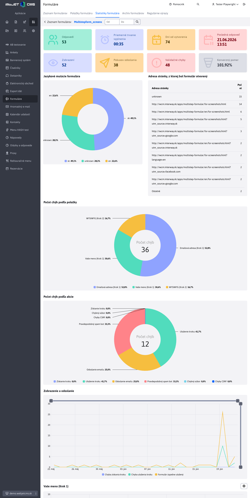

# Štatistiky formulára

Sekcia **Štatistiky formulára** poskytuje prehľad o odpovediach odoslaných cez viackrokový formulár. Zobrazuje súhrnné čísla, grafické vizualizácie odpovedí na jednotlivé položky formulára a pokročilé štatistiky vyplnenia formulára.

## Súhrnné štatistiky

V hornej časti stránky sa nachádzajú základné informačné karty:

| Karta | Popis |
| --- | --- |
| **Odpovedí** | Počet vyplnených a odoslaných formulárov v zvolenom období. |
| **Priemerné trvanie vyplnenia** | Priemerný čas, ktorý respondenti strávili vypĺňaním formulára v zvolenom období, vo formáte `MM:SS`. |
| **Dní od vytvorenia** | Počet dní, ktoré uplynuli od vytvorenia formulára. Pri formulári vytvorenom v aktuálny deň sa zobrazí hodnota `< 1`. |
| **Posledná odpoveď** | Dátum a čas poslednej odoslanej odpovede v zvolenom období. |

Po kliknutí na tlačidlo **Zobraziť pokročilú štatistiku** sa zobrazia aj ďalšie karty:

| Karta | Popis |
| --- | --- |
| **Zobrazení** | Počet zobrazení viackrokového formulára návštevníkom. |
| **Pokusov** | Počet pokusov dokončiť formulár odoslaním posledného kroku. |
| **Chyby** | Súčet validačných chýb položiek a systémových chýb pri práci s krokmi formulára. |
| **Pomer** | Pomer počtu odpovedí voči celkovému počtu zobrazení formulára v percentách. |

## Filtrovanie obdobia

V hornej lište stránky je dátumový filter **Od - Do**. Po zmene rozsahu a kliknutí na tlačidlo filtrovania sa prepočítajú odpovede, grafy položiek formulára a štatistiky, ktoré sa viažu na uložené odoslania. Ak rozsah nezadáte, použije sa predvolený rozsah posledných 30 dní.

| Údaj | Správanie pri dátumovom filtri |
| --- | --- |
| **Odpovede**, **Priemerné trvanie vyplnenia**, **Posledná odpoveď**, grafy položiek, jazykové mutácie, adresa nasadeného formulára a systémové chyby | Počítajú sa zo zvoleného obdobia. |
| **Zobrazení**, **Pokusov** a validačné chyby položiek | Ide o priebežné počítadlá od nasadenia sledovania, dátumový filter ich spätne nerozdeľuje. |
| **Dní od vytvorenia** | Počíta sa od vytvorenia formulára bez ohľadu na zvolený rozsah. |

!>**Upozornenie:** Staršie historické odpovede vytvorené pred rozšírením štatistík nemusia obsahovať jazyk, adresu nasadenia formulára ani počítadlá chýb.

## Grafy položiek formulára

Pod súhrnnými kartami sa zobrazujú grafy pre jednotlivé položky formulára, ktoré majú povolené zobrazenie štatistiky. Pre každú takúto položku sa vykreslí samostatný graf s rozdelením odpovedí v zvolenom období.

!>**Upozornenie:** Graf sa zobrazí len pre tie položky formulára, ktoré majú zapnutú možnosť **Zobraziť štatistiku** v karte [Štatistika](./README.md#štatistika) pri editácii položky.

Každý graf obsahuje v pravom hornom rohu tlačidlo <button class="btn btn-sm btn-outline-secondary chart-more-btn"><i class="ti ti-settings"></i></button>, ktoré otvorí dialóg s kartou **Štatistika** na konfiguráciu grafu. Táto karta je priamo spárovaná s kartou [Štatistika](./README.md#štatistika) dostupnou pri editácii položky formulára.

## Úprava grafov

Ak chcete zmeniť typ grafu, jeho správanie alebo farby, otvorte dialóg cez tlačidlo nastavení v pravom hornom rohu príslušného grafu. Po zmene a uložení preferencií sa graf automaticky prekreslí bez nutnosti opätovného načítania stránky a použije aktuálne nastavený dátumový rozsah.

Dostupné možnosti konfigurácie grafu sú rovnaké ako nastavenia v karte [Štatistika](./README.md#štatistika) pri editácii položky formulára:

- **Typ grafu** – určuje, akým typom grafu chcete dáta reprezentovať.
- **Počet hodnôt** – počet najčastejších hodnôt, ktoré sa zobrazia v grafe.
- **Zobraziť "Ostatné"** – zvyšné hodnoty za hranicou **Počet hodnôt** sa zlúčia do jednej položky „Ostatné".
- **Zobraziť "Nezodpovedané"** – nezodpovedané odpovede sa zobrazia ako samostatná položka „Nezodpovedané".
- **Porovnávať laxne** – pri zoskupovaní odpovedí sa ignoruje veľkosť písmen a diakritika (napr. `Áno` a `ano` sa spočítajú ako rovnaká odpoveď).
- **Vybrať farebnú schému pre graf** – výber farebnej schémy z dostupných paliet (každá obsahuje 5 farieb, pri väčšom počte hodnôt sa farby opakujú).

## Pokročilá štatistika

Kliknutím na tlačidlo **Zobraziť pokročilú štatistiku** sa zobrazia ďalšie štatistické informácie.

| Graf | Popis |
| --- | --- |
| **Jazykové mutácie formulára** | Rozdelenie odoslaných odpovedí podľa jazyka stránky, do ktorej bol formulár vložený. Jazyk sa zisťuje z priečinka alebo šablóny stránky. |
| **Adresa nasadeného formulára** | Prehľad najčastejších URL adries stránok, z ktorých bol formulár odoslaný. Ak sa adresa nedá zistiť, zaradí sa do hodnoty `unknown`. |
| **Počet chýb podľa položky** | Rozdelenie validačných chýb podľa položiek formulára. Zobrazí sa 5 najčastejších položiek, zvyšok sa zlúči do hodnoty **Ostatné**. |
| **Počet chýb podľa akcie** | Rozdelenie systémových chýb podľa akcie **Získanie kroku** alebo **Uloženie kroku** v zvolenom období. |
| **Zobrazenie a odoslanie** | Čiarový graf odoslaní a systémových chýb podľa dní. |

Pokročilé grafy sú pevne dané a nemajú samostatné tlačidlo nastavenia grafu. Dátumový filter **ovplyvňuje** graf typu **Počet chýb podľa akcie** a **Časový vývoj systémových chýb**, dáta sú získavané z auditu.

## Ako sa údaje zbierajú

- **Zobrazenie formulára** sa započíta pri zobrazení aplikácie viackrokového formulára na stránke.
- **Pokus o odoslanie** sa započíta pri dokončení posledného kroku formulára.
- Ak validácia kroku zlyhá, započítajú sa validačné chyby konkrétnych položiek. Takýto neúspešný krok nezvýši počet pokusov o odoslanie formulára.
- Pri uloženej odpovedi sa eviduje trvanie vyplnenia, jazyk stránky a adresa stránky, z ktorej bol formulár odoslaný.
- Pri chybe načítania alebo uloženia kroku sa vytvorí záznam v audit logu typu **Viackrokový formulár - Používatelia**.
