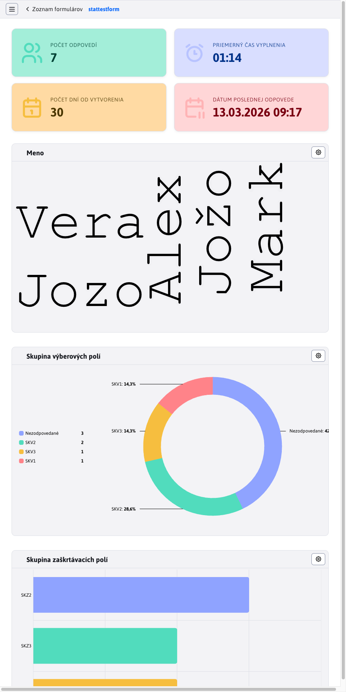
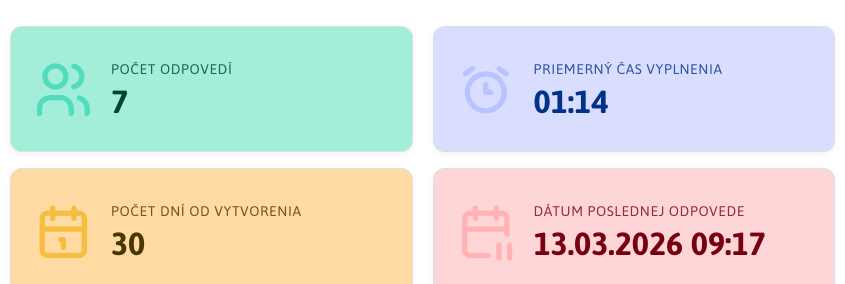

# Štatistiky formulára

Sekcia **Štatistiky formulára** poskytuje prehľad o odpovediach odoslaných cez viackrokový formulár. Zobrazuje súhrnné čísla aj grafické vizualizácie odpovedí na jednotlivé položky formulára.

## Súhrnné štatistiky

V hornej časti stránky sa nachádzajú štyri informačné karty:

| Karta | Popis |
| --- | --- |
| **Počet odpovedí** | Celkový počet vyplnených a odoslaných formulárov. |
| **Priemerný čas vyplnenia** | Priemerný čas, ktorý respondenti strávili vypĺňaním formulára, vo formáte `MM:SS`. |
| **Počet dní od vytvorenia** | Počet dní, ktoré uplynuli od vytvorenia formulára. |
| **Dátum poslednej odpovede** | Dátum a čas poslednej odoslanej odpovede. |

## Grafy položiek formulára

Pod súhrnnými kartami sa zobrazujú grafy pre jednotlivé položky formulára, ktoré majú povolené zobrazenie štatistiky. Pre každú takúto položku sa vykreslí samostatný graf s rozdelením odpovedí.

!>**Upozornenie:** Graf sa zobrazí len pre tie položky formulára, ktoré majú zapnutú možnosť **Zobraziť štatistiku** v karte [Štatistika](./README.md#štatistika) pri editácii položky.

Každý graf obsahuje v pravom hornom rohu tlačidlo <button class="btn btn-sm btn-outline-secondary chart-more-btn"><i class="ti ti-settings"></i></button>, ktoré otvorí dialóg s kartou **Štatistika** na konfiguráciu grafu. Táto karta je priamo spárovaná s kartou [Štatistika](./README.md#štatistika) dostupnou pri editácii položky formulára.

## Úprava grafov

Ak chcete zmeniť typ grafu, jeho správanie alebo farby, otvorte dialóg cez tlačidlo nastavení v pravom hornom rohu príslušného grafu. Po zmene a uložení preferencií sa grafy automaticky prekreslí bez nutnosti opätovného načítania stránky.

Dostupné možnosti konfigurácie grafu sú rovnaké ako nastavenia v karte [Štatistika](./README.md#štatistika) pri editácii položky formulára:

- **Typ grafu** – určuje, akým typom grafu chcete dáta reprezentovať.
- **Počet hodnôt** – počet najčastejších hodnôt, ktoré sa zobrazia v grafe.
- **Zobraziť "Ostatné"** – zvyšné hodnoty za hranicou **Počet hodnôt** sa zlúčia do jednej položky „Ostatné".
- **Zobraziť "Nezodpovedané"** – nezodpovedané odpovede sa zobrazia ako samostatná položka „Nezodpovedané".
- **Porovnávať laxne** – pri zoskupovaní odpovedí sa ignoruje veľkosť písmen a diakritika (napr. `Áno` a `ano` sa spočítajú ako rovnaká odpoveď).
- **Vybrať farebnú schému pre graf** – výber farebnej schémy z dostupných paliet (každá obsahuje 5 farieb, pri väčšom počte hodnôt sa farby opakujú).