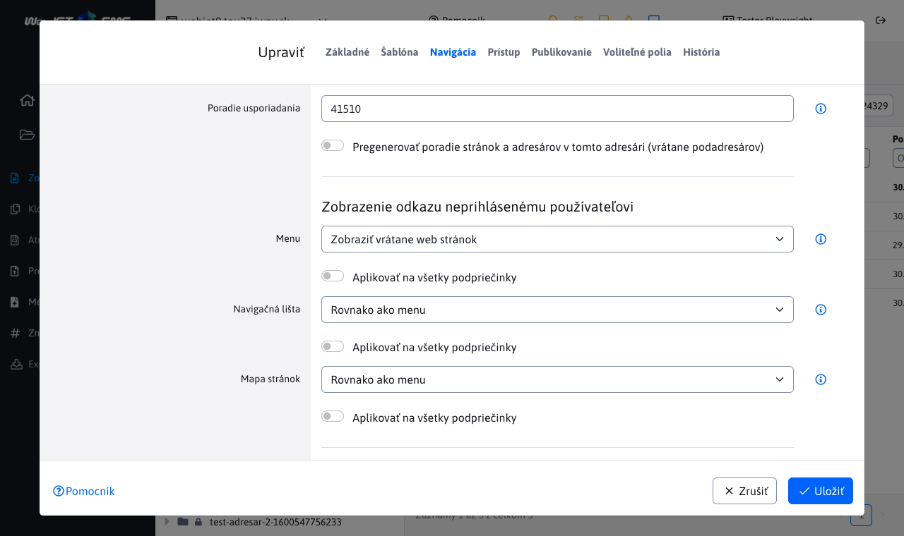
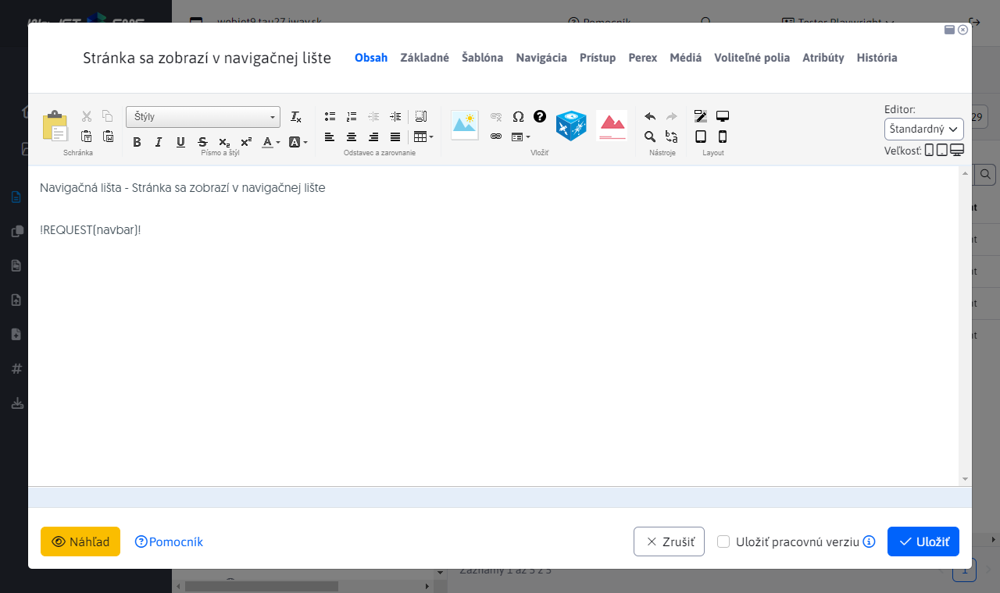

# Navigačná lišta

Navigačná lišta (navbar / breadcrumb / drobečková navigácia) zobrazuje vo web stránke klikateľnú cestu k aktuálne zobrazenej web stránke. Na názvy adresárov je možné kliknúť a dostať sa jednoducho o úroveň nižšie. Príklad:


Zobrazenie položky v navigačnej lište je závislé od nastavenia poľa Navigačná lišta v karte Navigácia adresára web stránok. Má nasledovné možnosti:

- Rovnako ako menu - zobrazenie v navigačnej lište sa správa rovnako ako je nastavené pole pre zobrazenie v menu.
- Zobraziť - položka sa v navigačnej lište zobrazí.
- Nezobraziť - položka sa v navigačnej lište nezobrazí (a to vrátane pod-priečinkov).

Pri možnosti zobraziť môžete ešte zobrazenej web stránke nastaviť možnosť zobrazenia (typicky sa jedná o poslenú položku v navigačnej lište). Tá je rovnako v karte Navigácia a obsahuje možnosti:

- Zobraziť - web stránka sa v navigačnej lište zobrazí.
- Nezobraziť - web stránka sa v navigačnej lište nezobrazí.



## Použitie

Navigačná lišta sa vkladá priamo do JSP šablóny ako značka:

```html
<iwcm:write name="navbar"/>
```

alebo je možné ju vložiť priamo do web stránky ako výraz:

```html
!REQUEST(navbar)!
```

