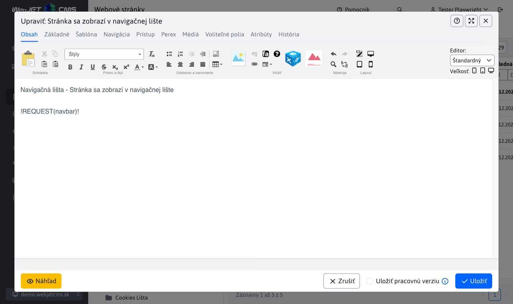

# Navigačná lišta

Navigačná lišta (navbar / breadcrumb / drobečková navigácia) zobrazuje vo web stránke klikateľnú cestu k aktuálne zobrazenej web stránke. Na názvy adresárov je možné kliknúť a dostať sa jednoducho o úroveň nižšie. Príklad:


Zobrazenie položky v navigačnej lište je závislé od nastavenia poľa Navigačná lišta v karte Navigácia adresára web stránok. Má nasledovné možnosti:

- Rovnako ako menu - zobrazenie v navigačnej lište sa správa rovnako ako je nastavené pole pre zobrazenie v menu.
- Zobraziť - položka sa v navigačnej lište zobrazí.
- Nezobraziť - položka sa v navigačnej lište nezobrazí (a to vrátane pod-priečinkov).

Pri možnosti zobraziť môžete ešte zobrazenej web stránke nastaviť možnosť zobrazenia (typicky sa jedná o poslednú položku v navigačnej lište). Tá je rovnako v karte Navigácia a obsahuje možnosti:

- Zobraziť - web stránka sa v navigačnej lište zobrazí.
- Nezobraziť - web stránka sa v navigačnej lište nezobrazí.


## Použitie

Navigačná lišta sa vkladá priamo do JSP šablóny ako značka:

```html
<iwcm:write name="navbar"/>
```

alebo je možné ju vložiť priamo do web stránky ako výraz:

```html
!REQUEST(navbar)!
```



## Vlastná implementácia navigačnej lišty

Pre niektoré projekty môže byť potrebné vytvoriť vlastnú implementáciu navigačnej lišty s odlišným formátovaním alebo štruktúrou. WebJET umožňuje definovať vlastnú triedu pre generovanie navigačnej lišty.

### Vytvorenie vlastnej implementácie

Vlastná implementácia musí implementovať rozhranie `sk.iway.iwcm.doc.NavbarInterface`:

```java
package com.example.custom;

import javax.servlet.http.HttpServletRequest;
import sk.iway.iwcm.doc.NavbarInterface;

public class CustomNavbar implements NavbarInterface {
    
    @Override
    public String getNavbar(int groupId, int docId, HttpServletRequest request) {
        // Vlastná implementácia navigačnej lišty
        return "<nav>Vlastná navigácia pre skupinu " + groupId + "</nav>";
    }
}
```

### Nastavenie

Po vytvorení vlastnej implementácie je potrebné nastaviť konfiguračnú premennú `navbarDefaultType` na plný názov triedy (vrátane package):

```
navbarDefaultType=com.example.custom.CustomNavbar
```

Táto konfigurácia sa nastavuje v **Nastavenia > Konfigurácia** v administrácii WebJET.

### Štandardné implementácie

WebJET obsahuje tri štandardné implementácie:

- **NavbarStandard** - štandardná textová navigácia (hodnota `normal` alebo prázdna)
- **NavbarRDF** - navigácia vo formáte RDF (hodnota `rdf`)
- **NavbarSchemaOrg** - navigácia vo formáte Schema.org (hodnota `schema.org`)

### Poznámky

- Ak konfiguračná premenná `navbarDefaultType` obsahuje názov triedy (nie štandardné hodnoty `normal`, `rdf`, `schema.org`), WebJET sa pokúsi načítať túto triedu a použiť ju.
- Ak trieda neexistuje alebo neimplementuje `NavbarInterface`, použije sa štandardná implementácia.
- Vlastná trieda musí mať verejný konštruktor bez parametrov.