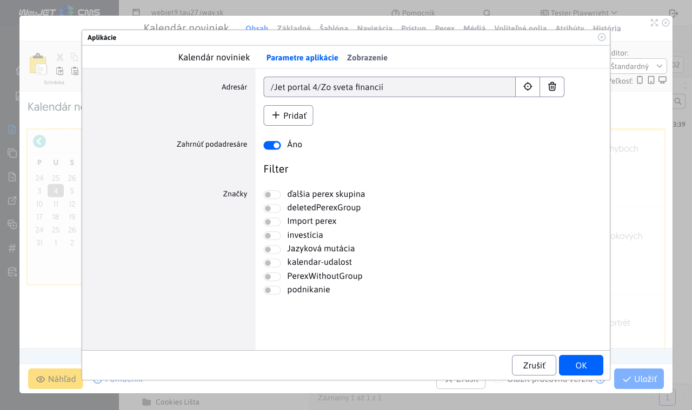

# Kalendár noviniek

Aplikácie **Kalendár noviniek** a **Novinky** sú navzájom prepojené - po výbere dátumu v kalendári sa zobrazí zoznam noviniek filtrovaný podľa zvoleného dátumu. Zobrazia sa novinky so zhodným dátumom v poli Dátum začiatku.

## Nastavenie aplikácií

### Zdieľaný priečinok pre Novinky a Kalendár noviniek:

Obe aplikácie musia byť nastavené na rovnaký priečinok noviniek. Ak sa tieto nastavenia nezhodujú, **Kalendár noviniek** nebude schopný správne filtrovať novinky pre vybraný dátum. Prepojenie medzi aplikáciami funguje tak, že prvá aplikácia **Novinky** vložená za **Kalendár noviniek** v editore s ním bude automaticky prepojená.

Do stránky teda vložte aplikáciu Kalendár noviniek a následne aplikáciu Novinky.

