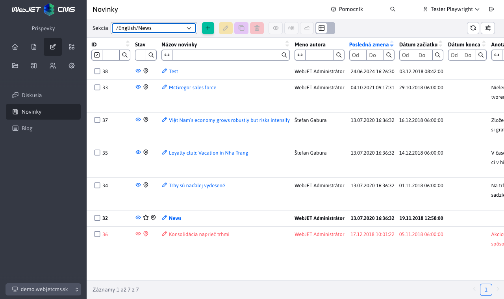
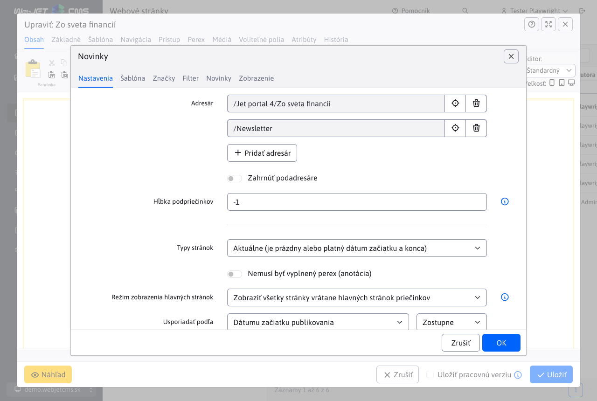
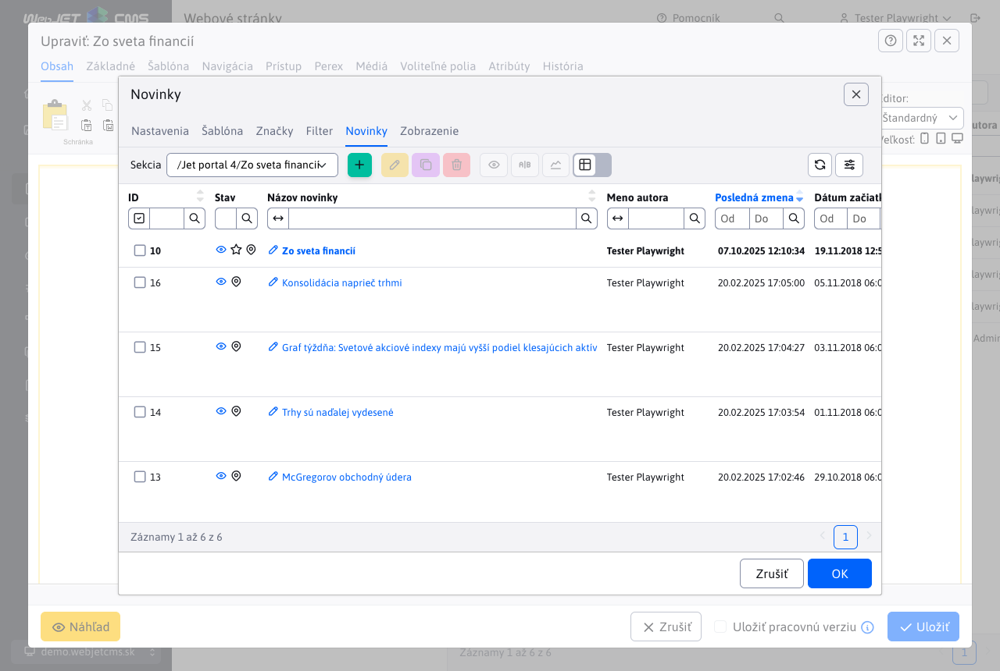

# Novinky

Aplikácia Novinky, vloží do stránky zoznam web stránok v zadanom priečinku. Používa sa na vkladanie zoznamu noviniek, tlačových správ, ale aj iných podobných výpisov (zoznam kontaktných miest, osobných kontaktov, produktov a podobne).


## Zoznam noviniek

Zoznam noviniek v administrácii je podobný zoznamu web stránok, ale neobsahuje stromovú štruktúru. Nachádza sa v menu Príspevky/Novinky. V hornej časti je možné vybrať priečinok pre zobrazenie v tabuľke.



Hodnoty vo výberovom poli sekcie v hlavičke sa generujú:

- automaticky - ak je konf. premenná `newsAdminGroupIds` nastavená na prázdnu hodnotu získa sa zoznam ID priečinkov s novinkami vyhľadávaním výrazu `!INCLUDE(/components/news/` v telách stránok a dohľadaním nastaveného ID priečinka `groupIds`.
- podľa konf. premennej `newsAdminGroupIds`, kde je možné zadať čiarkou oddelený zoznam ID priečinkov, napr. `17,23*,72`, pričom ak ID priečinka končí na znak `*` načítajú sa pri výbere aj novinky (web stránky) z pod priečinkov.

Kliknutím na názov novinky sa otvorí editor zhodný s [editorom stránok](../../webpages/editor.md).


## Nastavenie aplikácie vo web stránke

Aplikácia vložená do web stránky má nasledovné karty:

### Parametre aplikácie

V záložke parametre aplikácie nastavujete základné správanie aplikácie a jej nastavenia.



- Adresár - ID adresárov (priečinkov web stránok), z ktorých sa budú vyberať novinky (stránky). Tlačítkom Pridať, môžete vybrať viac ID adresárov.
- Zahrnúť podadresáre - zvolením tejto možnosti sa načítajú novinky aj z podadresárov zvolených adresárov z poľa Adresár.
- Hĺbka podpriečinkov - pri zobrazení noviniek z pod priečinkov je možné nastaviť maximálnu hĺbku hľadania pod priečinkov. Hodnota menej ako 1 nastaví hľadanie bez obmedzení.
- Typy stránok - výber stránok podľa dátumovej platnosti
  - Aktuálne – je platný dátum začiatku a konca - zobrazia sa len novinky, ktorých dátum platnosti (začiatok a koniec pulikovania) je v rozmedzí aktuálneho dátumu.
  - Staré – zobrazia sa novinky, ktoré majú dátum konca v minulosti (archív).
  - Všetky – zobrazia sa novinky bez ohľadu na dátum začiatku a konca ich publikovania.
  - Nasledujúce – zobrazia sa len novinky, ktoré majú dátum začiatku publikovania v budúcnosti.
  - Aktuálne platné - zobrazia sa len novinky s vyplneným dátumom začiatku (koniec nemusí byť vyplnený) a konca ktorých rozsah je platný v aktuálny dátum a čas.
- Režim zobrazenia hlavných stránok - nastavuje zobrazenie hlavných stránok pod priečinkov. Často máte štruktúru Novinky a v ňom roky 2025, 2026 a podobne. V zozname noviniek nechcete zobrazovať hlavné stránky týchto priečinkov, keďže je to typicky stránka so zoznamom. Alebo naopak, potrebujete zobraziť len hlavné stránky pod priečinkov.
- Usporiadať podľa - určuje spôsob usporiadania zoznamu noviniek
  - Priority
  - Dátumu začiatku publikovania
  - Dátumu konania
  - Dátumu poslednej zmeny
  - Názvu stránky
  - Miesta
  - ID stránky
  - Ratingu - hodnotenia stránky (napr. pri použití eshopu) - hodnotenie sa nastavuje pomocou aplikácie hodnotenie stránky.
- Vzostupne - štandardne sa usporiada zoznam zostupne (napr. od najnovšej novinky po najstaršiu), zaškrtnutím tohto poľa bude usporiadanie naopak - od najstaršej po najnovšiu
- Stránkovanie - ak zaškrtnete zobrazí sa aj stránkovanie zoznamu noviniek (ak je počet noviniek väčší ako hodnota v poli Počet položiek na stránke)
- Počet položiek na stránke - počet zobrazených noviniek na jednej stránke, ak je stránkovanie nezaškrtnuté podľa tejto hodnoty sa načíta z databázy počet noviniek, vhodné napr. na úvodnú stránku kde chcete mať zobrazené napr. 3 novinky a odkaz na zoznam všetkých noviniek, ale stránkovanie nechcete zobraziť.
- Preskočiť prvých - počet záznamov, ktoré chcete preskočiť pri načítaní zoznamu (napr. ak máte v stránke dve aplikácie pod sebou s iným dizajnom a v druhej chcete preskočiť počet záznamov z prvej aplikácie)
- Nemusí byť vyplnený perex (anotácia) - štandardne sa zobrazia len novinky, ktoré majú vyplnenú anotáciu (perex), ak zaškrtnete toto pole, načítajú sa aj tie, ktoré anotáciu (perex) vyplnenú nemajú
- Načítanie s textom stránky (menej optimálne) - štandardne sa z databázy nenačítava text stránky, ak ho pre zobrazenie potrebujete, zaškrtnite toto pole. Načítanie ale bude pomalšie a náročnejšie na výkon databázy a servera.
- Kontrolovať duplicitu - ak stránka obsahuje viacero aplikácii novinky v jednej stránke, eviduje sa zoznam už zobrazených noviniek. Už existujúce sa vyradia so zoznamu. Nemusí ale následne sedieť počet zobrazených záznamov, zároveň sa ale nestane, že bude na jednej stránke zobrazená rovnaká novinka viac krát.
- Vylúčiť hlavné stránky priečinkov - ak je zvolené vylúčia sa hlavné stránky priečinkov (pri možnosti Zahrnúť podadresáre). Predpokladá sa, že podadresáre obsahujú hlavnú stránku so zoznamom noviniek v tomto priečinku. Takéto stránky sa vylúčia a nepoužijú sa v zozname noviniek.
- Vložiť triedy do `Velocity` šablóny - špeciálne pole pre programátora, ktorým je možné zadefinovať Java triedu (program), ktorú je možné následne použiť v šablóne. Ak nemáte presné inštrukcie čo do tohto poľa vložiť ponechajte ho prázdne.
- Čas vyrovnávacej pamäte (minúty) - počet minút pamätania zoznamu noviniek. Načítanie zoznamu noviniek môže byť náročné na výkon databázy, odporúčame nastaviť vyrovnávaciu pamäť na minimálne 10 minút. Urýchli to zobrazenie stránky (hlavne ak je zoznam noviniek napr. na úvodnej stránke).

### Šablóna

V karte šablóna volíte vizuálny spôsob zobrazenia zoznamu noviniek.


Ak máte právo [Novinky - úprava šablón](../../../frontend/templates/news/README.md) môžete vytvoriť novú dizajnovú šablónu noviniek a upravovať existujúce.

### Perex skupiny

V karte Perex skupiny môžete vytvárať podmienky pre zobrazenie noviniek len zo zvolených perex skupín. Používajú sa na označenie napr. Top správy na úvodnej stránke a podobne.

Zároveň ak potrebujete so zoznamu vylúčiť perex skupinu nastavte ju do poľa Nezobraziť zvolené perex skupiny.


Používa sa to v prípade, ak máte na úvodnej stránke v hornej časti sekciu TOP Novinky kde zobrazujete novinky označené príznakom TOP a následne pod tým máte zoznam ostatných noviniek. Vylúčením perex skupiny TOP z druhého zoznamu noviniek zamedzíte duplicite.

### Filter

V karte filter môžete definovať pokročilé možnosti zobrazenia noviniek podľa databázových atribútov a podmienok. Medzi jednotlivými podmienkami sa používa `A/AND`, teda musia byť splnené všetky zadané podmienky filtra.


### Novinky

V karte novinky sa zobrazí zoznam noviniek, ktoré sa načítajú podľa zvolených adresárov z karty Parametre aplikácie. Vidíte tak zoznam noviniek a môžete jednoducho existujúce novinky upravovať (upraviť nadpis, fotografiu, prípadne text novinky). Rovnako môžete vytvoriť novú novinku.



## Vyhľadávanie

Aplikácia podporuje aj dynamické vyhľadávanie/filtrovanie noviniek priamo na web stránke pomocou URL parametrov. Viete tak vo web stránke pridať filtrovanie zobrazených noviniek podľa želania návštevníka (napr. podľa kategórie, dátumov atď). Vyhľadávanie/filtrovanie sa zadáva do URL parametrov vo formáte:

```txt
search[fieldName_searchType]=value
search[title_co]=test
```

pričom hodnota searchType môže má nasledovné možnosti:

- `eq` - presná zhoda
- `gt` - viac ako
- `ge` - viac ako vrátane
- `le` - menej ako vrátane
- `lt` - menej ako
- `sw` - začína na
- `ew` - končí na
- `co` - obsahuje
- `swciai` - začína na bez ohľadu na veľkosť písmen a diakritiku
- `ewciai` - končí na bez ohľadu na veľkosť písmen a diakritiku
- `cociai` - obsahuje bez ohľadu na veľkosť písmen a diakritiku

Pri zadávaní URL parametrov môže nastať problém z odmietnutím hodnoty `[]` a zobrazením chyby `400 - Bad Request`, v takom prípade použite náhradu `[=%5B, ]=%5D`, príklad volania:

```txt
/zo-sveta-financii/?search%5Btitle_co%5D=konsolidacia
```

URL parameter search sa môže vyskytovať viac krát, pre viaceré parametre sa použije spojenie `AND`.

## Možné konfiguračné premenné

- ```newsAdminGroupIds``` - Zoznam ID priečinkov s novinkami. ID sú oddelené čiarkami.