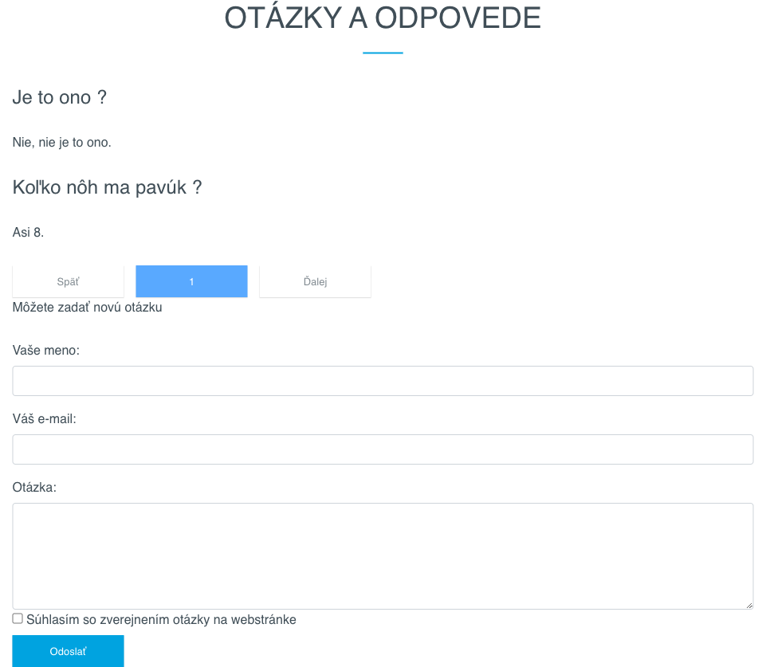
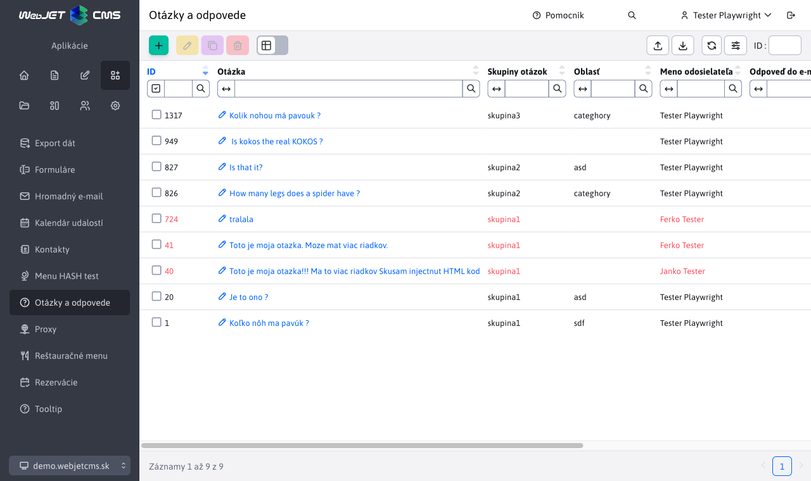
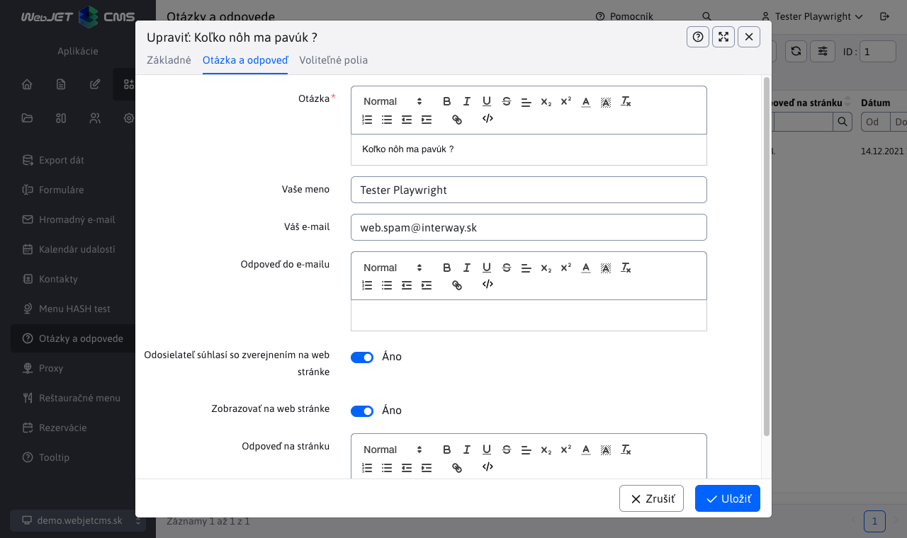

# Otázky a odpovede

Aplikácia Otázky a odpovede, umožňuje do stránky vložiť časté otázky a odpovede. Je možné ich kategorizovať podľa skupiny. Nová otázka príde na zadaný email.

## Parametre aplikácie

- Vložiť
  - Otázky s odpoveďami
  - Formulár na zadanie otázky
- Skupina otázok - zadajte názov skupiny, z ktorej sa vyberú príspevky pre zobrazenie na stránke
- Počet otázok na stránke (zobrazí sa ak je zvolené: Otázky s odpoveďami)
- Email pre zasielanie otázok (zobrazí sa ak je zvolené: Formulár na zadanie otázky)

Otázky sú radené do skupín, ktorú zadávate pri vkladaní aplikácie. Ak potrebujete spraviť ešte podskupiny, môžete modifikovať súbor ```/components/qa/qa-ask.jsp```, kde nahradíte skryté pole ```categoryName``` za výberové menu, pomocou ktorého budú návštevníci môcť vybrať podskupinu.



## Administrácia

Prehľad všetkých príspevkov do sekcie Otázky a odpovede si môžete prezrieť zvolením položky Otázky a odpovede v sekcii Aplikácie. Červenou farbou sú zobrazené otázky, ktoré nemajú zadanú odpoveď.



Kliknutím na otázku, sa vám zobrazí formulár s parametrami otázky a odpovede. Otázku s odpoveďou je možné okrem zobrazenia na stránke aj odoslať emailom na adresu zadávateľa otázky. Pokiaľ zadávateľ neoznačil možnosť **Súhlasím so zverejnením otázky na web stránke**, odpoveď je možné iba zaslať na jeho email (možnosť Zobrazovať na web stránke nechajte nezvolenú). Vykonané zmeny potvrdíte kliknutím na Uložiť.



Aplikácia podporuje nastavenie [voliteľných polí](../../../frontend/webpages/customfields/README.md).