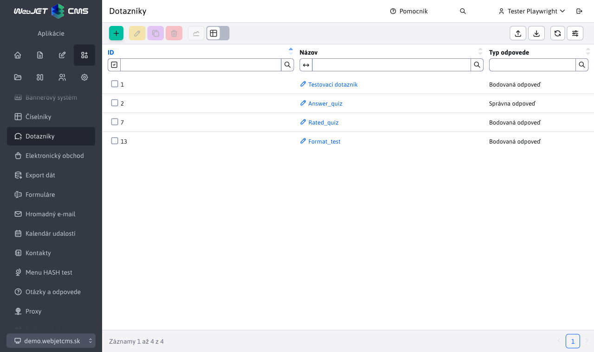
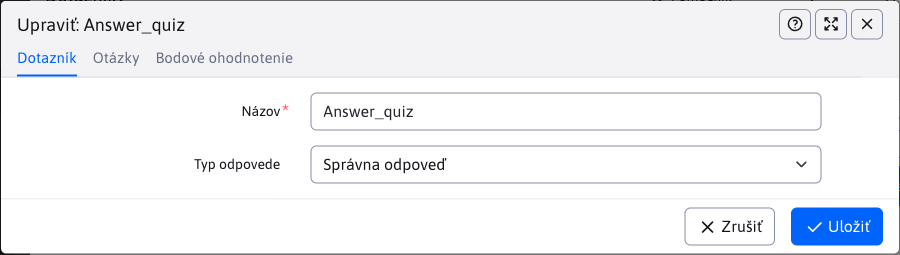
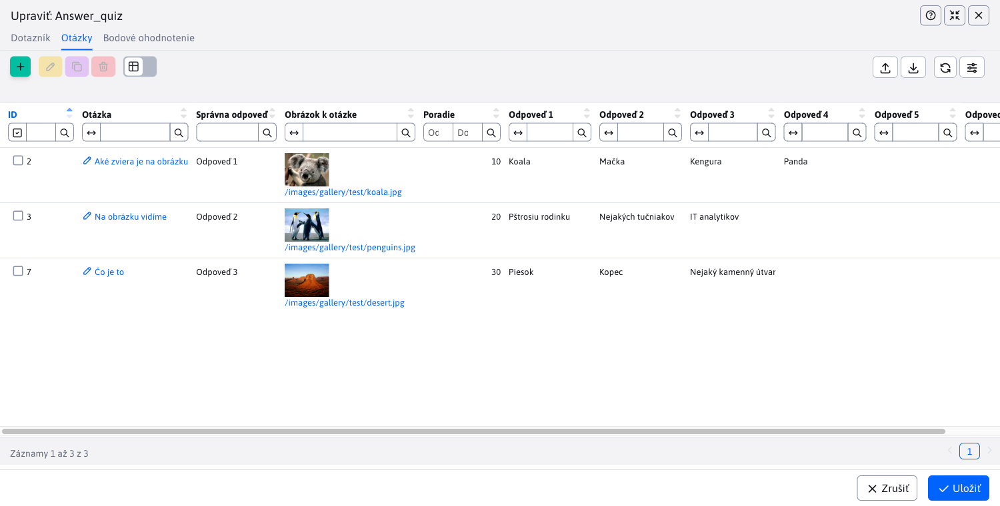
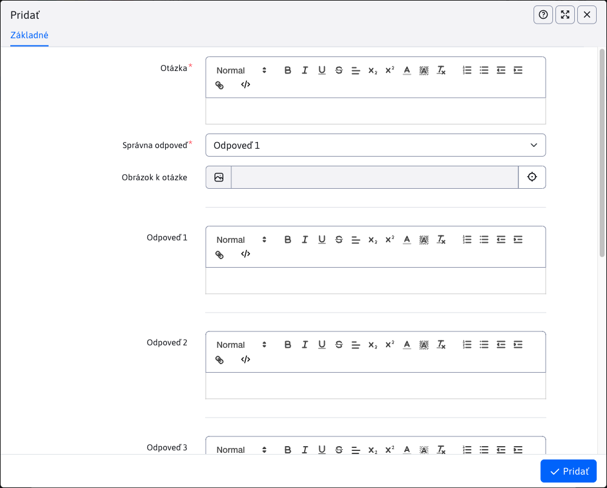
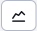
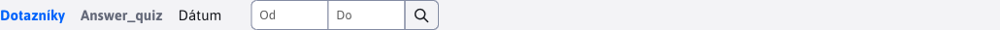

# Dotazníky

Aplikácia Dotazníky slúži na prípravu a správu dotazníkov. Okrem správy samotných dotazníkov umožňuje aj správu otázok a odpovedí pre dotazník. Dostupná je taktiež štatistická sekcia, kde je prehľad jednotlivých výsledkov dotazníku.

Pre vytvorenie sú potrebné 2 parametre:

- Názov
- Typ odpovede

Parameter Typ odpovede má na výsledný vzhľad aj nastavovanie dotazníka veľký vplyv. Podporuje 2 typy:

- Správna odpoveď - vždy je správna iba jedna odpoveď z niekoľkých a táto správna odpoveď má hodnotu 1 bod
- Bodová odpoveď - správnych môže byť aj viacero odpovedí, a každá správna odpoveď môže mať inú bodovú hodnotu

## Otázky

Správa otázok sa vykonáva prostredníctvom vnorenej datatabuľky, priamo v karte **Otázky** editora dotazníkov. Samotný vzhľad tejto tabuľky aj editora je ovplyvnený zvoleným parametrom dotazníka **Typ odpovede**.

Na nasledujúcom obrázku vidíme vnorenú datatabuľku v karte otázky pre možnosť **Správna odpoveď**. Napovedá nám aj stĺpec Správna odpoveď, nakoľko tieto typy otázok môžu mať iba jednu správnu odpoveď.

Na nasledujúcom obrázku vidíme vnorenú datatabuľku v karte otázky pre možnosť **Bodová odpoveď**. Oproti predchádzajúcej verzii, môžeme vidieť, že stĺpec Správna odpoveď sa v tejto tabuľke nenachádza, nakoľko správnych môže byť viacero odpovedí. Pribudli nám však stĺpce Body, reprezentujúce získaný počet bodov pri voľbe danej odpovede. Odpoveď sa považuje za **správnu** iba ak je za ňu udelených **viac ako 0 bodov**.

### Vytváranie otázok a odpovedí

Pri vytváraní otázky sa nám VŽDY zobrazí možnosť zadať 1-6 odpovedí. Ak odpoveď nie je vyplnená, v dotazníku sa nezobrazí. Povinná je iba otázka a aspoň jedná odpoveď. Odpovede ako aj samotná otázka môže byť grafický upravená editorom, takže môžu obsahovať ak komplexnejšie texty. Môžete zadať taktiež obrázok, ktorý sa v dotazníku zobrazí nad príslušnou otázkou.

Na nasledujúcom obrázku vidíme editor Otázok pre možnosť **Správna odpoveď**. Po vyplnení ľubovoľného počtu odpovedí je potrebné zvoliť Správnu odpoveď.

Na nasledujúcom obrázku vidíme editor Otázok pre možnosť **Bodová odpoveď**. Ako aj v prípade datatabuľky, tu sa nenachádza Správna odpoveď, ale namiesto toho, môžete priradiť body, k jednotlivým odpovediam. Pri definovaní odpovedí na otázku môžete nastaviť ako body aj hodnotu 0 a vtedy je odpoveď považovaná za nesprávnu (ak hodnotu body nevyplníte, automatický sa nastaví hodnota 0). Všetky zadané číselné hodnoty bodov musia byť kladné (vrátane nuly).

## Bodové ohodnotenie

Správa hodnotenia sa vykonáva prostredníctvom vnorenej datatabuľky, priamo v karte  **Bodové ohodnotenie** editora dotazníkov. V tabuľke môžete zadefinovať ohodnotenie, ktoré sa zobrazí užívateľovi po dokončení testu. Napríklad môže ísť o stupnicu k známke.

Nové ohodnotenie zadáme vyplnením hodnôt od-do (kladné hodnoty bodov) a textom hlásenia.

## Nastavenie poradia

Poradie, s akým sa budú otázky/ohodnotenie zobrazovať je dané hodnotou parametra poradie. Tento parameter je pri vytváraní otázky/hodnotenia skrytý a pri editácií už je viditeľný. Pri vytváraní sa na pozadí nastaví ako najväčšia existujúca hodnota poradia v databáze (pre konkrétny dotazník) + 10. Ak žiadna hodnota v databáze neexistuje, prednastaví sa na hodnotu 10. Pri editácií tak viete zmenou hodnoty určiť poradie (hodnota nesmie byť záporná). Otázky/ohodnotenie s najmenšou hodnotou parametra poradie budú prvé.

## Vytváranie otázok/ohodnotenia pred samotným Dotazníkom

Aplikácia Dotazníky umožňuje vytvorenie a správu otázok/ohodnotení ešte pred vytvorení samotného Dotazníku. Možné to je vďaka tomu, že karty **Otázky** a  **Bodové ohodnotenie** sú viditeľné aj pri vytváraní dotazníku.

Takéto vytvorené otázky/ohodnotenia, ktoré boli vytvorené pred samotným dotazníkom nie sú dočasne viazané z žiadnemu dotazníku (nenaviazané), kým nie je uložený nový dotazník. Po uložení nového dotazníka sa k nemu naviažu. Ak sa užívateľ rozhodne dotazník neuložiť, už vytvorené záznamy sa  nezmažú a ostávajú mu ďalej dostupné v kartách pri vytváraní dotazníka (napr. ak znovu otvorí okno pre vytvorenia). Iný používatelia nenaviazané otázky/ohodnotenia nevidia (je to per používateľ) a taktiež nie sú viditeľné ani pri editácií iných dotazníkov. Ak sa rozhodnete že nový dotazník sa nebude vytvárať a nechcete ani už vytvorené otázky/ohodnotenia, ktoré čakajú na naviazanie, môžete ich ľubovoľne vymazať alebo editovať cez okno vytvorenia dotazníka (priamo v kartách).

## Možné chyby

Možné chyby na ktoré si treba dávať pozor:

- Ak nevyplníte žiadnu odpoveď, uloženie otázky sa nepodarí a budete vyzvaný k vyplneniu aspoň jednej odpovede.
- To, ako je zvolená Správna odpoveď (u dotazníka typu **Správna odpoveď**) je výhradne na vás. Keď, ako správnu odpoveď zvolíte nezadefinovanú (prázdnu) odpoveď, otázka sa uloží, ale nikdy nebude možné na ňu odpovedať správne, nakoľko prázdna odpoveď sa nezobrazí.
- Ak pri definovaní odpovedí u dotazníka typu **Bodová odpoveď** zabudnete týmto odpovediam priradiť body, automaticky sa nastavia na 0. To znamená, že zvolením takejto odpovede sa nezískajú žiadne body a odpoveď je považovaná za nesprávnu.

## Štatistika dotazníkov

Aplikácia dotazníky ponúka taktiež štatistickú časť. Po označení záznamu dotazníka v tabuľke sa presmerujete na štatistickú časť stlačení tlačidla . Ako aj v prípade tabuľky otázok, štatistická sekcia sa líši v závislosti od typu odpovede daného dotazníka. Niektoré prvky však majú spoločné.

Spoločná je hlavička stránky s rozšíreným filtrom, pre filtrovanie dát v určitom dátumovom rozsahu. Filter funguje na princípe:

- ak žiaden rozsah nie je zadaný, automatický vráti dáta za posledný mesiac (+- 30 dní)
- ak je nastavený rozsah iba OD, tak filter vráti dáta v rozsahu nastaveného OD do aktuálneho dátumu
- ak je nastavený rozsah iba DO, tak filter vráti dáta v mesačnom rozsahu s koncom v zadanom DO

Pre obe typy odpovedí sú spoločné PRVÉ 2 grafy a tabuľka dát (zloženie stĺpcov tabuľky sa taktiež mení v závislosti od typu odpovede dotazníka aby to viac logicky vyhovovalo dátam). Spoločné grafy sú:

- Percento správnych odpovedí na jednotlivé otázky, za zvolené obdobie (zaokrúhlené), pomocou stĺpcového grafu reprezentuje percento správnych odpovedí (zo všetkých) za daný časový rozsah. Hodnoty v % sú zaokrúhlené na celé čísla. Z grafu môžete ľahko odpozorovať, ktoré otázky boli zodpovedané s najväčšou alebo najmenšou úspešnosťou.
- Počet správnych a nesprávnych odpovedí za zvolené obdobie - pre všetky otázky, pomocou čiarového grafu reprezentuje koľko bolo správnych a nesprávnych odpovedí (v celých číslach) za daný deň. Počítajú sa odpovede všetkých užívateľov za všetky otázky dohromady. Z grafu tak ľahko vyčítate, v ktorý deň bol pomer dobrých a zlých odpovedí na otázky lepší či horší. Graf obsahuje taktiež čiaru, reprezentujúcu počet všetkých odpovedí (pre lepšiu vizualizáciu pomeru správnych/nesprávnych ku všetkým).

**Správna odpoveď**

Štatistika dotazníka s odpoveďou typu **Správna odpoveď** obsahuje 2 ďalšie grafy:

- Počet správnych odpovedí za zvolené obdobie - pre jednotlivé otázky, čiarový graf reprezentujúci počet správnych odpovedí na jednotlivé otázky v daný deň. Poskytuje prehľad o tom, ktoré otázky konkrétne v ktorý deň mali najviac/najmenej SPRÁVNYCH odpovedí. Od všetkých užívateľov spolu.
- Počet nesprávnych  odpovedí za zvolené obdobie - pre jednotlivé otázky, čiarový graf reprezentujúci počet nesprávnych odpovedí na jednotlivé otázky v daný deň. Poskytuje prehľad o tom, ktoré otázky konkrétne v ktorý deň mali najviac/najmenej NESPRÁVNYCH odpovedí. Od všetkých užívateľov spolu.

**Bodová odpoveď**

Štatistika dotazníka s odpoveďou typu **Bodová odpoveď** obsahuje 1 ďalší graf:

- Počet získaných bodov za zvolené obdobie - pre jednotlivé otázky,  čiarový graf reprezentujúci počet získaných bodov za jednotlivé otázky v daný deň. Nakoľko otázka môže mať v tomto prípade viacero správnych odpovedí, tak graf percentuálnej úspešnosti nestačí. Tento graf jasne ukáže, ktoré otázky boli v daný deň bodovo najviac/najmenej ziskové. Takže otázka menšou úspešnosťou môže byť stále viac bodovo úspešná (napríklad keď jej odpovede sú vyššie hodnotené alebo užívatelia volili vyššie hodnotené odpovede na túto otázku).