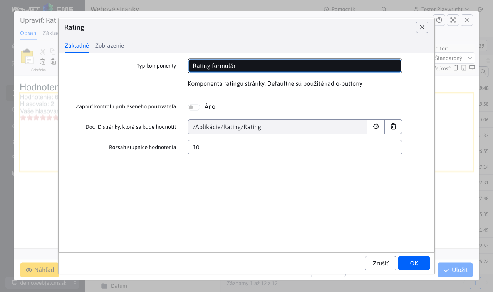
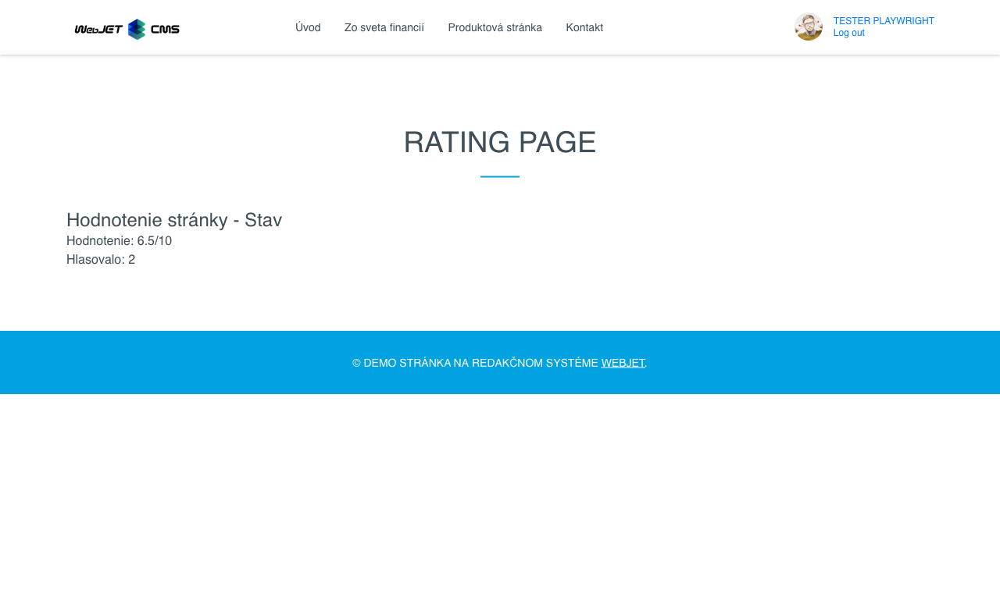
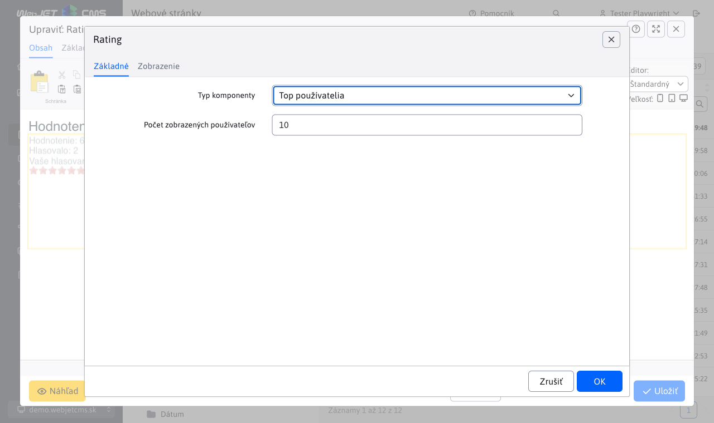
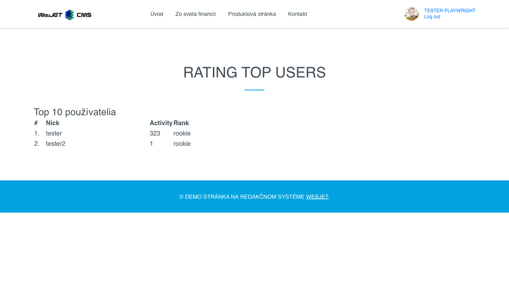
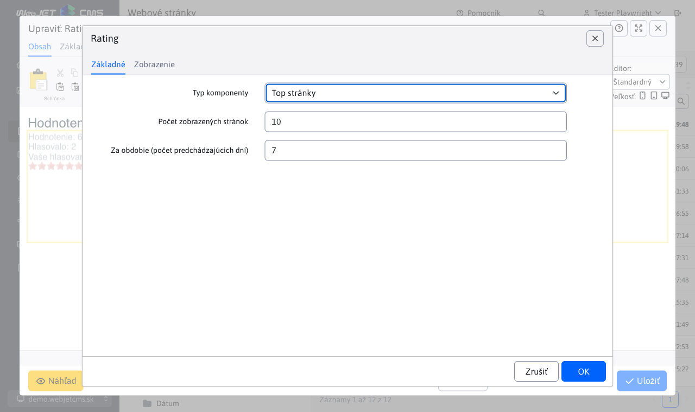
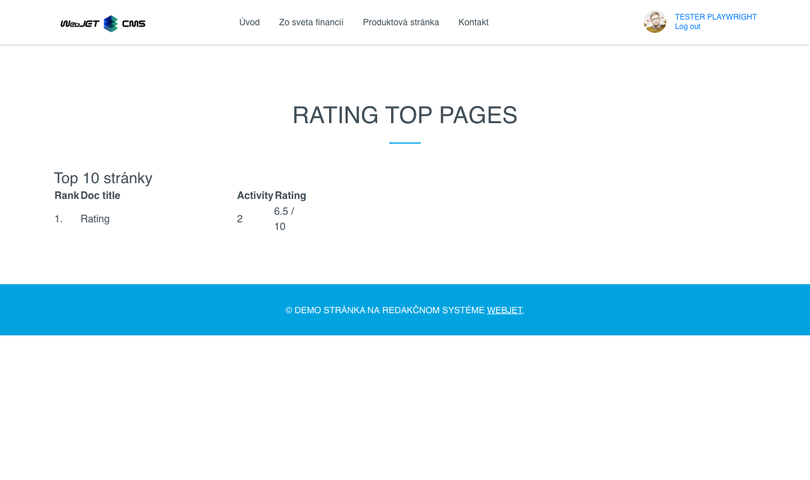

# Hodnotenie/Rating

Aplikácia Ohodnotenie umožňuje hodnotiť stránku (jej kvalitu). Následne ponúka zobrazenie hodnotenia na stránke, štatistické údaje o počte hlasujúcich, zoznam najčastejšie hlasujúcich používateľov, ako aj zoznam stránok s najvyšším hodnotením.

Formulár na vloženie aplikácie do stránky, je dostupný v editore stránok. Poskytuje možnosť výberu typu hodnotenia:

- Rating formulár
- Rating stránky
- Top používatelia
- Top stránky

## Rating formulár

Formulár na hodnotenie stránky môžete pridať ako aplikáciu alebo priamo pomocou kódu ```!INCLUDE(/components/rating/rating_form.jsp, checkLogon=false, ratingDocId=70839, range=10)!```.

Formulár obsahuje parametre:

- `checkLogon` - Zapnúť kontrolu prihláseného používateľa, ak je možnosť zvolená, hodnotiť stránku môžu iba prihlásený používatelia.
- `ratingDocId` - Doc ID stránky, ktorá sa bude hodnotiť, ak je zadaná hodnota <1 použije sa automaticky ID aktuálne zobrazenej web stránky.
- `range` - Rozsah stupnice hodnotenia.



Samotný vygenerovaný formulár v stránky funguje pomocou kliknutia na hviezdičky. Rozsah hviezdičiek je daný parametrom `Rozsah stupnice hodnotenia`. Po kliknutí na konkrétnu hviezdičku sa stránka ohodnotí a jej opätovné hodnotenie už nie je možné.


## Rating stránky

Rating stránky (alebo sta hodnotenia stránky) môžete pridať ako aplikáciu alebo priamo pomocou kódu ```!INCLUDE(/components/rating/rating_page.jsp, ratingDocId=70839, range=10)!```. Zobrazuje hodnotenie web stránky bez formuláru.


Obsahuje parametre:

- `ratingDocId` - Doc ID stránky, ktorá sa bude hodnotiť.
- `range` - Rozsah stupnice hodnotenia.

Zobrazuje štatistiku aktuálneho hodnotenia stránky.



## Top používatelia

Top používatelia (ktorý hodnotili) sa dajú pridať ako aplikácia alebo priamo pomocou kódu ```!INCLUDE(/components/rating/rating_top_users.jsp, usersLength=10)!```.

Obsahuje parameter:

- `usersLength` - Počet zobrazených používateľov.



Zobrazuje užívateľov s najväčším počtom hodnotení.



## Top stránky

Top stránky sa dajú pridať ako aplikácia alebo priamo pomocou kódu ```!INCLUDE(/components/rating/rating_top_pages.jsp, range=10, docsLength=10, period=7)!```.

Obsahuje parameter:

- `range` - Rozsah stupnice hodnotenia.
- `docsLength` - Počet zobrazených stránok.
- `period` - Za obdobie (počet predchádzajúcich dní).



Zobrazuje stránky s najlepším hodnotením.

