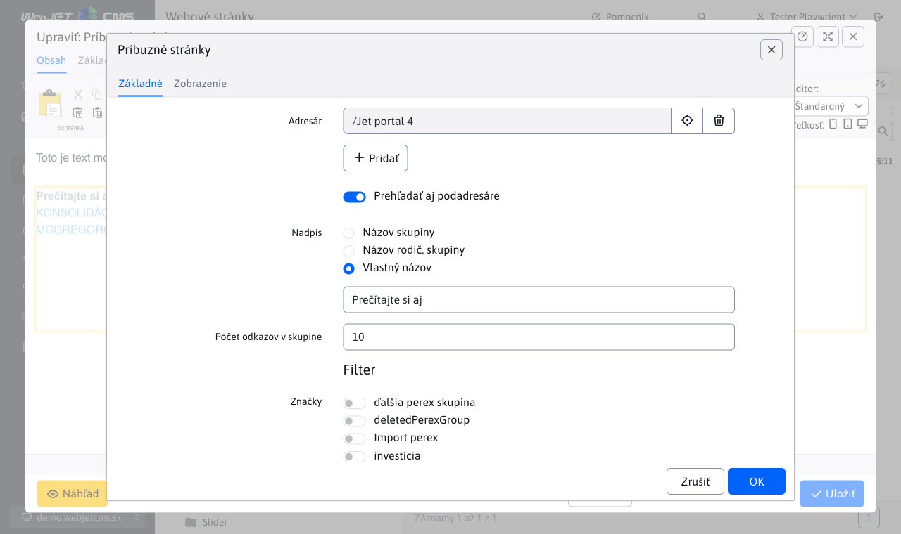
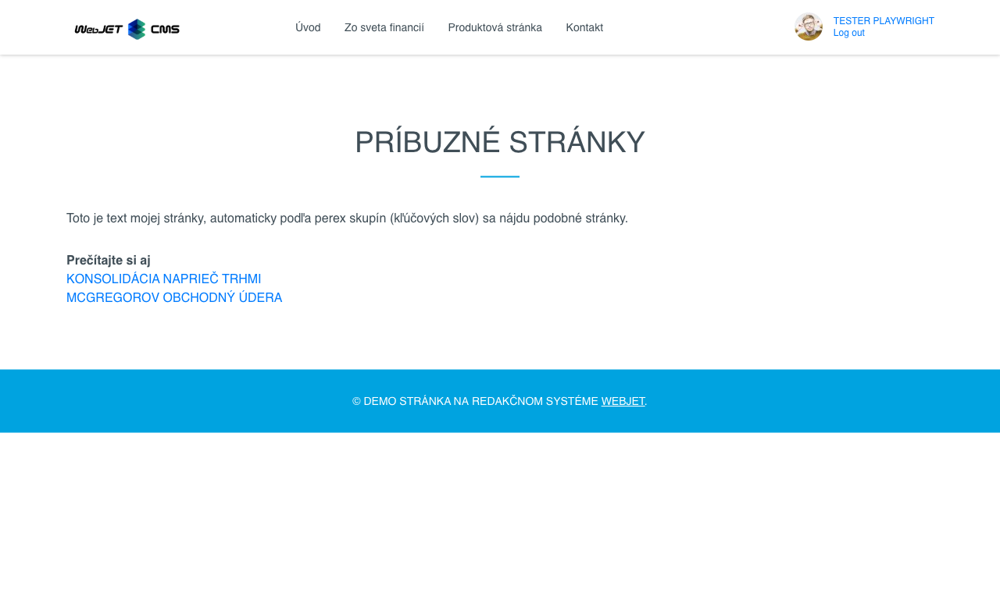

# Príbuzné stránky

Vloží do stránky aplikáciu, ktorá bude zobrazovať odkazy na príbuzné stránky. Tie sa vyhľadajú automaticky podľa priradených značiek (perex skupín) k aktuálnej stránke (vyhľadajú sa iné stránky obsahujúce rovnaké značky).

## Nastavenia aplikácie

V tejto časti je možné nastaviť:

- Adresár - koreňový priečinok v ktorom sa hľadajú príbuzné stránky
- Prehľadať aj podadresáre
- Nadpis
  - Názov skupiny - názov priečinka aktuálnej stránky
  - Názov rodič. skupiny - názov rodičovského priečinka aktuálnej stránky
  - Vlastný názov
- Perex skupiny - ak je zadané zobrazia sa najnovšie stránky podľa zadaných značiek, ak je prázdne zobrazia sa podľa značiek aktuálne zobrazenej web stránky
- Počet odkazov v skupine - maximálny počet zobrazených stránok

## Zobrazenie aplikácie

