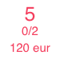
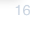

# Aplikácia Rezervácia dní

Aplikácia **Rezervácia dní** umožňuje rezerváciu vybraných rezervačných objektov na jeden alebo viacero dní, pomocou výberu želaných dní v kalendári.

## Použitie aplikácie

Aplikáciu môžete do svojej stránky pridať cez obchod s aplikáciami


alebo priamo ako kód do stránky

```html
!INCLUDE(sk.iway.iwcm.components.reservation.DayBookApp, reservationObjectIds=&quot;3683+3684+3962&quot;, device=&quot;&quot;, cacheMinutes=&quot;&quot;)!
```

V kóde si môžete všimnúť parameter `reservationObjectIds`. Ide o zoznam **vynútených** rezervačných objektov, ktoré sa budú v aplikácií dať rezervovať. Nastaviť ich môžete pri editácií aplikácie pomocou viacnásobného výberového poľa, alebo ich pridať priamo do parametra `reservationObjectIds`. Ak sa tento zoznam (parameter) nenastaví, v aplikácií sa zobrazia všetky (celodenné) dostupné rezervačné objekty.


!>**Upozornenie**: podporované sú iba rezervačné objekty, ktoré **sú nastavené ako rezervácia na celý deň**. Pretože tieto objekty sa dajú rezervovať len na základe dátumu. Nevyhovujúce rezervačné objekty sa v multi výberovom poli nezobrazujú.

!>**Upozornenie**: manuálne pridanie ID nevyhovujúceho rezervačného objektu do parametra `reservationObjectIds`, alebo zmena stavu "rezervácia na celý deň" už použitého rezervačného objektu v aplikácií **spôsobí chybné správanie sa aplikácie**.

## Stavba aplikácie

Aplikácia sa skladá z 2 hlavných častí:

- kalendár dostupnosti a cien
- formulár rezervácie


## Kalendár dostupnosti a cien

Kalendár slúži k výberu dátumového rozsahu, v ktorom si chcete rezervovať objekt. Pri zobrazení sa automatický nastaví aktuálny mesiac (vpravo) a nasledujúci mesiac (vľavo).

### Voľba dátumu

Ak chcete zmeniť aktuálne zobrazený dátum, viete tak urobiť kliknutím na mesiac/rok v hlavičke skoršieho mesiaca (vľavo). Kalendár **neumožňuje zobrazenie histórie, resp. rezerváciu v histórií**.

**Výber mesiaca**

Pri kliknutí na názov mesiaca v hlavičke kalendára sa vám zobrazí ponuka s výberom všetkých mesiacov. Ide o výber mesiacov pre konkrétne zvolený rok. Ak sa nejaký mesiac pre daný rok nachádza už v minulosti, bude zašednutý a nebudete ho vedieť zvoliť.


**Výber roku**

Podobne ako pri voľbe mesiaca, pri kliknutí na rok v hlavičke kalendára sa vám zobrazia dostupné roky na zvolenie. Roky v minulosti sú zašednuté a nebudú sa dať zvoliť.


### Prvky kalendára

Ako si môžete všimnúť, kalendár má rôzne graficky odlišné prvky, ktoré majú rôzny význam.


**Zvoliteľný deň**

Najbežnejší prvok kalendára je deň, ktorý si viete zvoliť k rezervácií. Každý prvok obsahuje informácie:
- deň v mesiaci
- informácia o obsadenosti, čiže koľko rezervácií už je na tento deň vytvorený a z akého maximálneho počtu. Príklad `0/1, 2/5, ...`.
- cena rezervácie za daný deň pre daný objekt aj s menou. Príklad `120 eur, 15 czk, ..`.

!>**Upozornenie**: táto cena rezervácie na daný deň je vypočítaná už so zľavou používateľa. Táto percentuálna zľava je nastavená pre špecifické [skupiny používateľov](../../../../admin/users/user-groups.md). Ak používateľ patrí do viacerých **skupín používateľov** ktoré majú nastavenú percentuálnu zľavu, použije sa z nich tá najväčšia. Ak zľava má hodnotu ```0%```, suma rezervácie sa nemení. Ak zľava má hodnotu ```100%```, rezervácia je zdarma.

Víkendové dni sú pre lepší prehľad zvýraznené na červeno.

Bežný deň             |  Bežný deň (už s inou rezerváciou)   | Víkendový deň
:--------------------:|:------------------------------------:|:------------------------------------:
   |           | 


**Nezvoliteľný deň**

Ďalší bežný prvok kalendára je deň, ktorý sa nedá zvoliť. Ide o dni, ktoré sú už v minulosti, alebo sú už plne rezervované. Takéto prvky sú zašednuté, nedajú sa zvoliť a nezobrazujú ani informácie o dostupnosti/cene.



**Špeciálny `Check-out ONLY` deň**

Tento špeciálny prvok kalendára zobrazuje deň, ktorý sa dá zvoliť, ale nie rezervovať.
Príklad: pri rezervácií izby ide o deň, ktorý si rezervoval už niekto iný (jeho rezervácia sa v daný deň začína) ale vy ho môžete využiť v rezervácií na odchod z izby. Odtiaľ aj pochádza názov `Check-out ONLY`, ktorý sa aj zobrazí ako popis prvku.


### Logika voľby rozsahu

Voľba rozsahu v kalendári funguje na jednoduchom princípe zvolenia počiatočného a konečného dňa k rezervácií (alebo naopak, nemá to žiaden vplyv). Zvoliť môžete iba **zvoliteľné dni** s výnimkou `Check-out ONLY` dní. Ak vám zvolený deň nevyhovuje, stačí na neho opäť kliknúť (tým sa vypne jeho označenie).

!>**Upozornenie**: môžete zvoliť naraz iba jeden rozsah, ktorý musí byť platný v celom trvaní, takže nemôže byť prerušený dňom v minulosti alebo plne obsadeným (rezervovaným) dňom.

Kalendár má už v sebe zabudované kontroly, aby sa táto podmienka dodržala. Preto nedovolí kliknúť na **nezvoliteľné dni**, ale naviac zablokuje tie dni, ktoré s práve zvoleným počiatočným dňom nedokázali vytvoriť súvislý interval.
**Príklad:** na nasledujúcich obrázkoch môžete vidieť, ako sa po výbere dňa `19.07` zablokujú všetky dni od `01.06` do `16.06`. Zablokujú sa, pretože sa nedajú zvoliť v jednom rozsahu. Tento rozsah by bol prerušený niekoľkými plne obsadenými (rezervovanými) dňami a takýto rozsah nie je platný.

Pred zvolením          |  Po zvolení
:---------------------:|:----------------------:
 |  

Po zvolení prvého dňa (počiatočného) stačí zvoliť druhý povolený deň (konečného). Pri prechode nad jednotlivými dňami sa vám bude rozsah pred-označovať aby ste mali prehľad a po výbere konečné dňa sa už plne označia.

Pred zvolením          |  Po zvolení
:---------------------:|:----------------------:
    |  

Všimnite si, že po zvolení sa nám opäť sprístupnili dočasne zablokované dni od `01.06` do `16.06`. Samozrejme, tento výber môžeme zmeniť. Stačí vybrať kliknutím nový počiatočný deň.

Taktiež si môžete všimnúť, že kalendár nám dovolil zvoliť dni od `21.07` do `23.07`, ktoré sú iba čiastočne rezervované.

!>**Upozornenie**: rozsah musí mať aspoň 2 dni, nakoľko posledný deň rezervácie je určený k opusteniu rezervovaného objektu a za tento posledný deň **sa neplatí**.

### Formulár rezervácií

Ide o jednoduchý formulár so základnými informáciami k rezervácií objektu.

Výberové pole **Názov objektu** vám umožňuje zmeniť rezervačný objekt, ktorý chcete rezervovať.

Tieto povinné polia sa automatický pred-vyplnia ak ste prihlásený používateľ, ale samozrejme dajú sa zmeniť. Ak pristupujete ako neprihlásený používateľ, musíte ich povinne zadať:
- Meno
- Priezvisko
- E-mail

Polia **Dátum a čas príchodu** a **Dátum a čas odchodu** sa nedajú zmeniť a slúžia iba na informačné účely. Automatický zmenia hodnotu podľa zvoleného rozsahu v kalendári.

!>**Upozornenie**: hodnoty pre **čas príchodu** a **čas odchodu** sa získavajú z konfiguračných premenných `reservationAllDayStartTime` a `reservationAllDayEndTime`.

!>**Upozornenie:** tlačidlo pre pridanie rezervácie sa zobrazí iba ak je zvolený rozsah v kalendári.


## Pridanie rezervácie

Po zvolení rozsahu v kalendári a vyplnení informácií v formulári (ak sú potrebné) ste pripravený požiadať o pridanie vašej rezervácie. V ľavom dolnom rohu sa zobrazí tlačilo **Pridať rezerváciu**


Ak sa rezervácia úspešne vytvorila dostanete hlásenie o úspešnom vytvorení rezervácie a na Vami zadaný email príde aj potvrdenie.

Ak rezervačný objekt **nepotrebuje schválenie**, rezervácia sa automatický schváli a vy dostanete nasledujúcu hlásenie. Následne sa upraví dostupnosť objektu pre jednotlivé dni.


Ak rezervačný objekt **potrebuje schválenie**, rezervácia bude v stave čakania. Dostupnosť objektu pre jednotlivé dni v kalendári sa nezmení, nakoľko sa počítajú IBA schválené rezervácie. Schvaľovateľ môže vašu rezerváciu schváliť alebo zamietnuť, o čom budete informovaný emailom.

