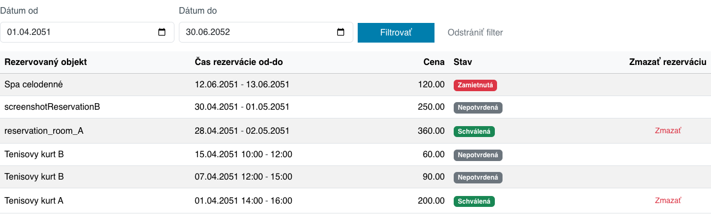

# Aplikácia Moje rezervácie

Aplikácia **Moje rezervácie** zobrazí prihlásenému používateľovi prehľad jeho vlastných rezervácií. Používateľ si vie rezervácie filtrovať podľa dátumu, skontrolovať ich stav a zmazať tie rezervácie, pri ktorých to ešte povoľujú pravidlá rezervačného objektu.



## Použitie aplikácie

Aplikáciu môžete do svojej stránky pridať cez obchod s aplikáciami výberom aplikácie **Moje rezervácie**.


Pridať ju môžete aj priamo ako kód do stránky:

```html
!INCLUDE(sk.iway.iwcm.components.reservation.MyReservationsApp, device=&quot;&quot;, cacheMinutes=&quot;&quot;)!
```

V aplikácii je možné nastaviť rezervačný objekt. Ak je zvolený zobrazia sa rezervácie len pre tento rezervačný objekt a nezobrazí sa stĺpec Rezervovaný objekt. Ak je výberové pole prázdne zobrazia sa rezervácie zo všetkých rezervačných objektov.

Zobrazené údaje sa určujú podľa aktuálne prihláseného používateľa a aktuálnej domény.

!>**Upozornenie:** aplikácia je určená pre prihlásených používateľov. Neprihlásenému návštevníkovi sa nezobrazia žiadne rezervácie.

## Stavba aplikácie

Aplikácia sa skladá z 2 hlavných častí:

- filter podľa dátumu rezervácie,
- tabuľka vlastných rezervácií.

## Filtrovanie rezervácií

V hornej časti aplikácie sa nachádzajú polia **Dátum od** a **Dátum do**. Pomocou nich môžete obmedziť zoznam rezervácií na zvolený dátumový interval.


Ak nie je nastavený žiadny filter, aplikácia automaticky zobrazí rezervácie za posledné 2 mesiace, vrátane budúcich rezervácií.

Pri filtrovaní sa zobrazia rezervácie, ktoré sa prekrývajú so zadaným intervalom:

- **Dátum od** zobrazí rezervácie, ktoré končia v tento deň alebo neskôr,
- **Dátum do** zobrazí rezervácie, ktoré začínajú v tento deň alebo skôr.

Tlačidlo **Filtrovať** použije zadaný interval. Tlačidlo **Zrušiť filter** odstráni zadané dátumy a vráti aplikáciu do predvoleného zobrazenia.

## Tabuľka rezervácií

Tabuľka obsahuje zoznam rezervácií aktuálne prihláseného používateľa zoradený od najnovšej rezervácie podľa dátumu začiatku.


V tabuľke sa zobrazujú tieto údaje:

- **Rezervačný objekt** - názov objektu, ktorého sa rezervácia týka.
- **Rozsah rezervácie** - dátum alebo dátum s časom začiatku a konca rezervácie. Pri celodenných rezerváciách sa zobrazujú iba dátumy, pri časových rezerváciách aj časy.
- **Cena** - vypočítaná cena rezervácie.
- **Stav** - aktuálny stav rezervácie.
- **Zmazať rezerváciu** - tlačidlo na zmazanie rezervácie, ak je zmazanie povolené.

Rezervácia môže mať tieto stavy:

- **Nepotvrdená** - rezervácia čaká na schválenie.
- **Schválená** - rezervácia je potvrdená.
- **Zamietnutá** - rezervácia bola zamietnutá.

## Zmazanie rezervácie

Tlačidlo na zmazanie sa zobrazí iba pri rezerváciách, ktoré je možné zmazať. Rezerváciu je možné zmazať len vtedy, keď:

- rezervácia je schválená,
- začiatok rezervácie je ešte v budúcnosti,
- nebol prekročený povolený čas na zrušenie rezervácie nastavený pri rezervačnom objekte.

Pri celodennej rezervácii musí byť dátum rezervácie neskorší ako aktuálny deň. Pri časovej rezervácii musí byť začiatok rezervácie neskorší ako aktuálny čas.

Ak má rezervačný objekt nastavené heslo pre zmazanie rezervácie, aplikácia si ho pred zmazaním vyžiada. Bez zadania hesla nebude rezervácia zmazaná.

Po úspešnom zmazaní sa zobrazí potvrdenie a rezervácia zmizne zo zoznamu. Ak bola tabuľka pred zmazaním filtrovaná, zvolený filter zostane zachovaný.

Ak rezerváciu nie je možné zmazať, aplikácia zobrazí chybové hlásenie s dôvodom neúspechu.

## Súvisiace aplikácie

Rezervácie zobrazené v tejto aplikácii môžu vzniknúť napríklad cez aplikácie:

- [Rezervácia času](../time-book-app/README.md)
- [Rezervácia dní](../day-book-app/README.md)
