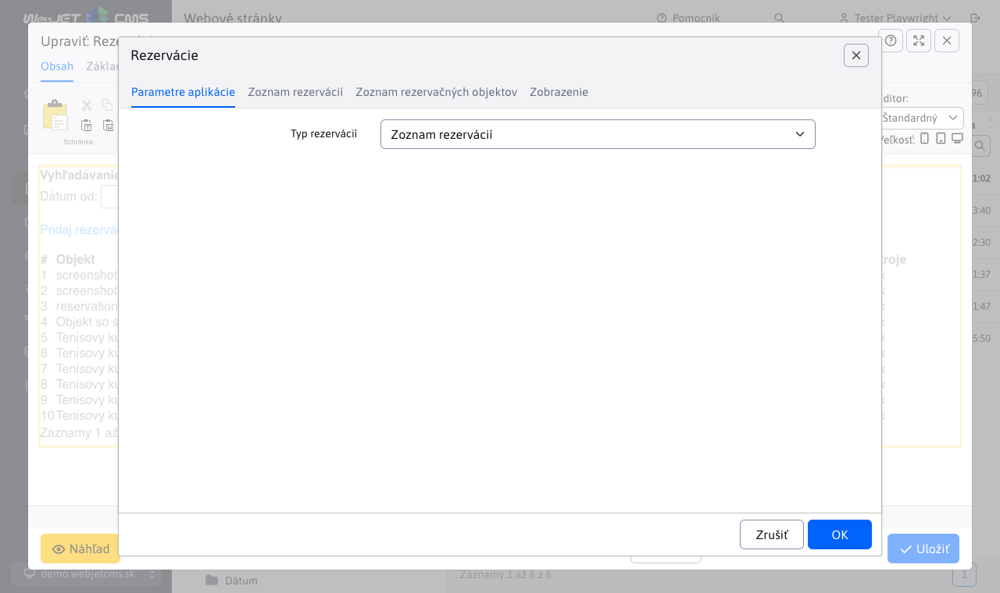
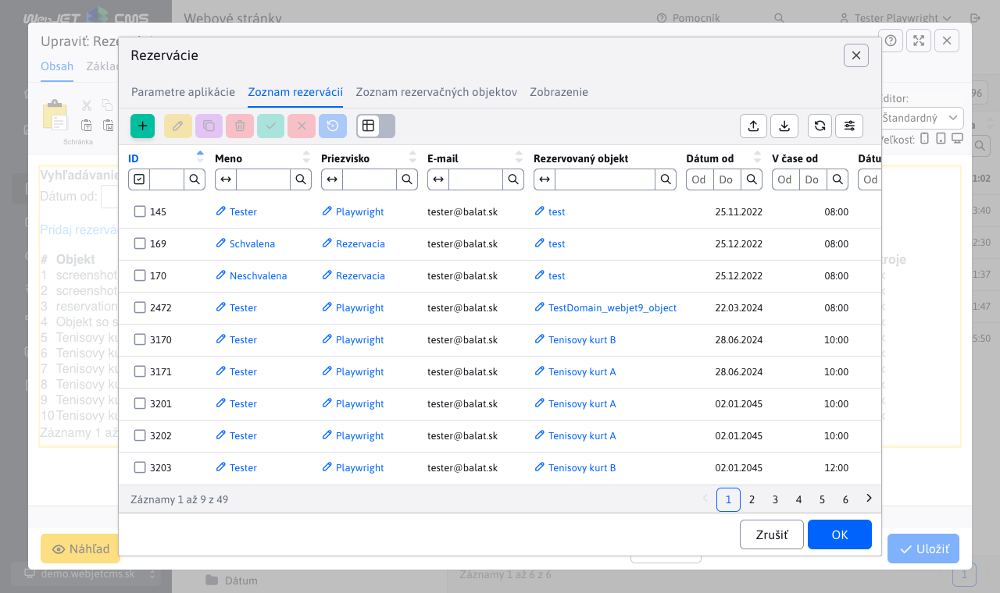
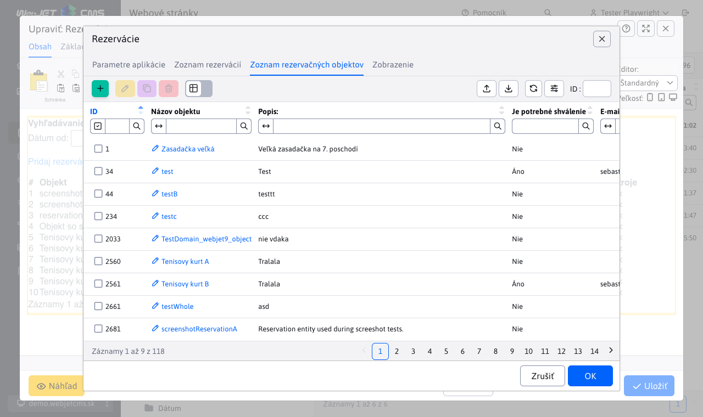
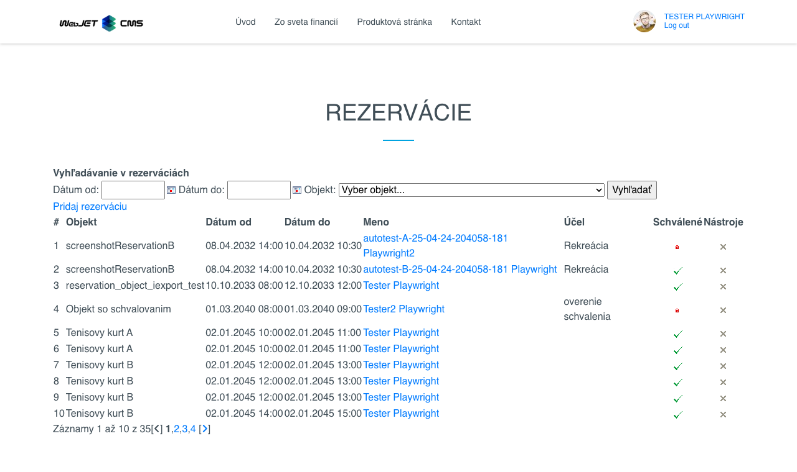

# Aplikácia Rezervácie

Pomocou tejto aplikácie je možné spravovať systém rezervácií. Je potrebné pridať na stránku túto aplikáciu a následne je možne pomocou formulára vyberať z rezervačných objektov (napr. izba, chata, tenisový kurt) a požiadať o rezerváciu. Administrátor môže schvaľovať jednotlivé žiadosti.

## Nastavenia aplikácie

V editore je možné zvoliť typ zobrazenia:
- **Zoznam rezervácií**
- **Zoznam rezervačných objektov**

Na základe výberu sa zmení obsah, ktorý bude používateľovi zobrazený.

### Zoznam rezervácií

V tejto karte je možné prehliadať, vytvárať a upravovať rezervácie.

[Prejsť na Zoznam rezervácií](../reservations/README.md)

### Zoznam rezervačných objektov

V tejto karte je možné upravovať a spravovať objekty, ktoré je možné rezervovať.

[Prejsť na Zoznam rezervačných objektov](../reservation-objects/README.md)

## Zobrazenie aplikácie

Takto vyzerá aplikácia po pridaní na stránku:

