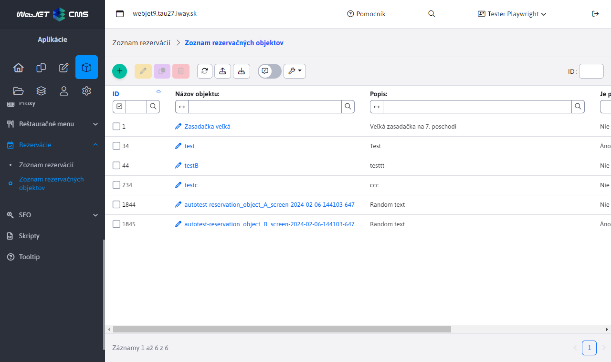
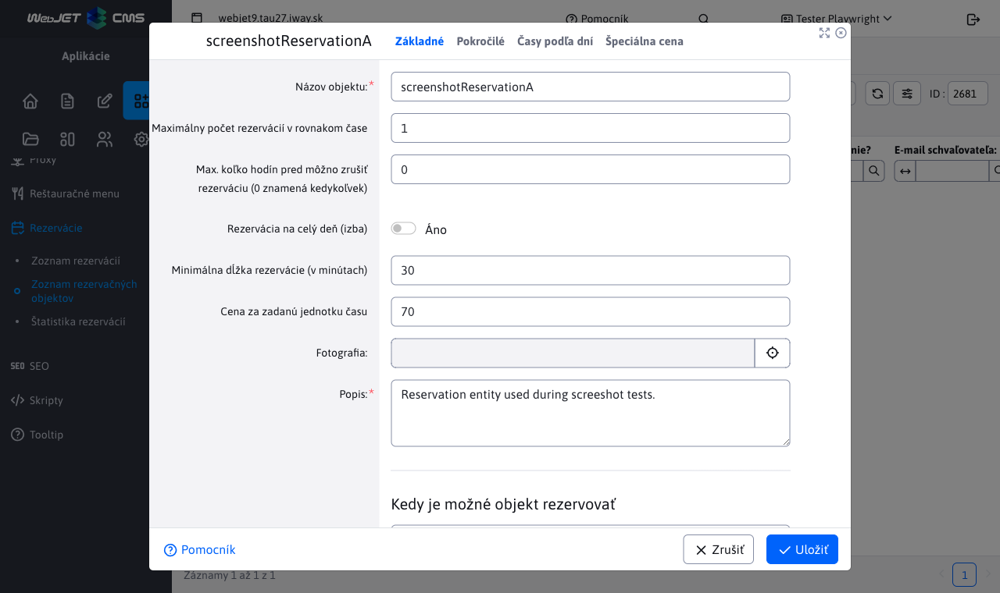
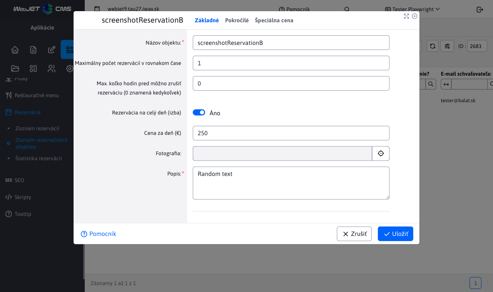
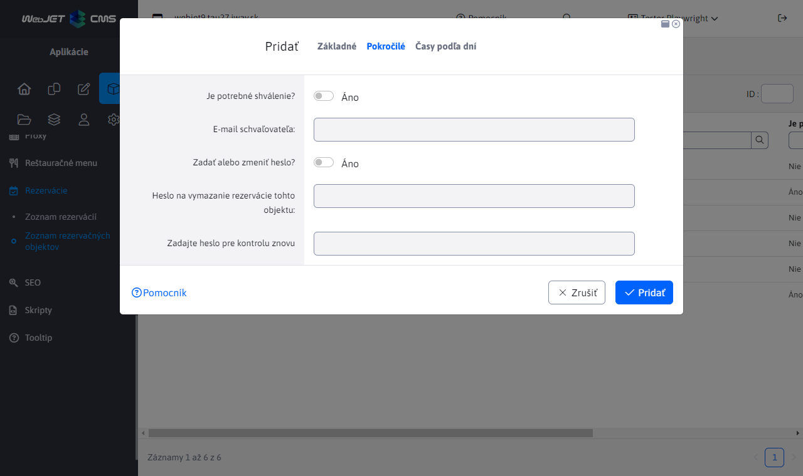
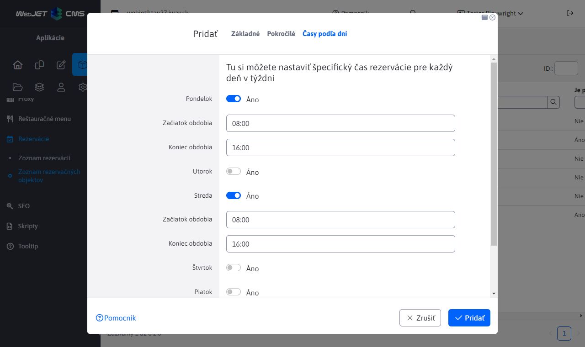
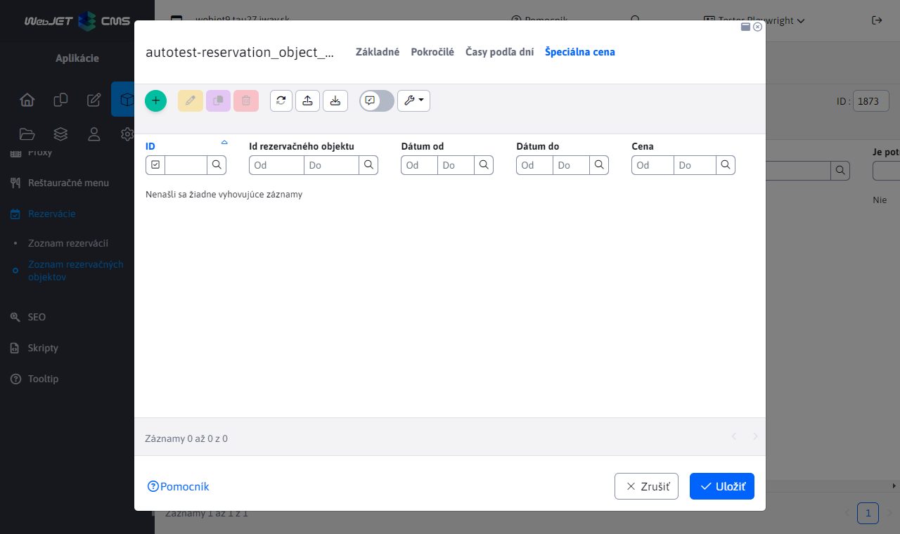
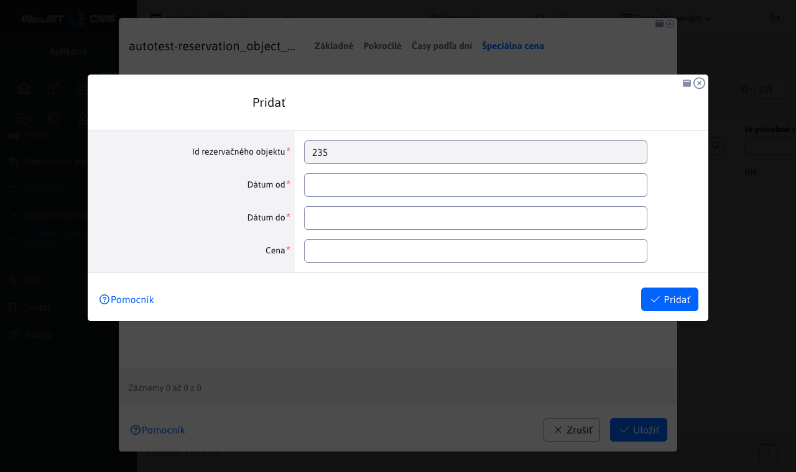

# Rezervačné objekty

## Zoznam rezervačných objektov

Aplikácia Zoznam rezervačných objektov umožňuje vytváranie/úpravu/mazanie rezervačných objektov, ako aj ich import z Excel súboru a export do Excel/CSV súboru (prípadne aj možnosť okamžitého tlačenia pri exporte).



Editor rezervačného objektu obsahuje 4 karty:

## Základné

Karta **Základné** ako už napovedá názov, obsahuje základné informácie ohľadne rezervačného objektu. Je povinné zadať názov rezervačného objektu ako aj jeho popis, zvyšné parametre sú voliteľné. Spodná časť karty obsahuje časový výber na zadanie rezervačného intervalu pre daný objekt. To znamená že tento objekt sa bude dať rezervovať iba v zadanom intervale.

Parameter **Maximálny počet rezervácií v rovnakom čase** je veľmi dôležitý parameter pri validácií nových rezervácií - [viac o validácií](../reservations/readme.md#validácia-rezervácií). Tento parameter udáva koľko rezervácií sa môže vytvoriť nad rezervačným objektom v rovnakom čase. Ak tento parameter bude nastavený na hodnotu napríklad 3, znamená to, že v rovnakom čase môžete mať maximálne 3 rezervácie nad týmto objektom ale nehovorí o tom koľko rezervácií počas celého intervalu sa môže pridať.

Ďalší dôležitý parameter je prepínač na rezervovanie izby na celý deň.

- Ak je táto možnosť vypnutá, môžete zadať minimálnu dĺžku rezervácie v minútach a cenu za danú zvolenú jednotku času. Cena môže byť samozrejme nulová a v tom prípade bude rezervácia tohto objektu bezplatná. Minimálna dĺžka rezervácie musí byť kladné nenulové číslo, takže aspoň 1 minúta. Tento objekt sa bude dať rezervovať minimálne na zadanú časovú hodnotu a maximálne do obdobia, ktoré sa nachádza vo zvolenom rezervačnom intervale.
- Ak je táto možnosť zapnutá, nebude sa dať nastaviť minimálna dĺžka rezervácie ani cena za danú jednotku času. Zadať budete môcť iba cenu za deň. To v praxi znamená, že si nemôžete rezervovať iba časť z celého intervalu ale rezervujete celý interval (celý deň).

!>**Upozornenie:** okrem toho že niektoré parametre sa skryjú v závislosti od stavu prepínača rezervovania na celý deň, skrýva/odkrýva sa aj celá karta [Časy podľa dní](#časy-podľa-dní).





## Pokročilé

Karta **Pokročilé** obsahuje iba 2 možnosti.

Ak zapnete možnosť **Je potrebné schválenie**, môžete zadať email schvaľovateľa rezervačného objektu. Takže vytvorená rezervácia nad týmto rezervačným objektom bude musieť byť najprv schválená a na zadaný email bude odoslaná správa (viac o tomto sa dozviete v sekcii [zoznam rezervácií](../reservations/readme.md#zoznam-rezervácií)).

Ak zapnete možnosť **Zadať alebo zmeniť heslo** a zadáte 2x zhodujúce sa heslo, pri pokuse o vymazanie rezervácie nad rezervačným objektom bude používateľ vyzvaný ku zadaniu tohto hesla. Ak je heslo už zadané, tak sa vymení za nové, viac sa dozviete v časti [Mazanie rezervácií](../reservations/readme.md#mazanie-rezervácií).



## Časy podľa dní

Karta **Časy podľa dní** rozširuje možnosť zadania rezervačného intervalu pre objekt. Umožňuje zadať jedinečný (alebo aj rovnaký) interval pre jednotlivé dni v týždni. V praxi víkendové dni ako sobota a nedeľa môžu mať iný rezervačný interval ako pracovné dni, alebo každý deň môžete mať iný interval. Ak pre nejaký deň v týždni nezadáte špecifický rezervačný interval, použije sa ten základný, ktorý je nastavený v karte [Základné](#základné). Polia pre časový výber intervalu sa pre jednotlivé dni zobrazia až po zapnutí možnosti s názvom daného dňa v týždni.

Karta nie je dostupná ak je zapnutá možnosť rezervovania na celý deň (z karty Základné).



## Špeciálna cena

Karta **Špeciálna cena** sa zobrazí iba pri editácii rezervačného objektu. V tejto karte sa nachádza vnorená tabuľka pre špeciálne ceny v konkrétne dátumové intervaly. Napríklad, ak je rezervačný objekt nastavený na rezerváciu na celý deň s cenou 15 eur na deň, tak si môžete zvoliť, v ktoré dni v roku bude táto cena iná (väčšia alebo menšia, napr. počas sviatkov).



Záznamy v tejto vnorenej tabuľke viete vytvárať/upravovať/mazať alebo importovať a exportovať. Pri vytváraní novej špeciálnej ceny pre zadané obdobie sa ```id``` rezervačného objektu nastaví automaticky (bez možnosti zmeny) a zvyšné polia sú povinné k vyplneniu. Zadáte cenu a interval v dňoch od a do kedy má táto cena platiť.

