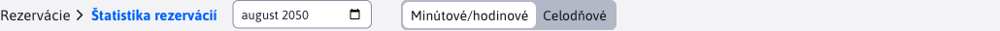
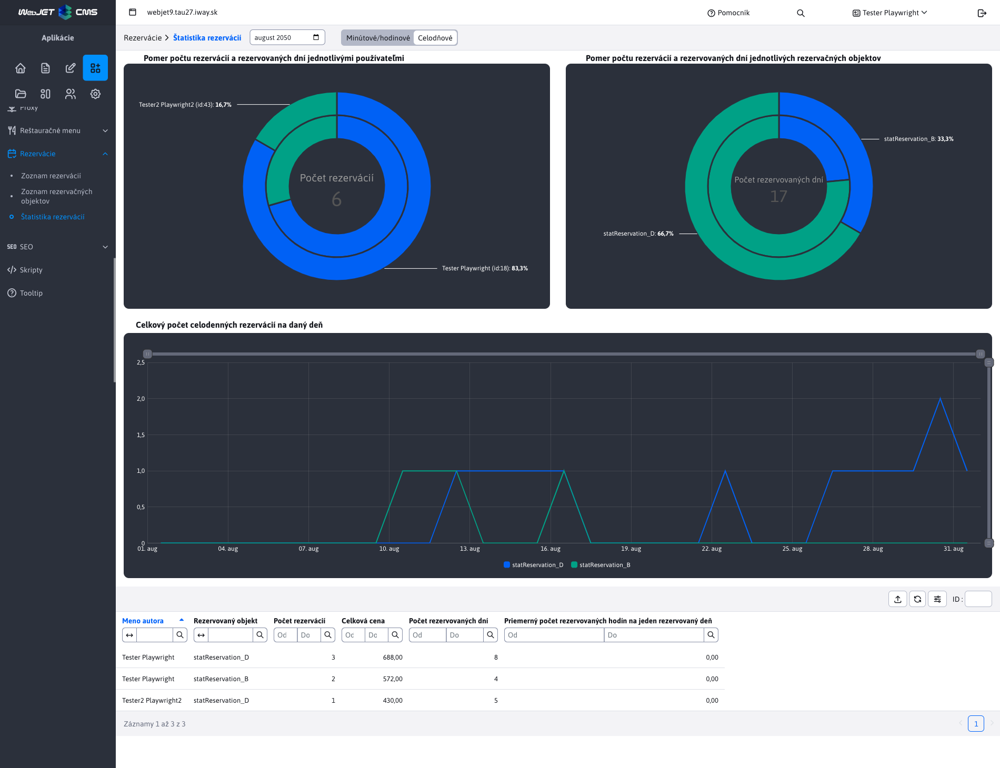

# Štatistika rezervácií

Sekcia **Štatistika rezervácií** ponúka rýchle a prehľadné vyobrazenie tých najdôležitejších štatistík, týkajúcich sa vytvorených [rezervácií](../reservations/README.md). Do úvahy sa berú iba také rezervácie, ktoré sú **schválené**. Viac o stave rezervácie sa dočítate v časti .

Štatistika spracováva dáta rezervácií v **mesačných intervaloch**, čiže vždy od začiatku po koniec zvoleného mesiaca. K voľbe mesiaca/roku za ktorý chceme štatistiku zobraziť slúži dátumoví filter vedľa názvu sekcie.

Rezervácie vieme logiky rozdeliť do 2 skupín a to **Minútové/hodinové** rezervácie (tie ktoré rezervujú objekt na nejaký čas) a **Celodenné** rezervácie (tie ktoré rezervujú objekt na celé dni). Typ rezervácie je daný [rezervačným objektom](../reservation-objects/README.md), ktorý rezervácia rezervuje.

Z tohto hľadiska sme museli aj štatistiku rozdeliť podľa typu rezervácie, čiže dáta sú od seba oddelené. Preto vedľa dátumového filtra je prepínač, ktorým viete zmeniť či si želáte vidieť štatistiku rezervácií typu **Minútové/hodinové** alebo **Celodenné**.

## Minútové/hodinové

Štatistika pre rezervácie typu **Minútové/hodinové** ponúka 3 grafy, ako aj tabuľku s údajmi. Dáta kladú dôraz na počet rezervovaných hodín. Nakoľko tieto rezervácie sa dajú rezervovať aj na minúty, tak sú hodnoty prepočítane na hodiny s presnosťou na 2 desatinné miesta.

### Tabuľka

Každý záznam (riadok) v tabuľke predstavuje kombináciu používateľa a štatistiky rezervácií nad jedinečným objektom. To znamená, že jeden používateľ sa môže v tabuľke vyskytnúť aj niekoľkonásobne, ak si vytvoril rezerváciu na rôzne rezervačné objekty. Každý takýto riadok ponúka prehľad o tom, koľko rezervácií na daný objekt používateľ vytvoril, koľko priemerne hodín rezervoval alebo koľko to celkovo stálo.

**Pozor**, ak rezerváciu vytváral neprihlásený používateľ (ako je to možné napríklad u aplikácie [Rezervácia času](../time-book-app/README.md)), tak dáta sa mapujú podľa zadanej email adresy. Ak rôzny neprihlásený používatelia zadajú rovnakú email adresu, v štatistike sa ich dáta spoja.

### Grafy

Ako je vidieť z obrázka vyššie, k dispozícií sú 3 grafy, ktoré si následne preberieme.

**Graf - Pomer počtu rezervácií a rezervovaných hodín jednotlivými používateľmi**

Tento dvojitý koláčový graf reprezentuje pomer rezervácií a rezervovaných hodín pre jednotlivých používateľov. Takto ľahko určíte, ktorý používatelia vytvorili najviac rezervácií a rezervovali najviac hodín.

- Vonkajšia vrstva ukazuje, koľko **rezervácií celkovo** vytvorili jednotlivý používatelia (nad všetkými objektami spolu).
- Vnútorná vrstva ukazuje koľko **hodín celkovo** bolo rezervovaných jednotlivými používateľmi (nad všetkými objektami spolu).
- Stred grafu zobrazuje sumár  **Počet rezervácií**, takže počet všetkých vytvorených rezervácií.

**Pozor**, môžete si všimnúť, že niektorý používatelia v grafe nemajú **id** ale majú hodnotu **email**. Jedná sa práve o spomínaných neprihlásených používateľov.

**Graf - Pomer počtu rezervácií a rezervovaných hodín jednotlivých rezervačných objektov**

Tento dvojitý koláčový graf reprezentuje pomer rezervácií a rezervovaných hodín nad jednotlivými objektami. Takto ľahko určíte, ktorý objekt bol najviac rezervovaný a mal najviac rezervovaných hodín.

- Vonkajšia v vrstva ukazuje, koľko **rezervácií celkovo** bolo vytvorený nad daným objektom (všetkými používateľmi spolu).
- Vnútorná vrstva ukazuje koľko **hodín celkovo** bolo rezervovaných nad daným objektom (všetkými používateľmi spolu).
- Stred grafu zobrazuje sumár  **Počet rezervovaných hodín**, takže počet všetkých rezervovaných hodín nad všetkými objektami.

**Graf - Celkový počet rezervovaných hodín za jednotlivé dni**

Tento čiarový graf zobrazuje koľko rezervovaných hodín bolo spolu nad všetkými objektami v jednotlivé dni. Graf takto poskytuje prehľad, ktoré dni boli najviac obľúbené pre rezervovania.

## Celodenné

Štatistika pre rezervácie typu **Celodenné** ponúka 3 grafy, ako aj tabuľku s údajmi. Dáta kladú dôraz na počet rezervovaných dní, nakoľko tieto rezervácie sú celodenné.

### Tabuľka

Každý záznam (riadok) v tabuľke predstavuje kombináciu používateľa a štatistiky rezervácií nad jedinečným objektom. To znamená, že jeden používateľ sa môže v tabuľke vyskytnúť aj niekoľkonásobne, ak si vytvoril rezerváciu na rôzne rezervačné objekty. Každý takýto riadok ponúka prehľad o tom, koľko rezervácií na daný objekt používateľ vytvoril, koľko priemerne dní rezervoval alebo koľko to celkovo stálo.

**Pozor**, ak rezerváciu vytváral neprihlásený používateľ (ako je to možné napríklad u aplikácie [Rezervácia času](../time-book-app/README.md)), tak dáta sa mapujú podľa zadanej email adresy. Ak rôzny neprihlásený používatelia zadajú rovnakú email adresu, v štatistike sa ich dáta spoja.

### Grafy

Ako je vidieť z obrázka vyššie, k dispozícií sú 3 grafy, ktoré si následne preberieme.

**Graf - Pomer počtu rezervácií a rezervovaných dní jednotlivými používateľmi**

Tento dvojitý koláčový graf reprezentuje pomer rezervácií a rezervovaných dní pre jednotlivých používateľov. Takto ľahko určíte, ktorý používatelia vytvorili najviac rezervácií a rezervovali najviac dní.

- Vonkajšia vrstva ukazuje, koľko **rezervácií celkovo** vytvorili jednotlivý používatelia (nad všetkými objektami spolu).
- Vnútorná vrstva ukazuje koľko **dní celkovo** bolo rezervovaných jednotlivými používateľmi (nad všetkými objektami spolu).
- Stred grafu zobrazuje sumár  **Počet rezervácií**, takže počet všetkých vytvorených rezervácií.

**Graf - Pomer počtu rezervácií a rezervovaných dní jednotlivých rezervačných objektov**

Tento dvojitý koláčový graf reprezentuje pomer rezervácií a rezervovaných dní nad jednotlivými objektami. Takto ľahko určíte, ktorý objekt bol najviac rezervovaný a mal najviac rezervovaných dní.

- Vonkajšia v vrstva ukazuje, koľko **rezervácií celkovo** bolo vytvorený nad daným objektom (všetkými používateľmi spolu).
- Vnútorná vrstva ukazuje koľko **dní celkovo** bolo rezervovaných nad daným objektom (všetkými používateľmi spolu).
- Stred grafu zobrazuje sumár  **Počet rezervovaných dní**, takže počet všetkých rezervovaných dní nad všetkými objektami.

**Graf - Celkový počet celodenných rezervácií na daný deň**

Tento čiarový graf zobrazuje koľko rezervácií bolo spolu nad všetkými objektami v jednotlivé dni. Graf takto poskytuje prehľad, ktoré dni boli najviac obľúbené pre rezervovania.