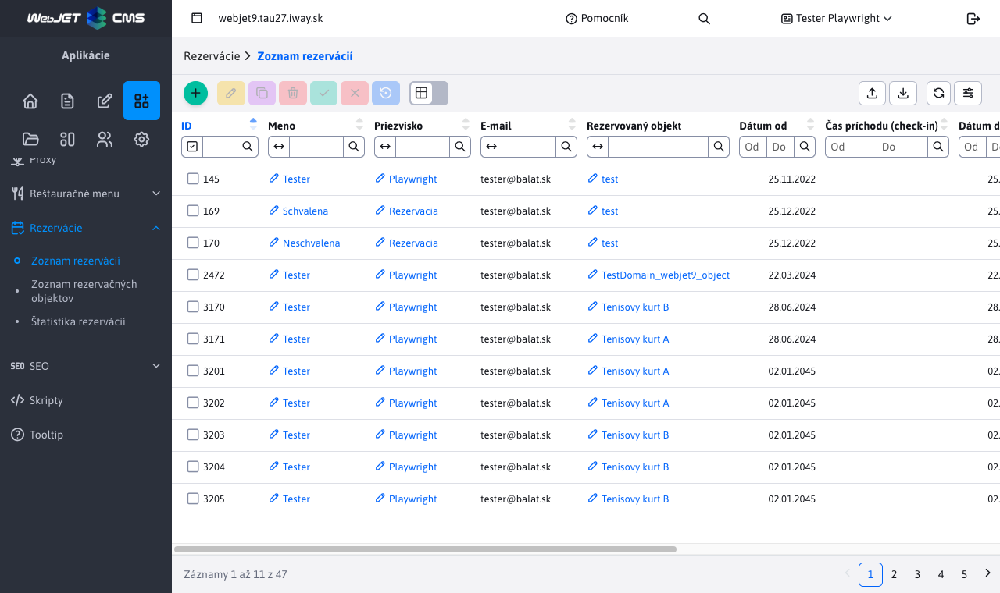
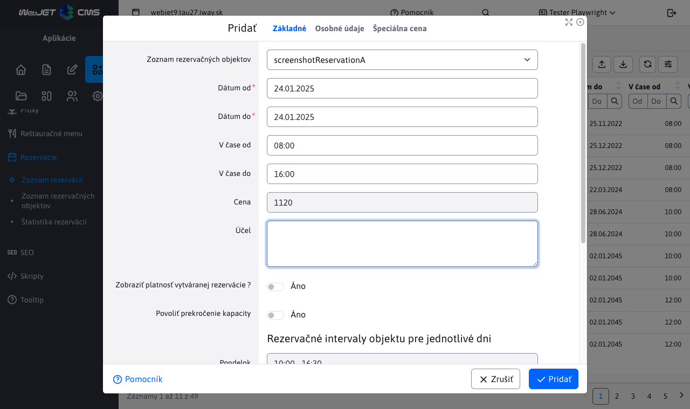
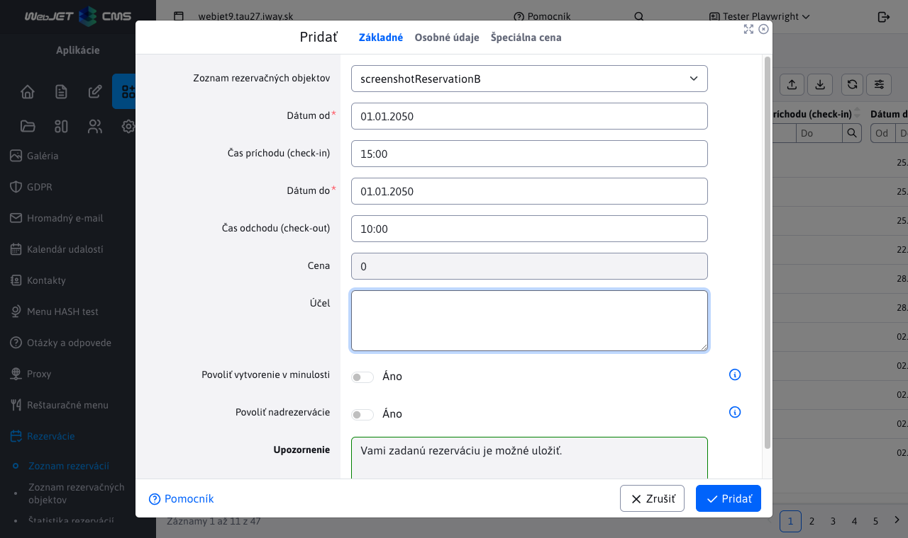

# Zoznam rezervácií

Aplikácia **Zoznam rezervácií** umožňuje vytváranie/úpravu/mazanie rezervácií, ako aj ich import z Excel súboru a export do Excel/CSV súboru (prípadne aj možnosť okamžitého tlačenia pri exporte).

Zoznam obsahuje aj 3 tlačidlá na schvaľovanie/zamietnutie/resetovanie rezervácie, viď. sekcia [Schvaľovanie rezervácií](#schvaľovanie-rezervácií). V ľavom menu môžete prejsť aj do [Štatistiky rezervácií](../reservations-stat/README.md).



Editor rezervácií obsahuje 4 karty, ktorých funkcie sú v nasledovnom opise.

## Základné

Karta **Základné** ako už napovedá názov, obsahuje základné informácie ohľadne rezervácie. Dôležitý je zoznam s výberom rezervačného objektu, ku ktorému sa rezervácia vzťahuje.



Karta ďalej obsahuje dátumový výber od/do a časový výber od/do. Pri tomto výbere si treba uvedomiť jednu podstatnú vec. Ak si zvolíte dni od 01.01.2022 do 03.01.2022 v čase od 08:00 do 16:00, neznamená to, že rezervácia sa začína 01.01.2022 o 08:00 a trvá do 03.01.2022 16:00 a všetko v tom rozsahu je rezervované. NIE. Pri týchto zvolených hodnotách to v praxi znamená, že si tento rezervačný objekt rezervujete v čase od 08:00 do 16:00 pre každý deň zvlášť. Dôvod je prostý, týmto spôsobom si viete rezervovať objekt v určitom čase pre viac dní bez potreby rezervovania celého intervalu. Ak je rezervačný interval pre daný objekt nastavený od 05:00 do 20:00 tak pre jednotlivé dni sa rezervuje iba zadaný časový interval a zvyšok intervalu rezervovaný nie je, aj keď rezervácia trvá napríklad 3 dni.

!>**Upozornenie**, ak sa rezervačný objekt dá rezervovať [IBA na celý deň](../reservation-objects/README.md) nasledovné možnosti sa skryjú a nebudú dostupné:

- výberu času
- prehľad rezervačných intervalov objektu pre jednotlivé dni



Prepínač **Zobraziť platnosť vytváranej rezervácie ?** po zvolení odkryje textové pole, v ktorom budete informovaný o platnosti rezervácie. To znamená či sa rezervácia pre zvolený objekt dá v danom rozsahu vytvoriť alebo nie. Bližšie informácie o možných stavoch v tomto poli sú vysvetlené v sekcii [Validácia rezervácií](#validácia-rezervácií). Ak je rezervácia platná ohraničenie textového poľa zmení farbu na zelenú a ak nie je rezervácia platná, zmení farbu na červenú.

**Cena rezervácie** zobrazuje aktuálnu cenu vytváranej rezervácie. Cena sa odvíja o zvoleného rezervačného objektu, rezervačného intervalu a od nastavených špeciálnych cien k danému rezervačnému objektu.

!>**Upozornenie:** na túto cenu rezervácie sa následne automatický aplikuje zľava používateľa. Táto percentuálna zľava je nastavená pre špecifické [skupiny používateľov](../../../../admin/users/user-groups.md). Ak používateľ patrí do viacerých **skupín používateľov** ktoré majú nastavenú percentuálnu zľavu, použije sa z nich tá najväčšia. Ak zľava má hodnotu ```0%```, suma rezervácie sa nemení. Ak zľava má hodnotu ```100%```, rezervácia je zdarma.

!>**Upozornenie:** platia práve aktuálne ceny a zľavy, čiže cena ktorá bola vypočítaná pri vytváraní rezervácie. To znamená, že ak máte naplánovanú rezerváciu napr. o mesiac a za ten čas sa zdvihne cena rezervačného objektu, alebo sa zmení používateľova zľava, cena rezervácie **sa nezmení**. **Avšak**, ak svoju vytvorenú rezerváciu upravíte, použijú sa aktuálne ceny a zľavy, čo môže zmeniť pôvodnú cenu, ku ktorej sa už spätne nedostanete.

Stav rezervácie ako aj cena rezervácie sa obnovujú vždy po zmene dátumu, času alebo rezervačného objektu.


V spodnej časti karty si môžete všimnúť prehľad s rezervačnými intervalmi objektu pre jednotlivé dni v týždni. Tieto časy sa nastavia podľa aktuálne zvoleného rezervačného objektu. Je to pomôcka pri vytváraní/úprave rezervácie, ak si presne nepamätáte kedy sa dá konkrétny rezervačný objekt rezervovať pre konkrétny deň v týždni.


## Osobné údaje

V karte **Osobné údaje** sa dajú nastaviť údaje žiadateľa o rezerváciu. Väčšina údajov sa automatický nastaví z profilu prihlásenej osoby, ale tieto hodnoty sa dajú aj zmeniť alebo vôbec nezadať.


## Špeciálna cena

Karta **Špeciálna cena** obsahuje vnorenú tabuľku s údajmi o špeciálnej cene rezervačného objektu pre konkrétne obdobie. Záznamy v tabuľke sa nastavia podľa aktuálne zvoleného rezervačného objektu z karty [Základné](../reservations/README.md#základné) a dajú sa iba exportovať, ale nie je možné ich pridávať, upravovať alebo odstrániť (slúžia iba na informačné účely).


## Schvaľovanie

Karta **Schvaľovanie** slúži na zmenu stavu rezervácie. Táto karta sa zobrazuje iba za špecifických podmienok.

Podmienky pre zobrazenie karty:

- editácia záznamu, karta sa zobrazí iba pri editácie záznamu rezervácie
- potreba schválenia, rezervačný objekt, ktorý sa rezervácia snaží rezervovať musí mať parameter **Je potrebné schválenie** a musí mať zadaný email schvaľovateľa
- schvaľovateľ, karta sa môže zobraziť iba osobe, ktorá ma povolenie danú rezerváciu schváliť. To znamená, že ak email prihláseného používateľa sa zhoduje s emailom schvaľovateľa zadaným v rezervačnom systéme a predošlé body boli splnené, karta sa používateľovi zobrazí

Po zobrazení, karta obsahuje prepínač medzi tromi stavmi, ktoré rezervácia môže nadobudnúť. Pri prepnutí z jedného stavu na druhý, sa spustí akcia zmeny stavu rezervácie ako v prípade využitia tlačidiel na zmenu stavu. Tieto akcie budú lepšie vysvetlené v sekcií **Schvaľovanie rezervácií**.


## Validácia rezervácií

Validačná logika rezervácií je dôležitá časť aplikácie **Zoznam rezervácií**, ktorá kontroluje či vytváraná alebo upravovaná rezervácia spĺňa všetky pravidlá a podmienky. Validácia sa automaticky spustí pri pokuse o uloženie novej rezervácie alebo úprave už existujúcej. Ak je rezervácia platná (spĺňa všetko potrebné) akcia vytvorenie/úpravy bude úspešná, v opačnom prípade nastane chyba a používateľ bude oboznámený buď konkrétnym alebo všeobecným chybovým hlásením.

Rezervácia sa nebude dať uložiť/upraviť kým nebude spĺňať všetky pravidlá validácie.

### Dátumový rozsah

Dátum od musí byť menší rovný ako dátumu do (ak sú dátumy rovnaké tak rezervuje iba ten jeden deň).

### Časový rozsah

Čas od musí byť ostro menší ako čas do, pretože musíte rezervovať minimálne 1 minútu. Súčasne sa kontroluje či tento časový rozsah je väčší alebo aspoň rovný ako ako zadaná hodnota "Minimálna dĺžka rezervácie (v minútach)" nastavená pre daný rezervačný objekt.

### Rozsah v minulosti

Nemôžete rezervovať deň/dni v minulosti. Ak sa snažíte robiť rezerváciu na dnešný deň tak časový interval nemôže byť v minulosti.

### Platný rezervačný rozsah,

Kontroluje sa, či zadaný časový rozsah je vnútri rezervačného intervalu objektu. Táto kontrola sa vykoná pre každý rezervovaný deň zvlášť. Napríklad ak sa snažíte rezervovať objekt v dobe od 08:00-09:00 na najbližšie 3 dni, a čo i len jeden z týchto dni má iný rezervačný interval tak rezervácia nie je platná. Samozrejme v úvahu sa berú aj špeciálne rezervačné intervaly pre jednotlivé dni v týždni, viac informácií v sekcií [časy podľa dní](../reservation-objects/README.md#časy-podľa-dní).

### Maximálny počet rezervácií v rovnakom čase

V tomto prípade sa kontroluje čí sa po pridaní rezervácie nebude pretínať viac rezervácií v rovnako čase ako je povolené parametrom **Maximálny počet rezervácií v rovnakom čase** daného objektu. Rezervácie sa považujú na prelínajúce ak sa ich časové intervaly prelínajú aspoň v jednej minúte (intervaly sa neprelínajú ak začiatok jedného je koniec druhého v rovnakú minútu). Napríklad ak máte 4 rezervácie, a ich časové intervaly sú ```08:00-11:00 / 08:00-09:00 / 09:00-10:00 / 10:00-11:00``` tak vidíme, že rezervácia v čase ```08:00-11:00``` sa prelína s 3 rôznymi rezerváciami, ale súčasne sa ich nikdy neprelína viac ako 2, pretože ostatné 3 rezervácie sa neprelínajú medzi sebou navzájom.

Pri kontrole sa zoberú všetky rezervácie (ale iba tie ktoré boli schválené) nad objektom v rovnaký deň a testuje sa či po pridaní našej rezervácie sa tento limit neprekročí. Testuje sa to pre každý deň samostatne a ak čo i len jeden deň presiahne maximálny počet rezervácií v rovnakom čase, rezervácia bude označená za neplatnú.

## Schvaľovanie rezervácií

Zmena stavu rezervácie je možná buď pomocou editoru a to presnejšie v karte [Schvaľovanie](../reservations/README.md#schvaľovanie), ktorá sa zobrazuje iba za určitých špecifických podmienok, alebo pomocou tlačidiel na zmenu stavu rezervácie.

Rovnako ako v karte **Schvaľovanie** aj tlačidlá ponúkajú 3 rôzne stavy a to :

-   **Schválenie** rezervácie (Rezervácia bola schválená)
-  **Zamietnutie** rezervácie (Rezervácia bola zamietnutá)
-  **Resetovať stav** rezervácie (Rezervácia čaká na schválenie)

### Nutné schválenie

Rezerváciu je potrebné schváliť v prípade, že rezervačný objekt má nastaveného schvaľovateľa a osoba čo vytvára/upravuje rezerváciu nie je schvaľovateľ. Prihlásená osoba NIE JE schvaľovateľ, ak sa jeho email nezhoduje s nastaveným emailom schvaľovateľa v rezervačnom objekte.

V takomto prípade sa odošle na email schvaľovateľa žiadosť o schválenie rezervácie. Takáto žiadosť obsahuje základné informácie o rezervácií ako aj priamy odkaz na túto rezerváciu.

### Automatické schválenie

Rezerváciu nie je potrebné schvaľovať, ak rezervačný objekt nemá nastaveného schvaľovateľa, alebo keď rezervačný objekt má nastaveného schvaľovateľa a ním je práve prihlásená osoba. Prihlásená osoba JE schvaľovateľ, ak sa jeho email zhoduje s nastaveným emailom schvaľovateľa v rezervačnom objekte.

### Vytváranie rezervácie

Pri pokuse o vytvorenie rezervácie sa nám na pozadí spustí validácia. Ak bola úspešná, rezervácia sa uloží a nastaví sa jej stav podľa situácie:

- ak rezerváciu NIE JE NUTNÉ schvaľovať, takáto rezervácia sa schváli automaticky a získa status **Rezervácia bola schválená**.
- ak rezerváciu JE NUTNÉ schvaľovať, uloží sa automaticky so statusom **Rezervácia čaká na schválenie** a na email schvaľovateľa sa odošle žiadosť o schválenie. Schvaľovateľ sa môže rozhodnúť, či rezerváciu schváli, zamietne alebo nevykoná žiadnu zmenu. Ak sa však stav rezervácie zmení, odošle sa správa na email žiadateľa o rezerváciu s informáciou o zmene stavu (tento email žiadateľa sa automatický pred-nastavil pri vytváraní rezervácie v karte [Osobné údaje](../reservations/README.md#osobné-údaje)).

### Úprava rezervácie

Pri pokuse o úpravu rezervácie sa nám na pozadí spustí validácia. Ak bola úspešná, rezervácia sa uloží a nastaví sa jej stav podľa situácie :

- ak rezerváciu NIE JE NUTNÉ schvaľovať, takáto upravená rezervácia sa uloží a automaticky schváli, čím získa status **Rezervácia bola schválená**.
- ak rezerváciu JE NUTNÉ schvaľovať, tak sa jej predošlý status vynuluje na hodnotu **Rezervácia čaká na schválenie** (nezáležiac na tom či bola schválená alebo zamietnutá) a opäť sa odosiela správa na email schvaľovateľa s prosbou o schválenie. Schvaľovateľ sa opäť môže rozhodnúť či rezerváciu schváli, zamietne alebo nevykoná žiadnu zmenu. Ak sa však stav rezervácie zmení, opäť sa odošle správa na email žiadateľa o rezerváciu s informáciou o zmene stavu.

### Zmena stavu rezervácie

Ako sa spomína vyššie, stav rezervácie môže skúsiť zmeniť pomocou karty alebo tlačidiel. V prípade karty je to ošetrené tak, že ju vidí iba osoba, ktorá má na to právo. V prípade tlačidiel je to tak že ich vidí každý.

Pri každom pokuse o zmenu rezervácie sa zobrazí potvrdenie akcie.


Ak sa rozhodnete akciu zrušiť, nič sa nestane. Ak sa rozhodnete akciu aj tak spustiť, na pozadí sa overí naše právo nad touto rezerváciou. Ak nastane prípad, že právo nemáme, bude zobrazená chybová správa a stav rezervácie sa nezmení.


Ak právo na zmenu máme, ďalej to bude záležať na tom, aký stav sa snažíte nastaviť:

**SCHVÁLENIE REZERVÁCIE**, nezáleží na pôvodnom stave rezervácie, na pozadí sa spustí validácia ktorá rozhodne čo sa stane s rezerváciou

- ak bola validácia úspešná, rezervácia sa schváli, zobrazí sa potvrdzujúca správa a odošle sa email žiadateľovi
- ak bola validácia neúspešná, rezervácia sa automatický zamietne, zobrazí sa chybová správa s dôvodom zamietnutia a odošle sa email žiadateľovi


**ZAMIETNUTIE REZERVÁCIE**, nezáleží na pôvodnom stave rezervácie, rezervácia bude proste zamietnutá, vráti sa potvrdzujúca hláška a odošle sa email žiadateľovi.


**RESETOVANIE STAVU REZERVÁCIE**, nezáleží na pôvodnom stave rezervácie, stav rezervácia bude proste resetovaný, vráti sa potvrdzujúca hláška a odošle sa správa žiadateľovi.


Odoslané emaily žiadateľovi pri zmene stavu rezervácie obsahujú základné informácie o rezervácií, jej nový stav a aj meno schvaľovateľa, ktorý tento zmenil stav tejto rezervácie.

## Mazanie rezervácií

Mazanie rezervácií je závislé od toho, nad akým rezervačným objektom bola táto rezervácia vytvorená. Rezervačný objekt môže mať nastavené heslo, ktoré zmení priebeh vymazávania rezervácie - heslo sa nastavovalo v karte [Pokročilé](../reservation-objects/README.md#pokročilé).

Ak heslo NIE JE nastavené, tak rezervácie nad týmto rezervačným objektom sa budú dať vymazať.

Ak heslo JE nastavené, budete vyzvaný k zadaniu tohto hesla.

- V prípade, že vymazávate viac rezervácií nad tým istým objektom (ktorý má heslo), tak budete vyzvaný iba jeden krát k zadaniu tohto hesla (nemusíte ho duplicitne zadávať pre každú rezerváciu zvlášť).
- V prípade, že vymazávate viacero rezervácií, ktoré sú nad viacerými objektmi s nastaveným heslom, tak môžete byť vyzvaný pre zadanie niekoľkých hesiel (zase bez duplicít).

V zobrazenej žiadosti o zadanie hesla budete informovaný, pre ktorý rezervačný objekt musíte heslo zadať. Ak zadávate viac hesiel a jedno alebo viac z nich sa rozhodnete nezadať (zrušíte akciu zadávania hesla), celková akcia vymazávania rezervácií tým však nebude ovplyvnená. Nezadané heslo je automatický považované za zlé a preto sa neodstránia rezervácie and objektom s týmto heslom.


Po zadaní všetkých potrebných hesiel sa zobrazí výzva na vymazanie rezervácií. Pomocou zobrazeného okna môžete celú akciu prerušiť, alebo potvrdiť rozhodnutie.


Ak bolo jedno alebo viac hesiel nesprávnych, vráti sa hláška pre každú rezerváciu, ktorú nebolo možné kvôli tomu vymazať. Hláška obsahuje informáciu o tom, ktoré heslo rezervačného objektu nebolo zadané správne a ktorá rezervácia kvôli tomu nemohla byť vymazaná.

