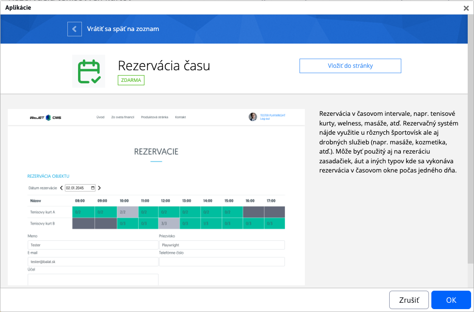
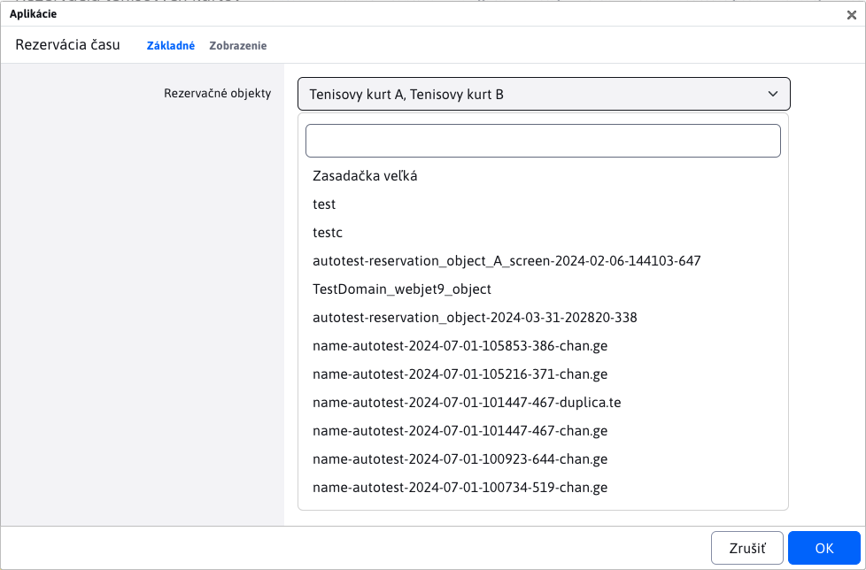
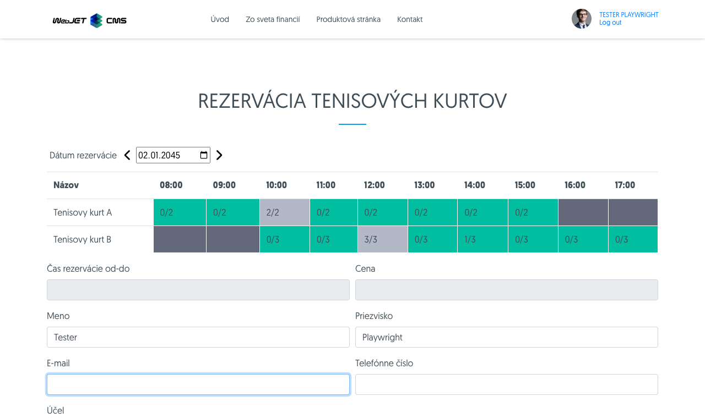
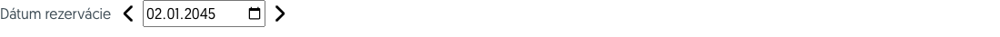
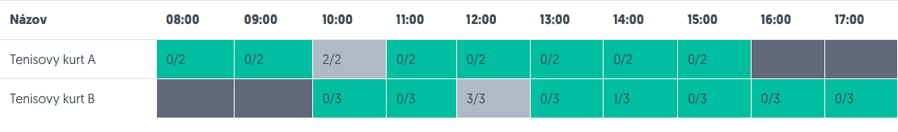
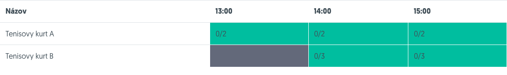
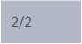
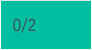
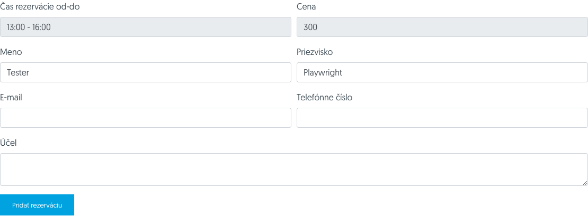
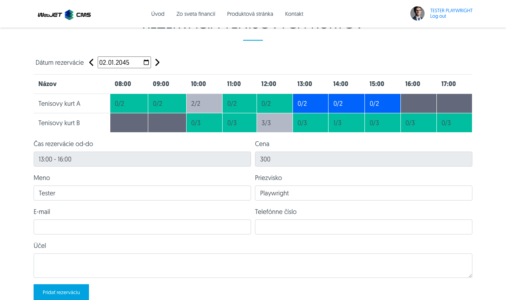

# Aplikácia Rezervácia času

Aplikácia **Rezervácia času** umožňuje rezerváciu vybraných rezervačných objektov na určitý časový interval.

## Použitie aplikácie

Aplikáciu môžete do svojej stránky pridať cez obchod s aplikáciami



alebo priamo ako kód do stránky

```html
!INCLUDE(sk.iway.iwcm.components.reservation.TimeBookApp, reservationObjectIds=&quot;2560+2561&quot;, device=&quot;&quot;, cacheMinutes=&quot;&quot;)!
```

V kóde si môžete všimnúť parameter ``reservationObjectIds``. Ide o zoznam povolených rezervačných objektov, ktoré sa budú v aplikácií dať rezervovať. Nastaviť ich môžete pri editácií aplikácie pomocou viacnásobného výberového poľa, alebo ich pridať priamo do parametra ``reservationObjectIds``.



!>**Upozornenie**: podporované sú iba rezervačné objekty, ktoré **NIE SÚ nastavené ako rezervácia na celý deň**. Pretože tieto objekty sa nedajú rezervovať na základe času, ale len dátumu. Nevyhovujúce rezervačné objekty sa v multi výberovom poli nezobrazujú.

!>**Upozornenie**: manuálne pridanie ID nevyhovujúceho rezervačného objektu do parametra ``reservationObjectIds``, alebo zmenenie stavu už použitého rezervačného objektu v aplikácií na "rezervácia na celý deň", **spôsobí chybné správanie sa aplikácie**.

## Stavba aplikácie

Aplikácia sa skladá z 3 hlavných častí:

-   výber dátumu rezervácie
-   tabuľka rezervačných objektov a časov
-   formulár rezervácie



### Dátumový výber

Zvolením dátumu určujete, na ktorý deň chcete rezerváciu vykonať. Pri prvom spustení je prednastavený aktuálny deň, ktorý môžete zmeniť dátumovým filtrom. Šípky vedľa dátumového filtra vám umožňujú prechádzať o deň dozadu alebo dopredu.



### Tabuľka rezervačných objektov

Každý riadok v tabuľke prestavuje jeden rezervačný objekt. Jednotlivé bunky tabuľky predstavujú dostupnosť v jednotlivých hodinách daného dňa.



Štruktúra tabuľky sa môže značne líšiť podľa zvoleného dňa v týždni. Nakoľko každý rezervačný objekt môže mať nastavený iný rezervačný časový interval na každý deň v týždni [bližšie informácie](../reservation-objects/README.md#časy-podľa-dní).



Jednotlivé bunky v tabuľke majú znamenajú špecifický status.

**Nedostupná** bunka znamená, že rezervácia objektu pre túto hodinu a deň v týždni je mimo povolený rozsah.


**Plná** bunka znamená, že bol dosiahnutý maximálny počet rezervácií pre tento rezervačný objekt a hodinu v dni. Ako aj vidíme, bunka môže obsahovať text ako "2/2", čo znamená, že už existujú 2 rezervácie z 2.

!>**Upozornenie:** môže nastať situácia, že táto bunka bude mať status napr. "1/2" alebo "0/2". Takáto situácia nastáva keď konkrétna hodina alebo celý deň je už v minulosti. Takže aj keď nebol dosiahnutý maximálny počet rezervácií, nie je možné pridať novú.



**Voľná** bunka v podstate znamená, že je možné požiadať o rezerváciu objektu v túto hodinu (a tento deň).



Táto bunka znamená že je vybraná. výber bunky sa vykoná kliknutím na ňu (ak na ňu opäť kliknete tak sa výber zruší).
!>**Upozornenie:** vybrať je možné iba dostupné bunky ergo tie, ktoré sú **voľné**.

### Formulár rezervácie

Ide o jednoduchý formulár so základnými informáciami k rezervácií objektu.

Tieto povinné polia sa automatický pred-vyplnia ak ste prihlásený používateľ, ale samozrejme dajú sa zmeniť. Ak pristupujete ako neprihlásený používateľ, musíte ich povinne zadať:
- Meno
- Priezvisko
- E-mail

Polia **Doba rezervácie od-do** a **Cena rezervácie** sa nedajú zmeniť a slúžia iba na informačné účely. Automatický zmenia hodnotu podľa vybraných buniek v tabuľke (podľa zvoleného rezervačného rozsahu pre rezervačný objekt). Ak žiadna bunka nie je vybraná, polia budú prázdne.

**Pozor**, na túto cenu rezervácie sa následne automatický aplikuje zľava používateľa. Táto percentuálna zľava je nastavená pre špecifické [skupiny používateľov](../../../../admin/users/user-groups.md). Ak používateľ patrí do viacerých **skupín používateľov** ktoré majú nastavenú percentuálnu zľavu, použije sa z nich tá najväčšia. Ak zľava má hodnotu ```0%```, suma rezervácie sa nemení. Ak zľava má hodnotu ```100%```, rezervácia je zdarma.

!>**Upozornenie:** tlačidlo pre pridanie rezervácie sa zobrazí iba ak je zvolená nejaká bunka v tabuľke.



## Pridanie rezervácie

Pre pridanie rezervácie musíte najprv zvoliť nejaký časový rozsah v tabuľke. Pridávanie rezervácie má však tieto nasledujúce pravidlá:
- **Rezervovať si môžete naraz iba 1 rezervačný objekt**. Takže ak v riadku pre objektA zvolíte rozsah od 13:00 do 15:00 a tak sa pokúsite zvoliť rozsah pre rezervačný objektB, výber pôvodného zvoleného rozsah sa automaticky celý zruší.
- **Zvoliť môžete iba 1 súvislí rozsah**. Nemôžete naraz zvoliť rozsah 13:00-15:00 a súčasne 16:00-17:00 aj keby išlo o ten istý objekt. Ak sa o to pokúsite prvý zvolený rozsah sa automatický zruší.
- **Zvolený rozsah nemôže byť prerušený nedostupným časom**. Ak sa pokúsite zvoliť rozsah 13:00-17:00 ale rozsah 15:00-16:00 daného objektu je už plne rezervovaný, zvolený rozsah sa automatický zruší.
- **Povinné polia**. Polia Meno/Priezvisko/Email sú povinné pre pridanie rezervácie.

Ak ste splnili spomenuté podmienky, máte zvolený korektný rozsah a vyplnené povinné polia, tak môžete požiadať o pridanie rezervácie.



Ak sa rezervácia úspešne vytvorila dostanete hlášku o úspešnom vytvorení rezervácie a na Vami zadaný email príde aj potvrdenie.

Ak rezervačný objekt **nepotrebuje schválenie**, rezervácia sa automatický schváli a vy dostanete nasledujúcu hlášku. Následne sa upraví dostupnosť jednotlivých časových intervalov v tabuľke.


Ak rezervačný objekt **potrebuje schválenie**, rezervácia bude v stave čakania. Dostupnosť jednotlivých časových intervalov v tabuľke sa nezmení, nakoľko sa počítajú IBA schválené rezervácie. Schvaľovateľ môže vašu rezerváciu schváliť alebo zamietnuť, o čom budete informovaný emailom.

