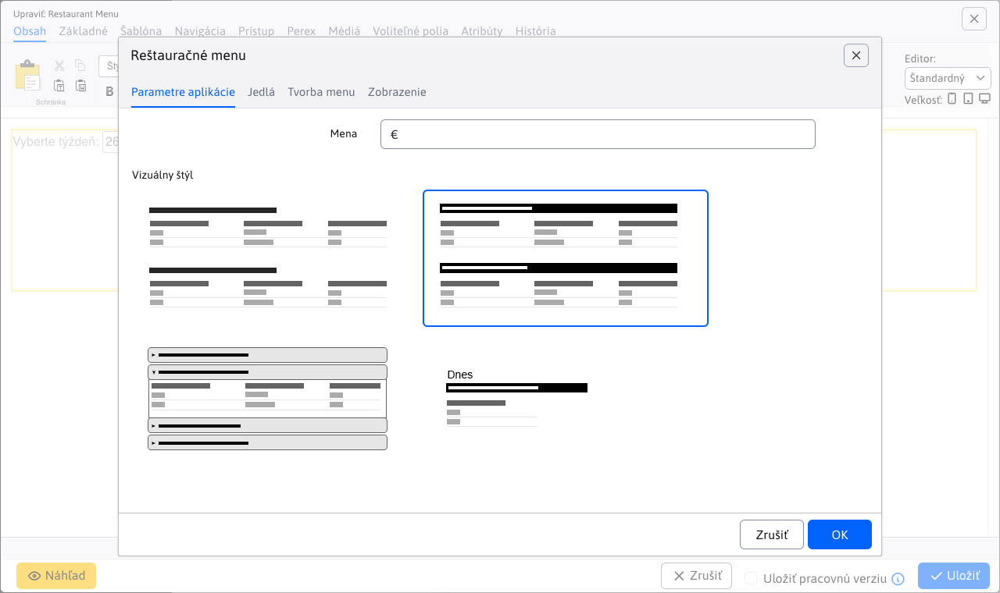
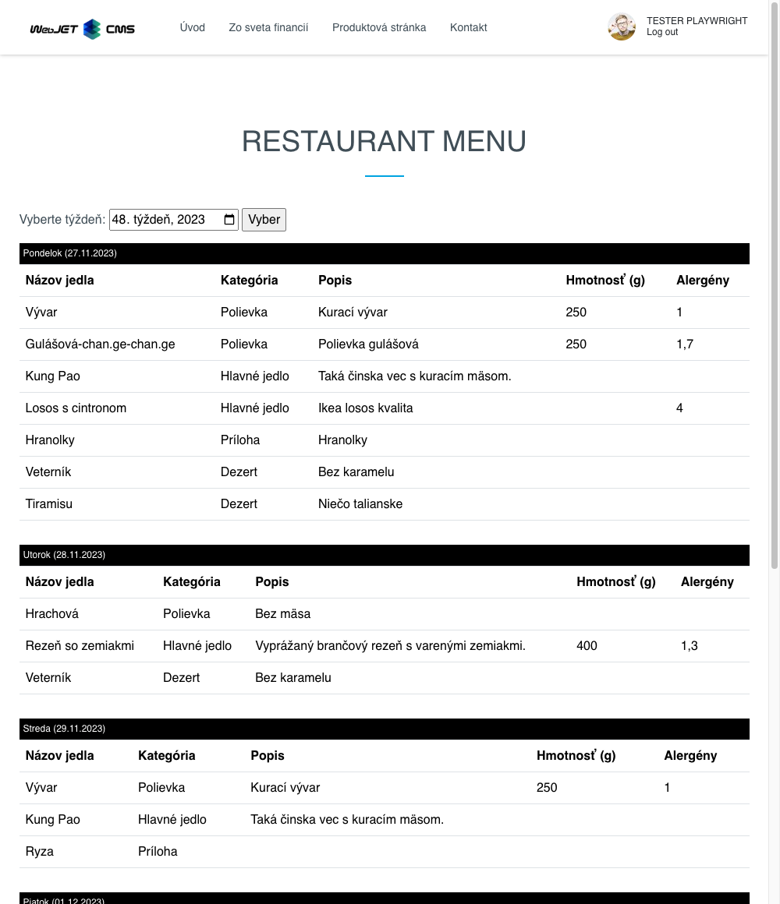
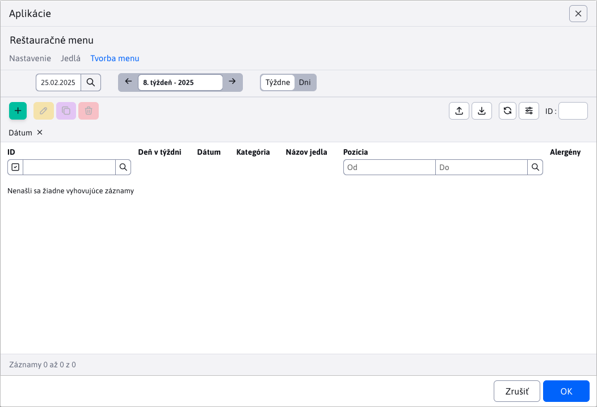

# Reštauračné menu

Aplikácia Reštauračné menu umožňuje zadefinovanie jedál, vytvorenia menu pomocou jedál a následne zobrazenie menu v rôznych štýloch. Do web stránky môžete aplikáciu Reštauračné menu pridať cez výber aplikácií, alebo priamo kódom do tela web stránky.
Príklad: ```!INCLUDE(/components/restaurant_menu/menu.jsp, style=02, mena=&euro;)!```



Dialógove okno aplikácie pozostáva z kariet:
- Nastavenia
- Jedlá
- Tvorba menu

## Nastavenia

V karte Nastavenia, si môžete vybrať štýl, akým sa vytvorené reštauračné menu zobrazí vo web stránky. Ako vidieť na predchádzajúcom obrázku, k dispozícii sú 4 rozdielne typy zobrazenia. Typ 01, 02 a 03 zobrazujú celé menu (celý týždeň). Typ 04 zobrazuje iba menu na konkrétny aktuálny deň.

Pre príklad si uveďme ako vyzerá vygenerované reštauračné menu typu 02 vo web stránke.



## Jedlá

Karta Jedlá ponúka vnorenú datatabuľku pre správu zoznamu podporovaných jedál. Celú dokumentáciu k tej tabuľke nájdete tu [Jedlá](./meals.md).


## Tvorba menu

Karta Tvorba menu ponúka vnorenú datatabuľku pre vytváranie a správu menu, na konkrétny deň/týždeň. Celú dokumentáciu k tej tabuľke nájdete tu [Tvorba menu](./menu.md).

