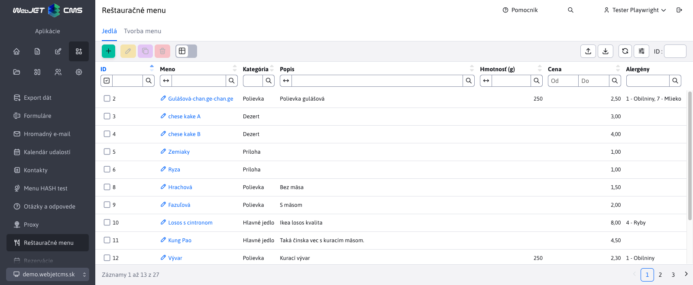
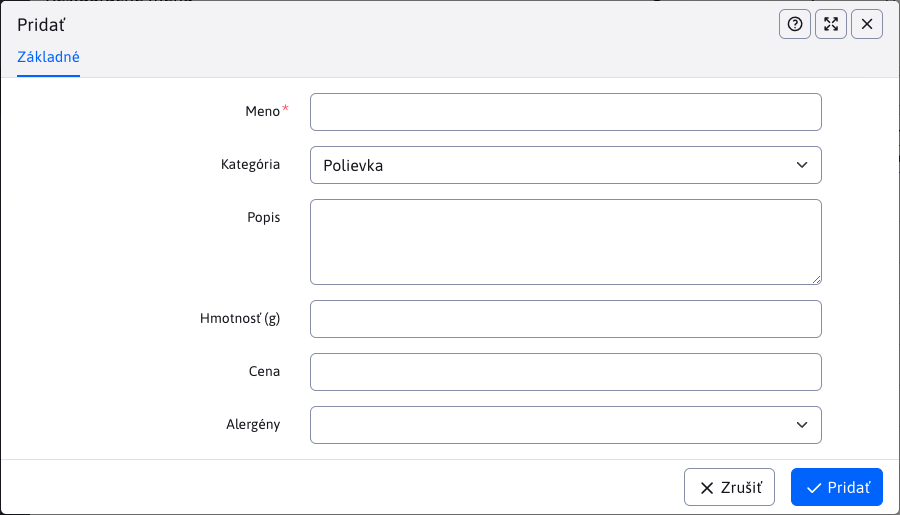
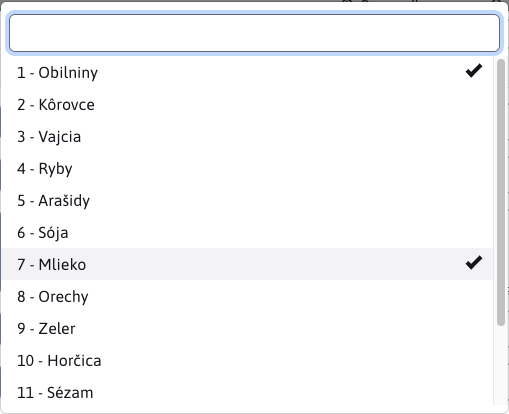

# Jedlá

Časť ``Jedlá`` spadá pod sekciu Reštauračné menu. Umožňuje zadefinovanie jedál, ktoré sa využívajú pri vytváraní reštauračného menu. Možné je pridávanie/upravovanie/duplikovanie/mazanie jedlá ako aj ich importovanie a exportovanie.

Pri vytváraní nového jedla sú v editore tieto parametre:
- Meno - meno nového jedla (jediný povinný parameter)
- Kategória - kategória jedla s výberom možností Polievka / Hlavné jedlo / Príloha / Dezert
- Popis
- Hmotnosť (g)
- Cena
- Alergény - alergény obsiahnuté v tomto jedle. Tento parameter je typu MULTISELECT, čo znamená, že si môžete vybrať viac alebo žiadnu hodnotu (na výber je niekoľko hodnôt).

Alergény vyberáte z výberového menu, v ktorom je možné označiť viaceré možnosti. Alergénov je 14 (počet sa dá nastaviť v konf. premennej `restaurantMenu.alergensCount`) a definujú sa v prekladových kľúčoch s prefixom `components.restaurant_menu.alergen`:

