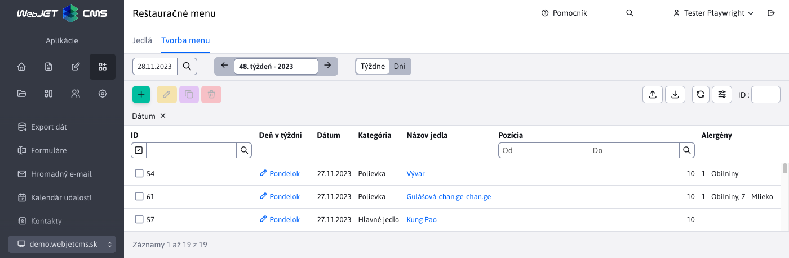
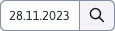
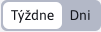
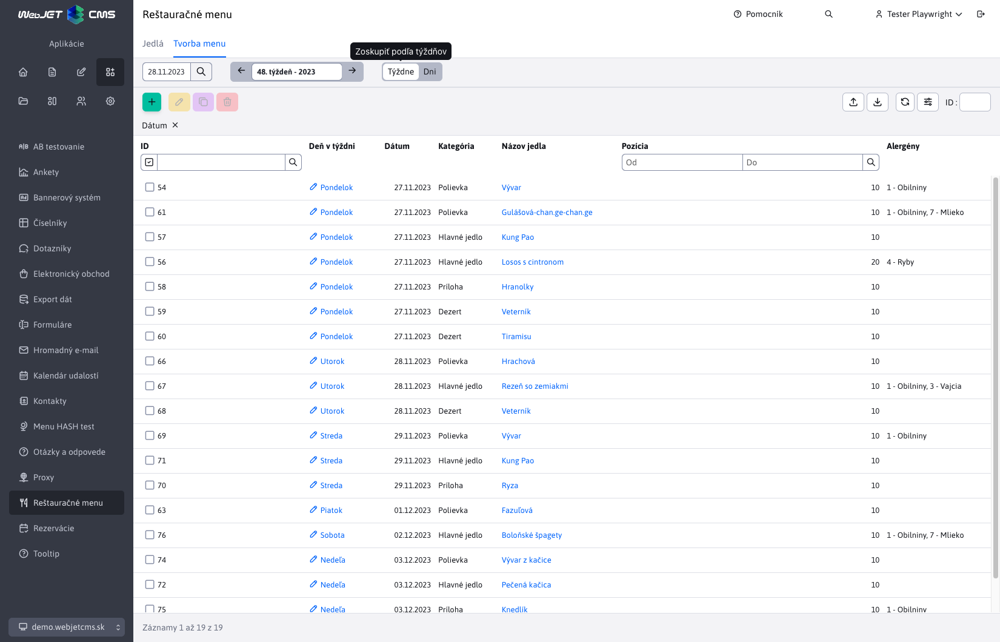

# Tvorba menu

Časť **Tvorba menu** spadá pod sekciu Reštauračné menu. Umožňuje vystavenie jedálnička a to priradením jedál ku konkrétnym dňom. Samozrejme poskytuje možnosť pridávania/upravovania/duplikovania/mazania týchto priradení ako aj ich importovanie a exportovanie.

Jedlo je predvolene reprezentované stĺpcami Kategória a Názov jedla. Zvyšné stĺpce reprezentujúce jedlo sa dajú pridať v nastavení datatabuľky. Samotná hodnota v stĺpci Názov jedla je odkaz, ktorá Vás po kliknutí na ňu presmeruje do tabuľky Jedlá a automaticky otvorí editor zvoleného jedla ([Jedlá](./meals.md)).

Záznamy v tejto tabuľke sú striktne filtrované:
- podľa dátumu (dňa v týždni)
- podľa zvolenej kategórie (1-Polievky, 2-Hlavné jedlá, 3-Prílohy a 4-Dezerty)
- následne podľa zvolenej pozície

Tento systém zoradenia je dobré vidieť na obrázku v sekcií [Režim zobrazenia](../restaurant-menu/menu.md#režim-zobrazenia), pri zobrazení záznamov z celého týždňa.

## Vytváranie nového záznamu

Parametre:
- Kategória, zoznam na výber kategórie jedla (prednastavená kategória Polievky)
- Názov jedla, zoznam, ktorý sa dynamický naplní podľa aktuálne zvolenej kategórie jedla. Zoznam obsahuje všetky zadefinované jedla pod danou zvolenou kategóriou (automaticky sa zvolí prvé jedlo vo vrátenom zozname)
- Dátum, ku ktorému sa jedlo priradí sa automatický naplní podľa hodnoty dátumového filtra ( [Dátumový filter](../restaurant-menu/menu.md#dátumový-filter) ) a nedá sa zmeniť
- Pozícia, pri vytváraní nového záznam (iba pri vytváraní) sa jeho hodnota pred-nastaví ako najväčšia priorita pre kombináciu daného dňa a zvolenej kategórie jedla + 10. To znamená, že napr. ak pre deň 23.11.2023 a kategóriu jedla Polievky je najvyššia priorita 20, tak nastaví hodnotu 30. Pri zmene kategórie jedla sa hodnota automatický opäť pred-nastaví.

## Ovládacie prvky

Tabuľka obsahuje špeciálne ovládacie prvky, umožňujúcu ľahšiu prácu s dátumami a režimom zobrazenia:

### Dátumový filter

Dátumový filter  slúži na obmedzenie zobrazených záznamov iba na konkrétny deň. Automatický sa nastaví na aktuálny deň (**Upozornenie:** jeho posledná aktuálna hodnota sa pri odchode zo stránky neuloží).

### Režim zobrazenia

Režim zobrazenia  umožňuje zmeniť rozsah, v ktorom sa záznamy zobrazujú. Poskytuje na výber zobrazenie podľa dní a týždňov.

Prednastavené je **zobrazenie podľa dní**, ktoré ste mohli vidieť už na úvodnom obrázku tabuľky vyššie. Pri tomto zobrazení sa filtrujú záznamy iba pre jeden špecifický deň.

Ak zvolíte **zobrazenie podľa týždňov**, budú sa filtrovať záznamy pre celý týždeň (7 dní). Ako týždeň je braný vždy rozsah od Pondelka po Nedeľu.

Zmenu týždňa dosiahnete zmenou hodnoty **Dátumového filtra**. Filter si automaticky od zvoleného dátumu odvodí celý týždeň a všetky hodnoty v tomto časom úseku budú zobrazené.

Príklad: ak zvolíte dátum 28.11.2023 (Utorok) tak v móde Týždne sa rozsah nastaví automaticky od Pondelka 27.11.2023 (vrátane) do Nedele 03.12.2023 (vrátane). Nezáleží, ktorý deň v tomto rozsahu zvolíte, vždy budú filtrované záznamy rovnaké, pokiaľ sú tieto dátumy v rovnakom týždni. Samotný týždeň môžete zmeniť až zvolením dátumu, ktorý spadá do iného týždňa (napr. 04.12.2023).

Samozrejme, nezáleží čí týždeň prechádza cez iný mesiac alebo rok.
Ako môžeme z nasledujúceho obrázka vidieť, zobrazia sa nám záznamy z celého týždňa a automaticky sa zobrazí stĺpec **Deň v týždni**, pre lepšie určenie, pod ktorý deň záznamy patria. Taktiež záznamy sú farebné odlíšené pri prechode z jedného dňa na iný.

Pôvodne nastavený dátum vo filtri sa nemení (samozrejme ho zmeniť môžete) a pri prepnutí do módu **zobrazenie podľa dní** sa zobrazia záznamy dňa, ktorého dátum je aktuálne nastavený.

### Dátumový status

Dátumový status slúži primárne na zobrazenie aktuálne zvoleného dňa týždňa.

V móde **zobrazenie podľa dní** zobrazuje informáciu aký deň v týždni je aktuálne zvolený a aký týždeň v roku to je 

V móde **zobrazenie podľa týždňov** zobrazuje informáciu o aký týždeň v roku ide a o aký rok

Na prechádzajúcich obrázkoch môžete vidieť, že tento dátumový status obsahuje aj šípky vpravo a vľavo. Tieto šípky slúžia na jednoduchý posuv v kalendári:
- šípka vľavo je posun do minulosti
- šípka vpravo je posun do budúcnosti

V móde **zobrazenie podľa dní** sa posúvate iba o jeden deň, v móde **zobrazenie podľa týždňov** sa posúvate o celý týždeň (7 dní). S týmto posunom sa automatický nastaví aj dátumový filter, aby ste mali prehľad, ktorý deň/týždeň je aktuálne nastavený.