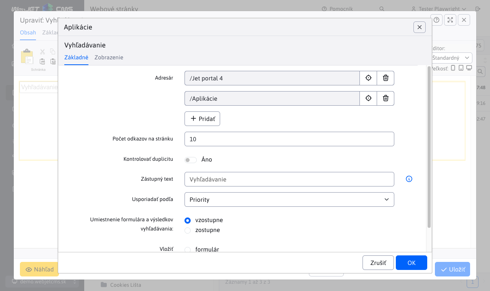
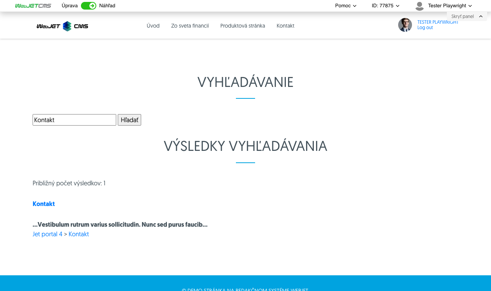

# Vyhľadávanie

Ponúknite návštevníkom možnosť rýchleho a presného vyhľadávania priamo na vašej stránke. Vložte vyhľadávací formulár a zobrazenie výsledkov vyhľadávania, ktoré umožňuje nastavenie adresára, počtu záznamov na stránku a spôsobu usporiadania. Využite silu vyhľadávania v databáze alebo pomocou Lucene/Elastic Search pre vyhľadávanie aj so skloňovaním. Podporované sú aj vyhľadávania v texte súborov typu `doc(x), xls(x), ppt(x), pdf, xml a txt`.

## Nastavenia aplikácie

V nastaveniach možno nastaviť:

- Typ vyhľadávania - pre konkrétnu vloženú aplikáciu možno použiť databázové, Lucene, sémantické alebo hybridné vyhľadávanie. Hodnota **Podľa konfigurácie** použije globálnu konfiguračnú premennú `searchType`.
- Pridať odpoveď RAG - zapne zobrazenie AI odpovede nad výsledkami vyhľadávania, ak je globálne povolená premenná `ragAnswerAllowed` a používa sa sémantické alebo hybridné vyhľadávanie.
- Adresár - ID priečinkov web stránok pre vyhľadávanie, hľadá sa aj v podpriečinkoch
- Počet odkazov na stránku - počet záznamov na jednu stranu vyhľadávania
- Kontrolovať duplicitu - ak sa web stránka nachádza vo viacerých priečinkoch, zapne sa kontrola duplicít. Zvyšuje záťaž na server.
- Usporiadať podľa - Priority, Názvu, Dátumu zmeny
- Vložiť - formulár, výsledky, spolu - nastavuje typ vloženej časti, ak chcete mať oddelené vyhľadávacie pole napr. v hlavičke vložte samostatne formulár a samostatne výsledky vyhľadávania. Pri nastavení hodnoty Formulár je potrebné zadať ID stránky s výsledkami vyhľadávania.

### Nastavenie hľadania v súboroch

Ak chcete vyhľadávať aj v súboroch, je potrebné [nastaviť indexovanie súborov](../../files/fbrowser/folder-settings/README.md#indexovanie) v časti Prieskumník a na danom priečinku so súbormi a spustiť prvotné indexovanie.

### Nastavenie typu vyhľadávania

Systém podporuje nasledujúce typy vyhľadávania:

- **Databázové vyhľadávanie** – štandardný typ vyhľadávania pomocou databázového servera.
  - Používa sa predvolene, ak nie je nastavený iný typ. Možno ho explicitne nastaviť konfiguračnou premennou `searchType` na hodnotu `db`.
- **Lucene** – vyhľadávanie pomocou knižnice [Lucene](https://lucene.apache.org/), ktorá tvorí základ aj systému Elastic Search.
  - Nastavte konfiguračnú premennú `luceneAsDefaultSearch` na hodnotu `true`, alebo premennú `searchType` na hodnotu `lucene`.
  - Spustite prvotné indexovanie cez `/components/search/lucene_console.jsp`.
- **Sémantické vyhľadávanie** – vyhľadávanie pomocou pgvector.
  - Nastavte premennú `searchType` na hodnotu `semantic`, alebo zvoľte typ priamo v aplikácii. Povoľte sémantické vyhľadávanie nastavením premennej `ragSemanticSearchEnabled` na `true`.
  - Viac sa dočítate v časti [Sémantické vyhľadávanie](../semantic-search/README.md).
- **Hybridné vyhľadávanie** – kombinuje sémantické vyhľadávanie s fulltextom nad indexovanými časťami textu.
  - Nastavte premennú `searchType` na hodnotu `hybrid`, alebo zvoľte typ priamo v aplikácii. Musí byť povolené `ragSemanticSearchEnabled=true` aj `ragHybridSearchEnabled=true`.
  - Viac sa dočítate v časti [Sémantické vyhľadávanie](../semantic-search/README.md).

!>**Upozornenie:** Konfiguračná premenná `luceneAsDefaultSearch` má vyššiu prioritu ako premenná `searchType`. Ak je teda `luceneAsDefaultSearch=true`, bude sa používať Lucene bez ohľadu na nastavenú hodnotu premennej `searchType`.

RAG odpoveď nie je samostatný typ vyhľadávania. Je to doplnok k sémantickému alebo hybridnému vyhľadávaniu, ktorý z nájdeného kontextu vygeneruje krátku odpoveď a zobrazí ju pred zoznamom výsledkov.

### Porovnanie typov vyhľadávania

| | Databázové (`db`) | Lucene | Sémantické (`semantic`) | Hybridné (`hybrid`) |
| --- | --- | --- | --- | --- |
| Technológia | SQL LIKE / FULLTEXT | `Apache Lucene` | `OpenAI embeddings` + `pgvector` | `pgvector` + fulltext nad chunkmi |
| Zhoda | Kľúčové slová | Kľúčové slová + skloňovanie | Sémantický význam | Sémantický význam aj presné slová |
| Výsledky bez zhody slov | Nie | Čiastočne | Áno | Áno |
| Vhodné pre krátke dotazy | Obmedzene | Áno | Čiastočne | Áno |
| Požiadavky | Primárna DB | Lucene index | `PostgreSQL` + `pgvector` + `OpenAI` | `PostgreSQL` + `pgvector` + `OpenAI` |
| Cena | Zadarmo | Zadarmo | OpenAI API (platené) | OpenAI API (platené) |

## Zobrazenie aplikácie

