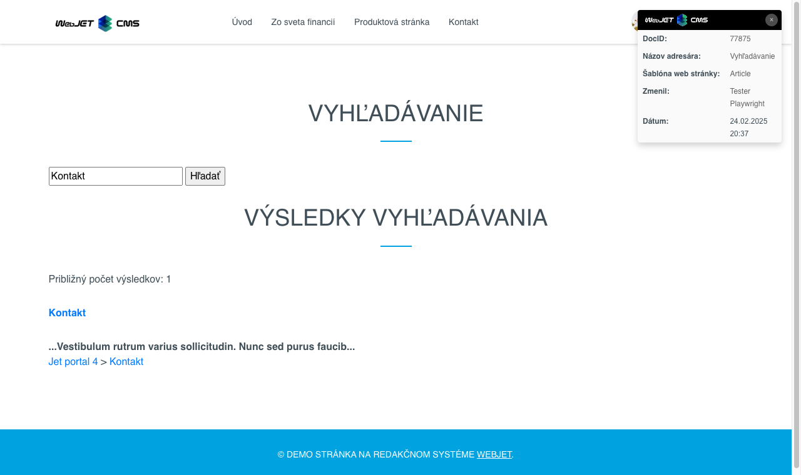

# Vyhľadávanie

Ponúknite návštevníkom možnosť rýchleho a presného vyhľadávania priamo na vašej stránke. Vložte vyhľadávací formulár a zobrazenie výsledkov vyhľadávania, ktoré umožňuje nastavenie adresára, počtu záznamov na stránku a spôsobu usporiadania. Využite silu vyhľadávania v databáze alebo pomocou Lucene/Elastic Search pre vyhľadávanie aj so skloňovaním. Podporované sú aj vyhľadávania v texte súborov typu `doc(x), xls(x), ppt(x), pdf, xml a txt`.

## Nastavenia aplikácie

V nastaveniach možno nastaviť:

- Adresár - ID priečinkov web stránok pre vyhľadávanie, hľadá sa aj v podpriečinkoch
- Počet odkazov na stránku - počet záznamov na jednu stranu vyhľadávania
- Kontrolovať duplicitu - ak sa web stránka nachádza vo viacerých priečinkoch, zapne sa kontrola duplicít. Zvyšuje záťaž na server.
- Usporiadať podľa - Priority, Názvu, Dátumu zmeny
- Vložiť - formulár, výsledky, spolu - nastavuje typ vloženej časti, ak chcete mať oddelené vyhľadávacie pole napr. v hlavičke vložte samostatne formulár a samostatne výsledky vyhľadávania. Pri nastavení hodnoty Formulár je potrebné zadať ID stránky s výsledkami vyhľadávania.


### Nastavenie hľadania v súboroch

Ak chcete vyhľadávať aj v súboroch, je potrebné [nastaviť indexovanie súborov](../../files/fbrowser/folder-settings/README.md#indexovanie) v časti Prieskumník a na danom priečinku so súbormi a spustiť prvotné indexovanie.

### Nastavenie používania Lucene

Štandardne sa používa vyhľadávanie pomocou databázového servera. Je možné aktivovať vyhľadávanie pomocou knižnice [Lucene](https://lucene.apache.org/), ktorá sa používa aj v ```Elastic Search``` ako vyhľadávací systém. Nastavte konf. premennú `luceneAsDefaultSearch` na hodnotu `true` a spustite prvotné indexovanie cez `/components/search/lucene_console.jsp`.

## Zobrazenie aplikácie


