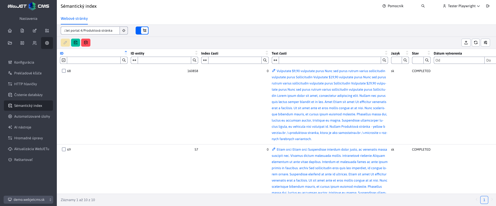
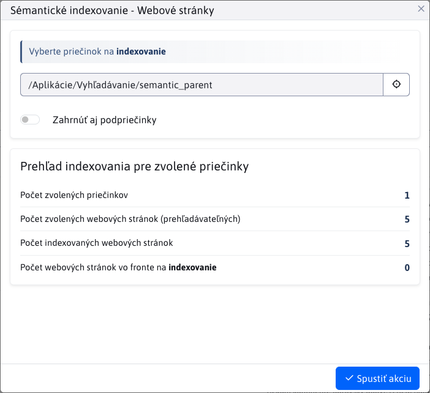
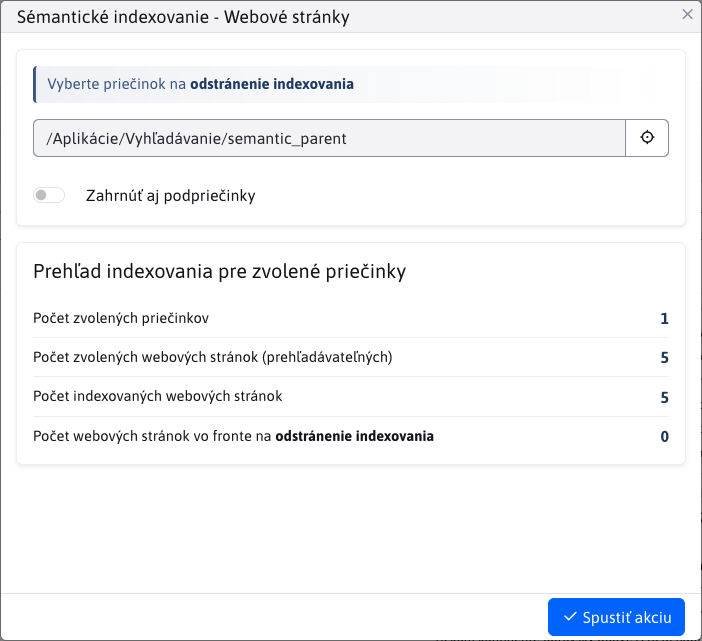

# Sémantický index

Sémantický index prevádza obsah stránok na vektorové reprezentácie (`embedding`) pomocou OpenAI API a ukladá ich do vektorovej databázy. Používa sa pre sémantické vyhľadávanie, hybridné vyhľadávanie aj pre generovanie RAG odpovede vo vyhľadávaní.

Pre presnejšie výsledky sa obsah rozdeľuje na menšie časti - **chunky**. Každý chunk je indexovaný samostatne, čo systému umožňuje porovnávať dotazy s konkrétnymi časťami textu a nie s celou stránkou naraz.

Správu vektorov nájdete v sekcii **Nastavenia → Sémantický index**.

Aktuálne je podporované indexovanie **webových stránok**. Ďalšie typy môžu pribudnúť v budúcnosti.

!>**Upozornenie:** Indexovanie **neprebieha okamžite**. Každá požiadavka (pridanie, úprava, vymazanie) sa zaradí do **fronty** a spracuje sa v pravidelných intervaloch pomocou cron úlohy.

Na zobrazenie zoznamu indexovaných objektov je potrebné mať právo Sémantický index.

## Indexovanie webových stránok

Indexuje sa čistý text stránky bez HTML značiek. Do indexovania vstupujú iba webové stránky, ktoré sú povolené pre vyhľadávanie. Obsah sa rozdelí na chunky, ktoré sú zobrazené v tabuľke nižšie.

Každý chunk obsahuje tieto stĺpce:

- **ID entity** - ID webovej stránky.
- **Index časti** - poradie chunku v rámci stránky (0, 1, 2, ...).
- **Text časti** - text, pre ktorý bol vygenerovaný embedding. Samotný embedding sa v tabuľke nezobrazuje.
- **Model** - použitý OpenAI model, napr. `text-embedding-3-small`.
- **Dimenzie** - počet dimenzií vektora, napr. `1536`.
- **Jazyk** - jazyková verzia stránky.
- **Stav** - stav spracovania:
  - **COMPLETED** - úspešne spracovaný.
  - **ERROR** - nastala chyba.
  - **PENDING** - čaká na spracovanie.
- **Chybová správa** - popis chyby, ak spracovanie zlyhalo.
- **Dátum vytvorenia** - čas spracovania, nie čas pridania do fronty.

V databáze sa navyše ukladá `group_id` a stĺpce `root_group_l1`, `root_group_l2`, `root_group_l3`. Tieto hodnoty sa používajú na rýchle obmedzenie sémantického a hybridného vyhľadávania podľa priečinkov zvolených v aplikácii **Vyhľadávanie**.

## Rozdelenie textu na chunky

Veľkosť chunkov sa nastavuje konfiguračnými premennými:

- `ragEmbeddingChunkSize` - maximálna veľkosť jednej časti textu v znakoch, predvolene `1000`.
- `ragEmbeddingChunkOverlap` - počet znakov prekrytia medzi susednými časťami, predvolene `200`.

Pri delení textu sa systém snaží zachovať prirodzený kontext. Koniec chunku sa vyberá v tomto poradí:

1. koniec odseku,
2. koniec riadku,
3. koniec vety alebo podobná interpunkcia,
4. medzera medzi slovami,
5. tvrdé rozdelenie podľa maximálnej veľkosti.

Prekrytie sa používa na zachovanie kontextu medzi susednými časťami. Pri RAG odpovedi sa susedné chunky jednej stránky môžu znovu zlúčiť, pričom sa odstráni duplicitný text vzniknutý prekrytím.

!>**Upozornenie:** Staršie konfiguračné premenné `ragChunkSize` a `ragChunkOverlap` sa už nepoužívajú. Po zmene veľkosti chunkov alebo po prechode zo starších nastavení spustite opätovné indexovanie.

## Filtrovanie

V hlavičke tabuľky sú dostupné tieto filtre:

- **Výber priečinka** - zobrazí chunky len pre stránky z daného priečinka v rámci aktuálnej domény.
- **Zobraziť aj z podpriečinkov** - zahrnie do výsledkov aj stránky z podpriečinkov.

!>**Upozornenie:** Ak vyberiete **Koreňový priečinok** bez zapnutia možnosti **Zobraziť aj z podpriečinkov**, nezískate žiadne výsledky. Koreňový priečinok je virtuálny a neobsahuje stránky priamo.

## Presmerovanie z Webových stránok

V sekcii **Webové stránky** môžete pri zvolenom priečinku kliknúť na tlačidlo <button class="btn btn-sm buttons-selected btn-outline-secondary"><i class="ti ti-database-search"></i></button> v hlavičke priečinkov. Tým sa otvorí sekcia **Sémantický index** s automaticky nastaveným filtrom pre daný priečinok.

### Automatické indexovanie

Systém automaticky zaradí stránku do fronty pri:

- **vytvorení alebo úprave** - stránka sa indexuje alebo aktualizuje bez manuálneho zásahu,
- **zmazaní alebo presunutí do koša** - všetky súvisiace chunky sa odstránia z databázy,
- **obnovení z koša** - stránka sa opätovne indexuje.

### Manuálne indexovanie

Kliknite na tlačidlo <button class="btn btn-sm btn-success" type="button"><i class="ti ti-database-plus"></i></button> pre otvorenie dialógu indexovania.

Dialóg zobrazí prehľad stránok zvoleného priečinka - celkový počet, počet už indexovaných a počet vo fronte. Priečinok sa nastaví podľa aktívneho filtra. Po potvrdení sa do fronty zaradia všetky vyhľadateľné stránky zo zvoleného priečinka. Ak sa text chunku nezmenil, systém sa pokúsi použiť existujúci embedding podľa jeho hash hodnoty.

Akciu spustíte tlačidlom <button class="btn btn-primary"><i class="ti ti-check"></i> Spustiť akciu</button>.

### Manuálne odstránenie indexovania

Kliknite na tlačidlo <button class="btn btn-sm btn-danger" type="button"><i class="ti ti-database-minus"></i></button> pre otvorenie dialógu odstránenia indexov.

Dialóg zobrazí rovnaký prehľad ako pri indexovaní. Po potvrdení sa stránky zaradia do fronty na odstránenie všetkých chunkov pre stránky zvoleného priečinka.

Akciu spustíte tlačidlom <button class="btn btn-primary"><i class="ti ti-check"></i> Spustiť akciu</button>.

## Chyby pri indexovaní

Ak pri indexovaní stránky nastane chyba, systém uloží záznam so stavom **ERROR** a skrátenou chybovou správou. Chyba sa zapisuje aj do administrátorského logu v kategórii **RAG**. Ak zlyhá spracovanie položky ešte na úrovni fronty, položka zostane vo fronte a systém sa ju pokúsi spracovať pri ďalšom behu cron úlohy.

## Detaily implementácie

Technický popis procesu indexovania nájdete v [dokumentácii pre vývojárov](../../../custom-apps/apps/rag/semantic-search/README.md).
