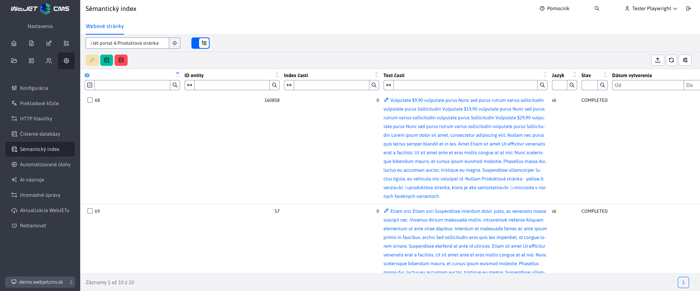
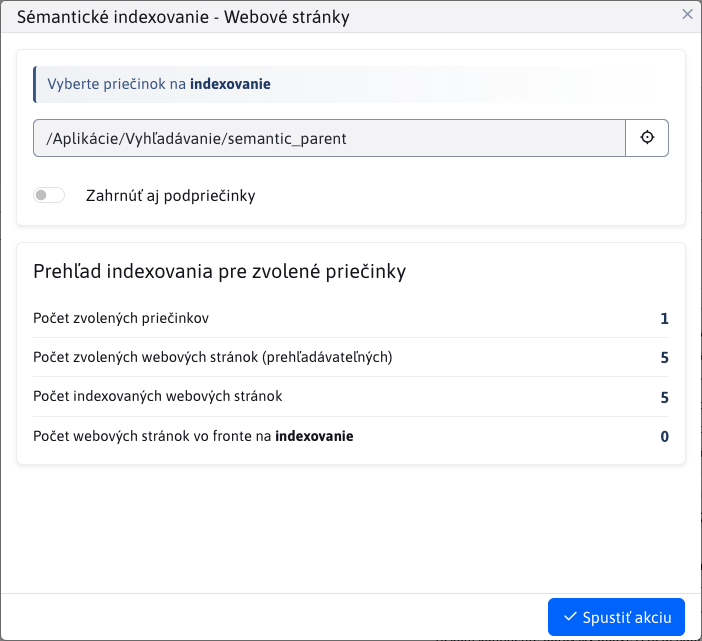
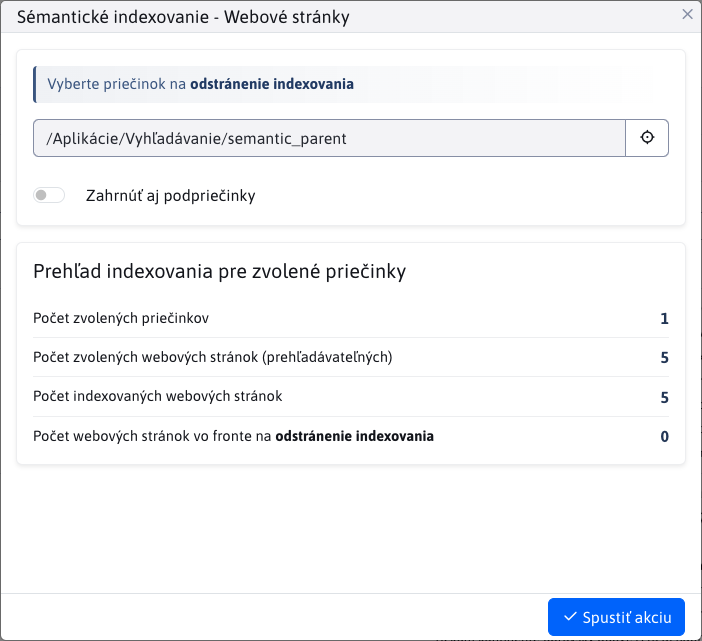

# Sémantický index

Sémantický index prevádza obsah stránok na vektorové reprezentácie (`embedding`) pomocou nastaveného AI poskytovateľa a ukladá ich do vektorovej databázy. Používa sa pre sémantické vyhľadávanie, hybridné vyhľadávanie aj pre generovanie RAG odpovede vo vyhľadávaní.

Pre presnejšie výsledky sa obsah rozdeľuje na menšie časti - **chunky**. Každý chunk je indexovaný samostatne, čo systému umožňuje porovnávať dotazy s konkrétnymi časťami textu a nie s celou stránkou naraz.

Správu vektorov nájdete v sekcii **Nastavenia → Sémantický index**.

Index je rozdelený na karty **Webové stránky** a **Markdown dokumenty**.

!>**Upozornenie:** Indexovanie **neprebieha okamžite**. Každá požiadavka (pridanie, úprava, vymazanie) sa zaradí do **fronty** a spracuje sa v pravidelných intervaloch pomocou cron úlohy.

Na zobrazenie zoznamu indexovaných objektov je potrebné mať právo Sémantický index.

## Indexovanie Markdown dokumentácie

Markdown dokumentácia a jej index sú spoločné pre všetky domény. Prepnutie domény nemení zobrazené dokumenty ani frontu indexovania. Korene dokumentácie aj embeddingový poskytovateľ a model sa načítajú z globálnej konfigurácie. Pridanie alebo odstránenie indexovania sa preto prejaví vo všetkých doménach; prístupové práva k vyhľadávaniu a asistent pre RAG odpovede sa naďalej riadia aktuálnou požiadavkou.

Na karte **Markdown dokumenty** vyberte priečinok pomocou stromového výberu. Strom začína koreňmi z globálnej konfiguračnej premennej `ragMarkdownFolders`, napríklad `/admin/docs/webjetcms` a `/admin/docs/orange`. Rozbalením koreňa môžete vybrať jeho podpriečinok. Prepínač **Zahrnúť aj podpriečinky** určuje, či tabuľka zobrazí časti súborov aj z vnorených priečinkov; po vypnutí zobrazí iba súbory priamo vo vybranom priečinku. Tabuľka navyše obsahuje stĺpce **Priečinok dokumentácie**, **Cesta dokumentu** a **Názov dokumentu**. Údaje zdroja slúžia len na čítanie.

Pre dokumentáciu použite alias `file:/docs/sk/admin/users`. Správca musí v globálnej premennej `symlinkTranslate` nastaviť mapovanie, napríklad `/docs/|/srv/documentation/webjetcms/`; alias potom označuje priečinok `/srv/documentation/webjetcms/sk/admin/users`. Lokálne môže mapovanie smerovať do priečinka `docs` vášho projektu. Bez mapovania sa alias nedá načítať. Iné lokálne priečinky možno nastaviť absolútnou cestou s prefixom `file:`, napríklad `file:/srv/manuals`. Indexujú sa aj súbory priamo v nastavenom priečinku, napríklad `README.md`. Susedné priečinky sa neprehľadávajú. Lokálne súbory sa indexujú rovnakými tlačidlami; ich indexovanie nevytvára verejnú webovú adresu dokumentácie.

**Dokumentácia musí byť rozdelená do jazykových priečinkov**, napríklad `/sk/`, `/en/` alebo `/cs/`. Jazyk sa určí z najbližšieho rozpoznaného jazykového priečinka v celej ceste vrátane nastaveného koreňa. Priečinok `file:/docs/sk/admin/users` preto automaticky priradí priamym súborom jazyk `sk`. Koreň `file:/docs` môže obsahovať viac jazykových priečinkov naraz. Rozpoznané jazyky vychádzajú z globálnej premennej `languages`; `sk`, `en` a `cs` sú podporované vždy. Súbory bez jazykového priečinka sa pri indexovaní preskočia.

Zelené tlačidlo **Pridať indexovanie** a červené tlačidlo **Odstrániť indexovanie** otvoria dialóg rovnako ako pri webových stránkach. Dialóg prevezme zvolený priečinok aj nastavenie **Zahrnúť aj podpriečinky**; obe voľby môžete zmeniť priamo v dialógu. Rozsah sa uplatní na počty súborov aj na zaradenie do fronty. Jazyk sa nevyberá, určí sa automaticky pre každý súbor z jeho cesty. Dialóg pri indexovaní zobrazuje pravidlo jazykových priečinkov a počty súborov s rozpoznaným jazykom: celkový počet, počet indexovaných súborov a počet vo fronte. Za indexované sa počítajú súbory aktuálneho poskytovateľa, modelu a jazyka odvodeného z ich cesty. Pri odstraňovaní sa zohľadnia všetky uložené indexy vo vybranom rozsahu bez ohľadu na jazyk.

Po potvrdení sa požiadavka uloží do fronty pre každý súbor samostatne. Spracuje ju existujúca úloha `sk.iway.iwcm.rag.service.RagIndexCronTask`; požiadavky na pridanie alebo odstránenie sa nevykonávajú v prehliadači. Chybné požiadavky zostávajú vo fronte na ďalší pokus. Odstránenie zahŕňa aj záznamy súborov vo vybranom rozsahu, ktoré už na disku neexistujú, a nahradí ich prípadné čakajúce požiadavky na indexovanie. Požiadavky z ostatných priečinkov zostávajú vo fronte. Výber podpriečinka nemení nakonfigurovaný koreň ani identifikátory dokumentov.

Fronta aj tabuľka chunkov uchovávajú úplnú cestu k súboru, napríklad `file:/docs/sk/admin/users/README.md`, bez samostatného stĺpca koreňového priečinka. Pri prechode zo staršej verzie odstráňte pôvodné Markdown indexy a čakajúce požiadavky s relatívnymi cestami a zaraďte dokumentáciu na indexovanie znova.

Pri prechode zo staršej verzie musí správca odstrániť staré čakajúce Markdown požiadavky viazané na konkrétnu doménu a zaradiť dokumentáciu znova do spoločného indexu. Postup je uvedený v [technickej dokumentácii](../../../custom-apps/apps/rag/markdown-search.md#správa-indexu-v-administrácii).

Ak nie je nastavený žiadny koreň, karta zobrazí informáciu o potrebnej konfigurácii a akčné tlačidlá sú vypnuté. Podrobnosti o obsahu priečinkov a automatickom sledovaní zmien sú v [dokumentácii Markdown vyhľadávania](../../../custom-apps/apps/rag/markdown-search.md).

!>Odstránenie indexu nemaže Markdown súbory ani nevypína ich automatickú indexáciu. Ak máte nastavenú úlohu `MarkdownIndexCronTask`, ďalšie prehľadanie nakonfigurovaného koreňa vytvorí index znova.

## Indexovanie webových stránok

Indexuje sa čistý text stránky bez HTML značiek. Do indexovania vstupujú iba webové stránky, ktoré sú povolené pre vyhľadávanie. Obsah sa rozdelí na chunky, ktoré sú zobrazené v tabuľke nižšie.

Každý chunk obsahuje tieto stĺpce:

- **ID entity** - ID webovej stránky.
- **Index časti** - poradie chunku v rámci stránky (0, 1, 2, ...).
- **Text časti** - text, pre ktorý bol vygenerovaný embedding. Samotný embedding sa v tabuľke nezobrazuje.
- **Poskytovateľ embeddingu** - poskytovateľ použitý pri vytvorení vektora, napr. `openai` alebo `gemini`.
- **Model embeddingu** - použitý embedding model, napr. `text-embedding-3-small` alebo `gemini-embedding-001`.
- **Dimenzie** - počet dimenzií vektora, napr. `1536`.
- **Jazyk** - jazyková verzia stránky.
- **Stav** - stav spracovania:
  - **COMPLETED** - úspešne spracovaný.
  - **ERROR** - nastala chyba.
  - **PENDING** - čaká na spracovanie.
- **Chybová správa** - popis chyby, ak spracovanie zlyhalo.
- **Dátum vytvorenia** - čas spracovania, nie čas pridania do fronty.

V databáze sa navyše ukladá `group_id` a stĺpce `root_group_l1`, `root_group_l2`, `root_group_l3`. Tieto hodnoty sa používajú na rýchle obmedzenie sémantického a hybridného vyhľadávania podľa priečinkov zvolených v aplikácii **Vyhľadávanie**.

Po načítaní stránky sa zobrazí informačné oznámenie s aktuálnym poskytovateľom a modelom používaným na indexovanie. Nastavenie sa načíta zo systémového AI asistenta `RAG-EMB-INDEX`, ktorého môžete upraviť v sekcii **Nastavenia → AI asistenti**.

Ak systémový asistent ešte neexistuje, vytvorí sa automaticky podľa konfiguračných premenných `ragEmbeddingProvider` a `ragEmbeddingModel`. Po jeho vytvorení majú hodnoty nastavené v asistentovi prednosť pred konfiguračnými premennými.

!>**Upozornenie:** Po zmene poskytovateľa alebo modelu spustite indexovanie znova. Indexy vytvorené rôznymi kombináciami poskytovateľa a modelu sa ukladajú oddelene a môžu existovať súčasne aj pre rovnakú stránku. Vyhľadávací asistent `RAG-EMB-SEARCH` musí používať rovnaký identifikátor poskytovateľa a modelu ako index, v ktorom má vyhľadávať.

Položka vo fronte neobsahuje poskytovateľa ani model; tieto hodnoty sa načítajú z asistenta `RAG-EMB-INDEX` až pri spracovaní. Ak má rozpracovaná fronta dokončiť pôvodný index, nechajte ju pred zmenou asistenta úplne spracovať.

## Rozdelenie textu na chunky

Veľkosť chunkov sa nastavuje konfiguračnými premennými:

- `ragEmbeddingChunkSize` - približná cieľová veľkosť chunku v znakoch, predvolene `1000`.
- `ragEmbeddingChunkOverlap` - približné prekrytie medzi susednými chunkmi v znakoch, predvolene `200`.

Chunky začínajú a končia na rozpoznanej hranici vety alebo odseku, ktorá je najbližšie k cieľovej veľkosti. Veta zalomená do viacerých riadkov zostane spolu. Dlhá veta alebo odsek bez vetnej interpunkcie môže prekročiť cieľovú veľkosť; systém nerozdeľuje slová kvôli dodržaniu limitu.

Prekrytie sa prispôsobuje celým vetám alebo odsekom, preto sa jeho skutočná veľkosť mení a môže byť aj nulová, ak je to potrebné na pokračovanie v texte. Každý ďalší chunk pridá nový obsah. Nové hranice sa na existujúce dokumenty použijú po opätovnom indexovaní.

Prekrytie sa používa na zachovanie kontextu medzi susednými časťami. Pri RAG odpovedi sa susedné chunky jednej stránky môžu znovu zlúčiť, pričom sa odstráni duplicitný text vzniknutý prekrytím.

!>**Upozornenie:** Staršie konfiguračné premenné `ragChunkSize` a `ragChunkOverlap` sa už nepoužívajú. Po zmene veľkosti chunkov alebo po prechode zo starších nastavení spustite opätovné indexovanie.

## Filtrovanie

V hlavičke tabuľky sú dostupné tieto filtre:

- **Výber priečinka** - zobrazí chunky len pre stránky z daného priečinka v rámci aktuálnej domény.
- **Zobraziť aj z podpriečinkov** - zahrnie do výsledkov aj stránky z podpriečinkov.
- **Poskytovateľ embeddingu** a **Model embeddingu** - obmedzia tabuľku na konkrétnu kombináciu uloženého indexu.

!>**Upozornenie:** Ak vyberiete **Koreňový priečinok** bez zapnutia možnosti **Zobraziť aj z podpriečinkov**, nezískate žiadne výsledky. Koreňový priečinok je virtuálny a neobsahuje stránky priamo.

## Presmerovanie z Webových stránok

V sekcii **Webové stránky** môžete pri zvolenom priečinku kliknúť na tlačidlo <button class="btn btn-sm buttons-selected btn-outline-secondary"><i class="ti ti-database-search"></i></button> v hlavičke priečinkov. Tým sa otvorí sekcia **Sémantický index** s automaticky nastaveným filtrom pre daný priečinok.

### Automatické indexovanie

Systém automaticky zaradí stránku do fronty pri:

- **vytvorení alebo úprave** - stránka sa indexuje alebo aktualizuje bez manuálneho zásahu,
- **zmazaní alebo presunutí do koša** - všetky súvisiace chunky sa odstránia z databázy,
- **obnovení z koša** - stránka sa opätovne indexuje.

### Manuálne indexovanie

Kliknite na tlačidlo <button class="btn btn-sm btn-success" type="button"><i class="ti ti-database-plus"></i></button> pre otvorenie dialógu indexovania.

Dialóg zobrazí prehľad stránok zvoleného priečinka - celkový počet, počet už indexovaných a počet vo fronte. Za indexované sa považujú iba stránky, ktoré majú index pre aktuálneho poskytovateľa a model asistenta `RAG-EMB-INDEX`. Index vytvorený iným poskytovateľom alebo modelom sa preto v tomto počte nezohľadní.

Manuálnu akciu možno vykonať iba nad priečinkami aktuálnej domény, pre ktoré má používateľ právo na úpravu. Pri výbere koreňového priečinka musí mať právo na všetky koreňové priečinky domény.

Priečinok aj voľba **Zobraziť aj z podpriečinkov** sa prevezmú z aktívneho filtra. Po potvrdení sa do fronty zaradia všetky vyhľadateľné stránky zo zvoleného rozsahu. Ak sa text chunku nezmenil, systém sa pokúsi použiť existujúci embedding s rovnakým poskytovateľom a modelom podľa jeho hash hodnoty. Opätovné indexovanie nahradí iba index aktuálnej kombinácie poskytovateľa a modelu; ostatné indexy rovnakej stránky zostanú zachované.

Akciu spustíte tlačidlom <button class="btn btn-primary"><i class="ti ti-check"></i> Spustiť akciu</button>.

### Manuálne odstránenie indexovania

Kliknite na tlačidlo <button class="btn btn-sm btn-danger" type="button"><i class="ti ti-database-minus"></i></button> pre otvorenie dialógu odstránenia indexov.

Dialóg prevezme priečinok aj voľbu **Zobraziť aj z podpriečinkov** a zobrazí rovnaký prehľad ako pri indexovaní, ale počet indexovaných stránok zahŕňa všetkých poskytovateľov a modely. Po potvrdení sa stránky zaradia do fronty na odstránenie všetkých chunkov pre stránky zvoleného rozsahu bez ohľadu na poskytovateľa a model.

Akciu spustíte tlačidlom <button class="btn btn-primary"><i class="ti ti-check"></i> Spustiť akciu</button>.

## Chyby pri indexovaní

Ak pri indexovaní stránky nastane chyba, systém uloží záznam so stavom **ERROR** a skrátenou chybovou správou. Chyba sa zapisuje aj do administrátorského logu v kategórii **Vyhľadávanie** (`SEARCH`). Ak zlyhá spracovanie položky ešte na úrovni fronty, položka zostane vo fronte a systém sa ju pokúsi spracovať pri ďalšom behu cron úlohy.

!>**Upozornenie:** Konfiguračná premenná `ragEmbeddingDimensions` je globálna pre celú inštaláciu. Jej zmena vymaže celý sémantický index pre všetkých poskytovateľov a modely, pretože databázový stĺpec `vector(N)` má spoločnú dimenziu. Po zmene je potrebné znova indexovať celý obsah. Lokálny model `intfloat/multilingual-e5-base` vyžaduje hodnotu `768`.

## Detaily implementácie

Technický popis procesu indexovania nájdete v [dokumentácii pre vývojárov](../../../custom-apps/apps/rag/semantic-search/README.md).
