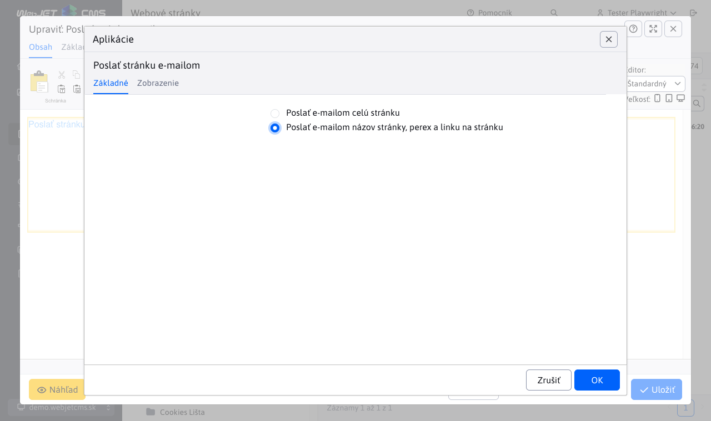

# Poslať stránku emailom

Vloží do stránky aplikáciu, ktorá umožňuje poslať odkaz na aktuálnu stránku spolu s doplneným textom na e-mail adresu. Ak návštevník nájde zaujímavé informácie na vašom webe, môže si ich preposlať na svoj email, alebo na email priateľa ktorému chce stránku zdieľať.

## Nastavenia aplikácie

V nastaveniach možno vybrať z možností:

- Poslať e-mailom celú stránku
- Poslať e-mailom názov stránky, perex a linku na stránku

## Zobrazenie aplikácie

Pre užívateľa sú polia:

- Vaše meno
- Váš e-mail
- E-mail príjemcu
- Predmet
- Zadajte text z obrázku
- Správa

Pričom všetky polia okrem správy sú povinné

